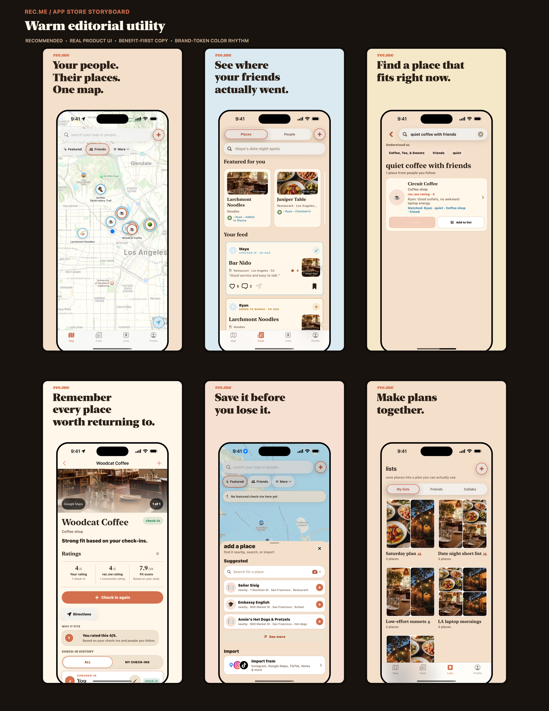

# rec.me App Store launch readiness

Updated: 2026-08-14

Owner issue: [REC-186](https://linear.app/recme/issue/REC-186/prepare-recme-app-store-product-page-and-review-package)

Parent: [REC-180](https://linear.app/recme/issue/REC-180/prepare-recme-for-app-store-launch)

## Recommendation

Launch rec.me as a **warm editorial utility**: emotionally clear like Corner, trustworthy like Beli, and immediately useful like Mapstr—without copying any of them.

The category position to own is:

> A living map of places your real people actually experienced, with enough context to choose what fits the moment.

Do not lead with import, ratings, or generic discovery. Lead with people and proof of real experience. Keep the first screenshot understandable in under two seconds.

Recommended first-frame promise:

> Your people. Their places. One map.

## Screenshot storyboard v1 — direction approved



The six panels use current, working rec.me UI rather than invented product screens. The visual system uses the existing cream, terracotta, sky, sun, serif, and black brand language. Before final export, fixture names and content should be replaced with a small public-safe fictional social graph and every screenshot should be recaptured from the release candidate.

Joe approved the visual direction and first-frame promise on 2026-08-12. This approval locks the narrative and art direction; it does not authorize App Store upload or submission. The final pixels remain gated on the production release candidate and public-safe fixture recapture.

| Order | Promise | Product proof |
|---|---|---|
| 1 | Your people. Their places. One map. | Dense Friends map |
| 2 | See where your friends actually went. | Friends' place feed |
| 3 | Find a place that fits right now. | Natural-language trusted search |
| 4 | Remember every place worth returning to. | Place memory and detail |
| 5 | Save it before you lose it. | Add/import surface |
| 6 | Make plans together. | Shared lists |

All six portrait files are opaque 1320 × 2868 PNGs, matching Apple's accepted 6.9-inch iPhone size. rec.me targets iPhone only (`TARGETED_DEVICE_FAMILY = 1`), so an iPad screenshot set is not required for this build.

## Competitor read

| App | What it owns | What rec.me should learn | What rec.me should avoid |
|---|---|---|---|
| [Beli](https://apps.apple.com/us/app/beli/id1478375386) | Restaurant ranking and friends' taste | Crisp three-part story and trusted recommendations | Becoming restaurant-only; forced invite mechanics |
| [Corner](https://apps.apple.com/us/app/corner-curate-share-places/id1668282277) | Vibe, social maps, and Gen-Z cultural energy | Emotional copy and beautiful social proof | Collage overload, opaque AI, and onboarding friction |
| [Mapstr](https://apps.apple.com/us/app/mapstr-save-follow-places/id917288465) | Broad save/import utility | Immediate solo value and organization | Utilitarian sameness and surprise paywalls |
| [World of Mouth](https://apps.apple.com/us/app/world-of-mouth/id1454663016) | Premium expert trust | Editorial authority and restraint | A distant expert voice instead of real relationships |
| [Step](https://apps.apple.com/us/app/step-your-world/id1474971037) | Broad social map | Category breadth and friend-based discovery | Leading with import instead of the emotional wedge |
| [Swarm](https://apps.apple.com/us/app/swarm-check-in-explore-map/id870161082) | Place memory and check-ins | Long-term memory value | Gamified check-in framing |

Recent public reviews reinforce four product requirements:

1. Give a useful solo experience before asking for contacts or invitations.
2. Make trust, personalization, and data use legible rather than mysterious.
3. Preserve organization as the map grows: search, filters, tags, and lists.
4. Avoid surprise paywalls, forced invite loops, and unstable core flows.

## Live App Store Connect audit

Snapshot refreshed after verified App Store Connect updates on 2026-08-14.

| Surface | Current state | Launch action |
|---|---|---|
| App/version | `rec.me`, version `1.0`, Prepare for Submission | Keep public version 1.0 |
| Uploaded builds | Builds 136–145 are valid but all report marketing version `0.1` | Change `MARKETING_VERSION` to `1.0`, test, archive, and upload a new candidate only after production cutover |
| Release behavior | Manual (`MANUAL`) | Complete; keep manual release through review |
| Subtitle | `Places from people you trust` | Keep; it is concrete, differentiated, and within the 30-character limit |
| Screenshots | 0 screenshots / 0 sets | Finalize and upload the approved six-panel 6.9-inch set |
| Categories | Primary: Social Networking. Secondary: Travel | Complete |
| Age rating | Questionnaire complete; UGC, messaging/comments, and social media declared. Apple calculates 13+ globally, 15+/16+ where regional rules require it | Complete; keep answers aligned with the release product |
| Content rights | Uses third-party content | Complete; accurately covers user content and licensed place/photo data |
| Privacy URLs | `https://getrec.me/privacy` and `https://getrec.me/privacy-choices` | Complete; App Privacy labels still require the dashboard form and exact archive reconciliation |
| Support/marketing URLs | `https://getrec.me/support` and `https://getrec.me/` | Complete; the published support address still needs a working mailbox |
| Price and availability | Free; United States only; no pre-order; no automatic new-territory enrollment | Complete for the US-first launch; expand deliberately after regional compliance review |
| Review information | Missing | Add contact and a populated review account that does not depend on an external inbox/OTP. The walkthrough is now committed in `reviewer-notes.txt`, and `scripts/app-store-review-release.mjs` can create/verify the private App Store Connect record without printing credentials |
| Description/keywords | Final draft applied and read back from App Store Connect | Reverify against the final candidate before submission |
| Latest binary | Build 145 is valid, iOS 17+, export encryption false | Not selectable for version 1.0 because of the marketing-version mismatch |

The linked in-app pages currently return HTTP 200: support, privacy, terms, community standards, and privacy choices. The `getrec.me` launch-site PR [#10](https://github.com/joelipshutz/recme-site/pull/10) is merged and deployed. It adds the safety-report fallback and moderation appeal paths, the 24-month safety-report retention disclosure, accessibility and responsive fixes, and a safe TestFlight-to-App-Store CTA switch.

The reversible changes are scripted in `scripts/app-store-metadata-release.mjs`, `scripts/app-store-age-rating-release.mjs`, and `scripts/app-store-commerce-release.mjs`. Each defaults to a read-only plan and requires `--apply`. On 2026-08-14, all three were applied and verified by App Store Connect read-back.

## Hard submission blockers

| Gate | Evidence | Required before submission |
|---|---|---|
| [REC-182](https://linear.app/recme/issue/REC-182/switch-recme-to-production-clerk-and-supabase-auth) — production auth | Release currently inherits the tracked Clerk test key and `.clerk.accounts.dev` host | Use production Clerk/Supabase configuration and production Associated Domains; validate sign-in, deletion, and a clean-device session |
| [REC-183](https://linear.app/recme/issue/REC-183/close-app-store-ugc-safety-and-moderation-gaps) — UGC safety | [PR #381](https://github.com/joelipshutz/wander/pull/381) is merged. Migration `20260813010000_community_moderation` is already present on the linked hosted project, and the full rollback-only hosted smoke passed on 2026-08-14, including report submission, private moderation queue/evidence, and rate limiting. | Complete one live report-to-resolution exercise without retaining test content, name primary/backup safety reviewers, and make `support@getrec.me` receive and reply reliably |
| [REC-185](https://linear.app/recme/issue/REC-185/complete-app-privacy-manifest-labels-and-permission-audit) — privacy | [PR #380](https://github.com/joelipshutz/wander/pull/380) is merged; app and share-extension manifests are on `main`, and 1,097 tests plus the Release build passed before merge | Verify PostHog project-level IP capture, inspect the signed archive privacy report, and complete App Store privacy labels from the audited data-flow matrix |
| [REC-187](https://linear.app/recme/issue/REC-187/harden-recme-production-backend-and-operations-for-launch) — backend/ops | [PR #304](https://github.com/joelipshutz/wander/pull/304) is merged, restoring repository parity with the already deployed hardening migration and preserving the rollback smoke harness | Complete monitoring ownership, quota alerts, APNs delivery, deletion cleanup, and the REC-182 production cutover. A fresh pre-cutover source backup is verified under `.private_backups`; do not replace or delete it during cutover |
| Support mailbox | DNS has no MX records and apex SPF is `v=spf1 -all`, so `support@getrec.me` cannot receive mail | Provision the mailbox, then verify inbound mail, reply, SPF, DKIM, and DMARC before submission |
| App Store final fields | App Privacy labels and App Review contact/demo details are incomplete. Privacy remains a dashboard task; review details are supported by the API | Sign in to App Store Connect to publish the evidence-backed privacy answers. Configure the monitored review contact and no-OTP production review account in local secrets, then dry-run/apply `scripts/app-store-review-release.mjs` |
| Version/build compatibility | Store version is 1.0; all uploaded binaries are 0.1 | Generate and upload a new 1.0 build only after the other release gates are closed |

Apple's UGC guideline requires objectionable-content filtering, reporting with timely response, blocking abusive users, and published contact information. The product, backend controls, and hosted migration are in place. The remaining operational gate is a staffed queue, working mailbox, and one verified end-to-end report-to-resolution exercise.

## Product-page copy draft

### Name

`rec.me`

### Subtitle

`Places from people you trust`

### Promotional text

`Remember places worth returning to—and find your next one through people you trust.`

### Keywords

`map,friends,restaurants,travel,save,discover,lists,checkin,local,food,cafes,bars,hikes,trip`

### Description

Find places through people you trust—not anonymous ratings.

rec.me turns real experiences from friends into a living map you can actually use. See where your people went, what they thought, and what fits the moment when you need a place now.

WITH REC.ME, YOU CAN

• See places your friends have actually visited

• Search your trusted map in natural language

• Save restaurants, bars, coffee shops, hikes, shops, and more

• Keep the notes and context that make a place worth remembering

• Organize places into lists and make plans together

• Control who can see what you share

Your map gets more useful with every memory—and every person you trust.

Need help? Visit https://getrec.me/support

Privacy: https://getrec.me/privacy

Terms: https://getrec.me/terms

### Reviewer notes outline

The final notes should include:

1. A dedicated review account with a populated trusted graph and sample places.
2. Exact steps for Sign in with Apple and any email/phone fallback.
3. A short walkthrough of Map, Feed, trusted search, Add, Lists, reporting, blocking, and account deletion.
4. An explanation of location, contacts, notifications, photo-library, and camera prompts, including how to test without granting each permission.
5. Confirmation that the backend is live and that reviewer access does not depend on a one-time code sent to an unavailable device.
6. Notes for the share extension, widgets, imported links, and any intentionally limited launch behavior.

Do not put real customer credentials or private user data in this document or source control.

### Private review-record release path

Keep these values only in `/Users/joelipshutz/.openclaw/workspace/.env.keys`:

```text
ASC_REVIEW_CONTACT_FIRST_NAME
ASC_REVIEW_CONTACT_LAST_NAME
ASC_REVIEW_CONTACT_PHONE
ASC_REVIEW_CONTACT_EMAIL
ASC_REVIEW_DEMO_ACCOUNT_REQUIRED=true
ASC_REVIEW_DEMO_ACCOUNT_NAME
ASC_REVIEW_DEMO_ACCOUNT_PASSWORD
```

The review account must be a dedicated, fictional, populated production account that Apple can enter with the supplied credentials alone. An email OTP sent to a mailbox Apple cannot access is not a usable review login.

The tool reads `reviewer-notes.txt`, redacts contact/account values from all output, and defaults to a read-only plan:

```bash
node scripts/app-store-review-release.mjs
node scripts/app-store-review-release.mjs --apply
```

Do not run `--apply` until the mailbox, production auth cutover, review-account login, and fictional graph have all been verified.

## Release sequence

1. **Complete:** positioning, first-frame copy, and six-panel storyboard direction approved 2026-08-12.
2. **Complete:** PRs #380, #381, and #304 are merged and their `main` manifest runs passed.
3. **Complete:** App Store product copy, URLs, categories, manual release, content-rights declaration, 13+ questionnaire, free pricing, and US-first availability were applied and verified on 2026-08-14.
4. Make `support@getrec.me` operational; name safety owners and complete one live report-to-resolution exercise.
5. Complete REC-182's lossless production Clerk/Supabase cutover and clean-device validation. Preserve the verified source backup and canonical IDs; do not switch traffic until all 6 existing account mappings validate.
6. Publish App Privacy answers after signing in to App Store Connect. Create the private App Review record with `scripts/app-store-review-release.mjs` only after the contact and populated no-OTP production review account are verified.
7. Replace concept fixtures with public-safe release fixtures and recapture the approved six-panel set from the release candidate.
8. Set version 1.0, increment the build, regenerate the project, and run the full test suite plus small/large-phone visual QA. The two deterministic launch UI failures were resolved in PR #405; its full run passed 1,145 unit tests and 28 UI tests with zero failures.
9. Archive, upload, process, and attach the 1.0 release candidate.
10. Run a final pre-submission audit, then submit for review under the launch authorization.

## Validation performed for this audit

- Latest `origin/main` built successfully on an iPhone 16 Plus simulator running iOS 18.6.
- Current Map, Feed, search, place detail, Add, Lists, Profile, and import surfaces were exercised and captured.
- All concept panels were verified as opaque 1320 × 2868 PNGs.
- App Store Connect metadata, rating, content-rights, price, and availability changes were applied through dry-run-first scripts and verified by API read-back.
- The hosted Supabase smoke remained rollback-only and passed after confirming the moderation migration was already deployed.
- App targets are iPhone-only.
- Current legal/support URLs were checked live.

## References

- [Apple screenshot specifications](https://developer.apple.com/help/app-store-connect/reference/app-information/screenshot-specifications)
- [Upload app previews and screenshots](https://developer.apple.com/help/app-store-connect/manage-app-information/upload-app-previews-and-screenshots)
- [App Review Guidelines](https://developer.apple.com/app-store/review/guidelines/)
- [App privacy details](https://developer.apple.com/app-store/app-privacy-details/)
- [Manage app privacy](https://developer.apple.com/help/app-store-connect/manage-app-information/manage-app-privacy/)
- [Add a privacy manifest](https://developer.apple.com/documentation/bundleresources/adding-a-privacy-manifest-to-your-app-or-third-party-sdk)
- [App Store categories](https://developer.apple.com/app-store/categories/)
- [Age rating values and definitions](https://developer.apple.com/help/app-store-connect/reference/app-information/age-ratings-values-and-definitions/)
- [Select an App Store version release option](https://developer.apple.com/help/app-store-connect/manage-your-apps-availability/select-an-app-store-version-release-option)
