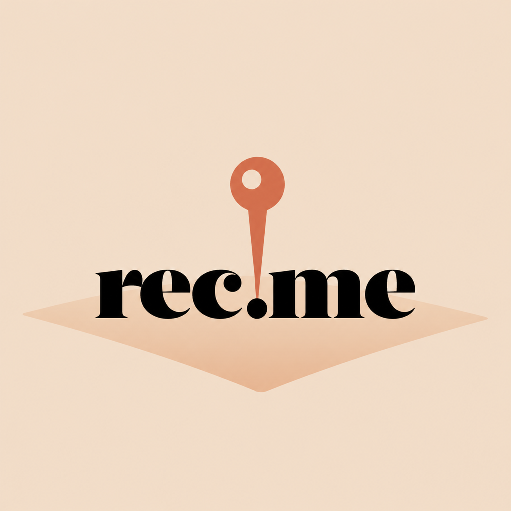
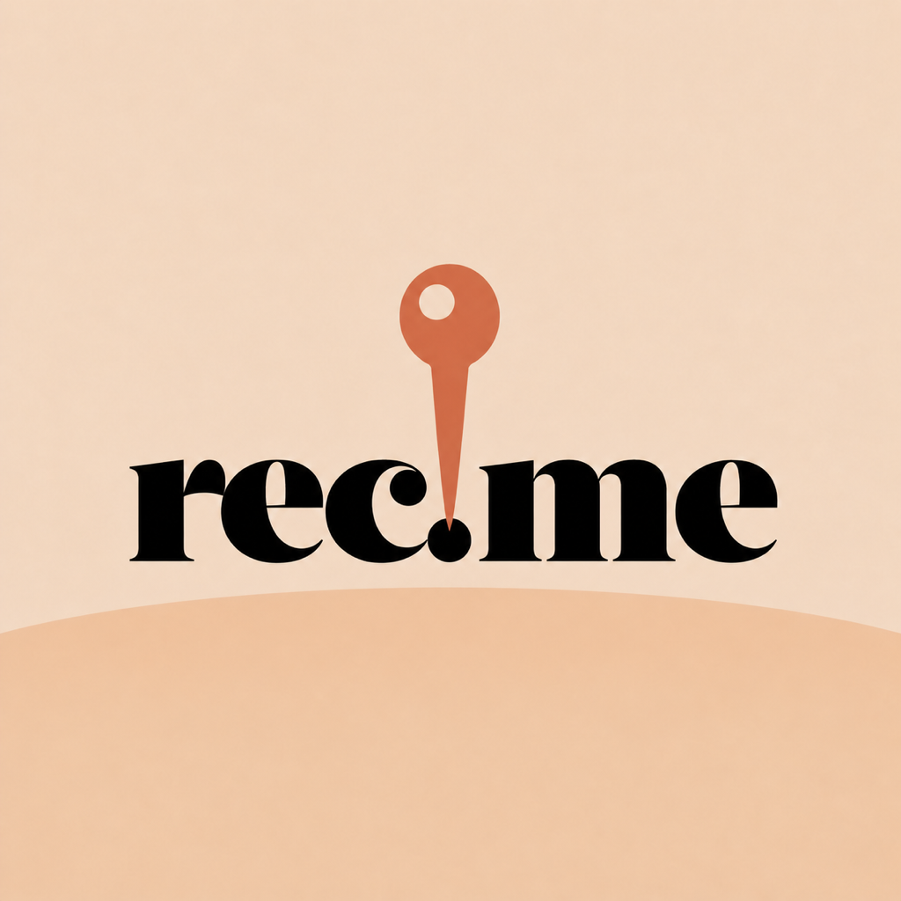
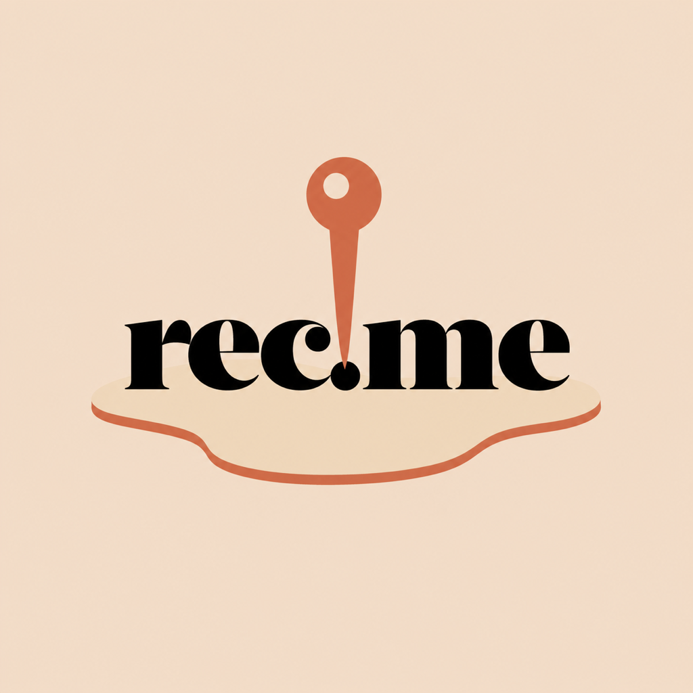

# REC-214 Pin-to-map app icon exploration

Status: concept exploration only. None of these files replaces the canonical
`AppIcon` master or changes the production icon contract.

## Brief

- Keep the lowercase `rec.me` wordmark and terracotta map pin.
- Remove the pin's existing oval landing ring.
- Taper the pin into a clear downward point that lands directly in the dot
  between `rec` and `me`.
- Put a compact angled map/Earth-like surface beneath and behind the wordmark.
- Preserve the warm rec.me palette, centered lockup, and small-size legibility.
- Avoid a folded map sheet, roads, a literal globe, or extra objects.

## Directions

### A — Tilted plane

A shallow diamond-like map plane recedes behind the wordmark. This is the
closest match to the requested 45-degree map surface and keeps the composition
lightest.

### B — Curved horizon

A clean convex horizon suggests Earth curvature without drawing a literal
globe. It is the most minimal surface, but the icon carries more visual weight
at the bottom.

### C — Floating terrain

An organic terrain slice with a thin terracotta edge gives the place surface
more personality and dimensionality. At small sizes, the edge can begin to
read as an underline or smile.

## Small-size review

The `small-size/` folder contains direct 180 px and 87 px reductions of all
three concepts.

- All three preserve the exact `rec.me` spelling and the pin-to-dot idea at
  180 px.
- A remains the best balance of angle, map meaning, and negative space.
- B is cleanest at 87 px, but its surface reads more like a horizon than a map.
- C stays recognizable, though the thin edge becomes more decorative than
  geographic at 87 px.

## Recommendation

Advance **Direction A** first. Its tilted plane communicates the requested map
surface most directly without turning the icon into a globe or a map
illustration. A deterministic production pass should redraw the pin, wordmark,
and plane from native/vector primitives; these generated PNGs are composition
references, not final masters.

The built-in image-generation workflow produced the concepts from the current
canonical icon as an edit target. Exact prompts are recorded in `prompts.md`.

## Liquid Glass follow-up

Ryan requested a more expressive follow-up with stronger refraction, a much
more colorful globe, and alternate wordmark typography. Five additional
composition mockups and their small-size reductions live in
[`liquid-glass/`](liquid-glass/README.md). Each direction also includes four
flat 1024 px layers prepared for Icon Composer import; the canonical AppIcon
master remains unchanged.

## Map-first redesign

Ryan later requested a complete reset that intentionally supersedes the
original no-roads / no-folded-map constraint. Five full-bleed, navigation-style
map concepts using the supplied rec.me wordmark reference live in
[`map-first-redesign/`](map-first-redesign/README.md).
