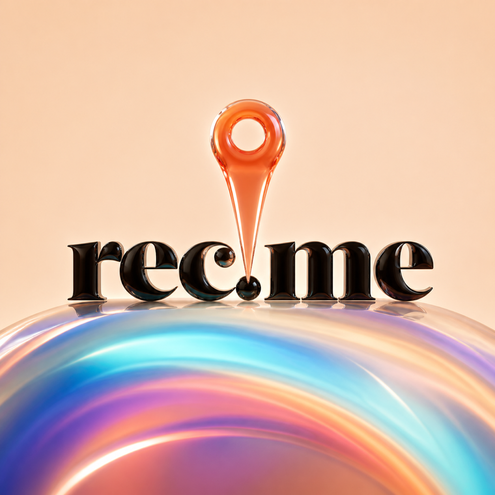
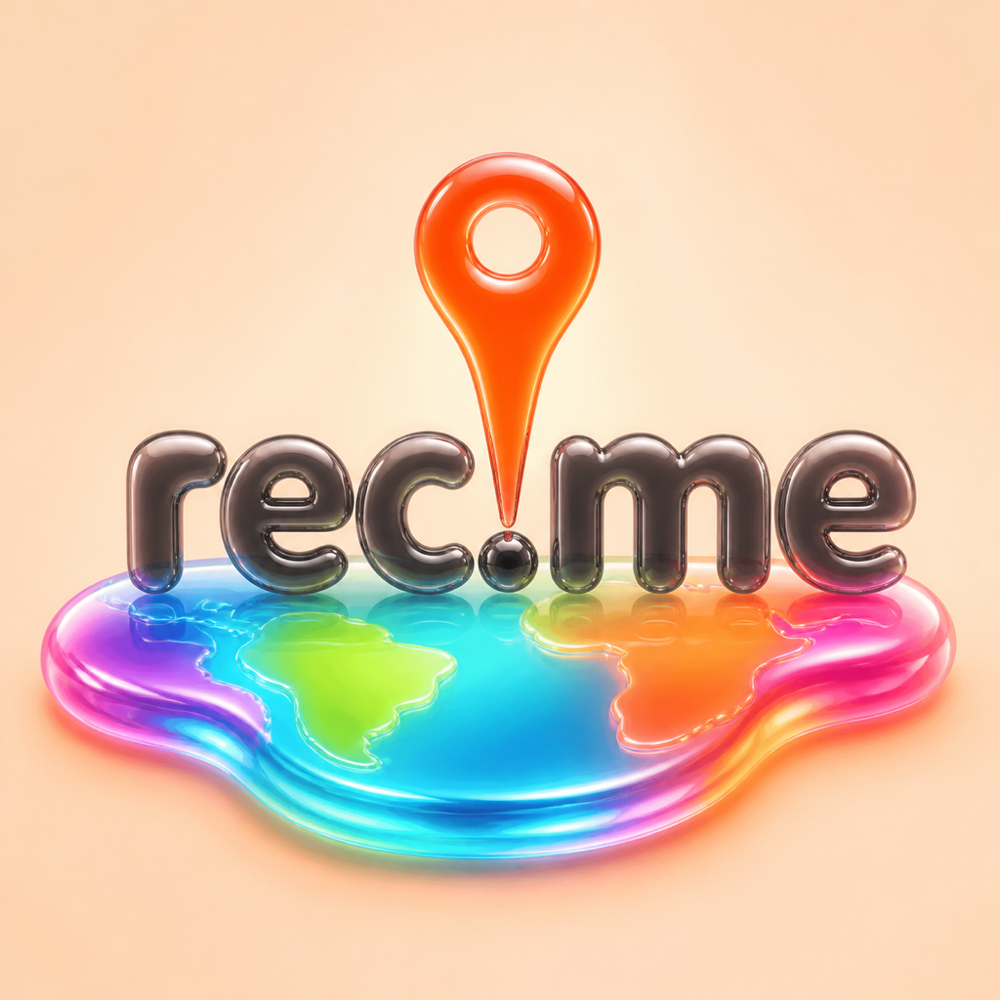
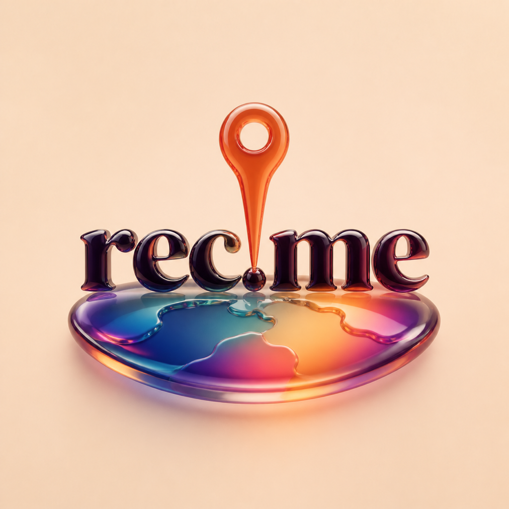
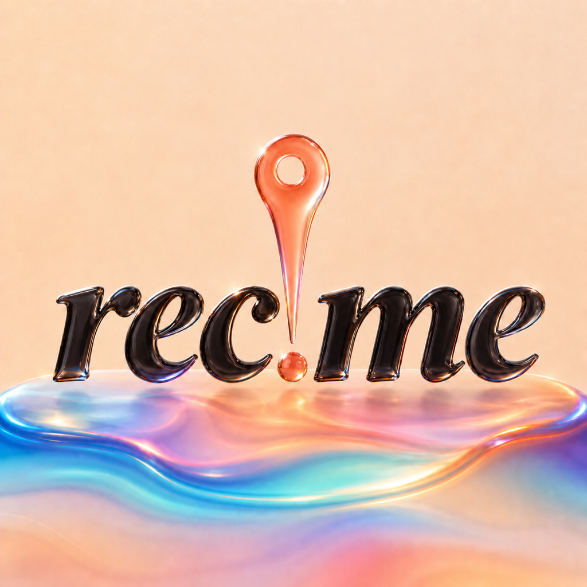

# REC-214 Liquid Glass app-icon follow-up

Status: concept exploration only. These files do not replace the canonical
`AppIcon` master or change the production icon contract.

## Brief

- Keep the exact lowercase `rec.me` wordmark and pin-to-period relationship.
- Preserve the warm rec.me canvas while making the globe substantially more
  colorful.
- Explore real refraction, translucency, specular highlights, and a more fluid
  material language.
- Compare multiple type personalities rather than assuming the current
  editorial serif is final.
- Keep enough contrast and silhouette strength to remain recognizable at
  180 px and 87 px.

## Directions

### D — Aurora editorial



The closest continuation of the current brand: high-contrast editorial serif,
near-black glass type, coral glass pin, and an aurora-colored horizon lens.

### E — Rounded gel



A friendlier rounded sans and a playful, organic world puddle. This is the most
expressive direction and the furthest from the existing editorial tone.

### F — Soft neo-serif



A softer contemporary serif with a compact glass world. It preserves brand
warmth while feeling less formal than the current high-contrast wordmark.

### G — Fluid italic



An italic serif adds motion and human warmth. The initial pale-glass wordmark
failed the 87 px contrast check, so the final mockup uses smoked charcoal glass.

### H — Globe forward


The globe becomes the primary silhouette with a condensed sans wordmark across
its face. This communicates global/place meaning fastest but is visually the
largest departure from the current icon.

## Icon Composer layers

`icon-composer/<direction>/` contains four transparent 1024 px PNG layers,
numbered back-to-front for direct import:

1. `01-globe-base.png`
2. `02-globe-colors.png`
3. `03-wordmark.png`
4. `04-pin.png`

Each direction also includes `00-flat-preview.png`, which is only a placement
check and should not be imported. The layers intentionally omit blur, shadow,
translucency, refraction, specular highlights, and the system icon mask so Icon
Composer can own those dynamic properties. Regenerate them with:

```bash
swift scripts/generate-liquid-glass-icon-layers.swift
```

Suggested Icon Composer setup:

- Canvas: warm peach/cream gradient, full bleed.
- Globe base group: Combined mode, high refraction, medium translucency,
  specular on, restrained shadow.
- Globe color group: Individual mode, medium refraction, medium-high
  translucency, specular on.
- Wordmark group: Combined mode, low-to-medium refraction, low translucency,
  strong edge specular for legibility.
- Pin group: Combined mode, medium-high refraction, low-to-medium
  translucency, specular on.

## Small-size review

The `small-size/` folder contains direct 180 px and 87 px reductions.

- D, F, G, and H preserve the exact wordmark and pin-to-period motif at 87 px.
- E remains readable but its bubbly letter counters and continent detail are
  the first to soften.
- D is the strongest evolutionary direction.
- G is the most distinctive typography change that still feels editorial.
- H communicates globe/place fastest, at the cost of more visual weight.

## Recommendation

Advance **D** and **G** into real Icon Composer tuning first. D is the safest
brand evolution; G is the clearest alternate-font experiment. Keep H as a
globe-forward challenger. Prompts are recorded in `prompts.md`.
