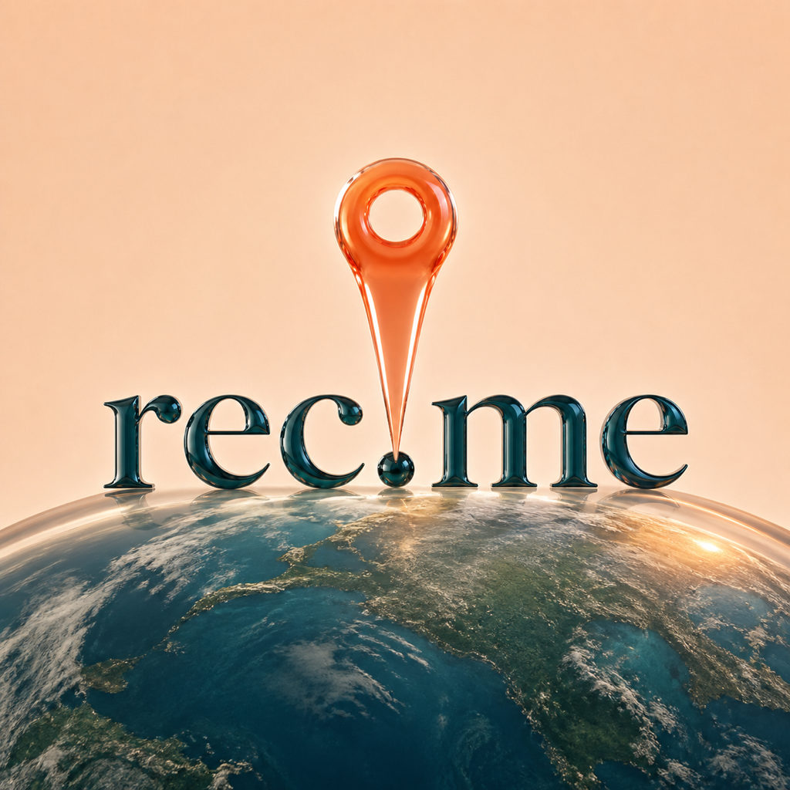
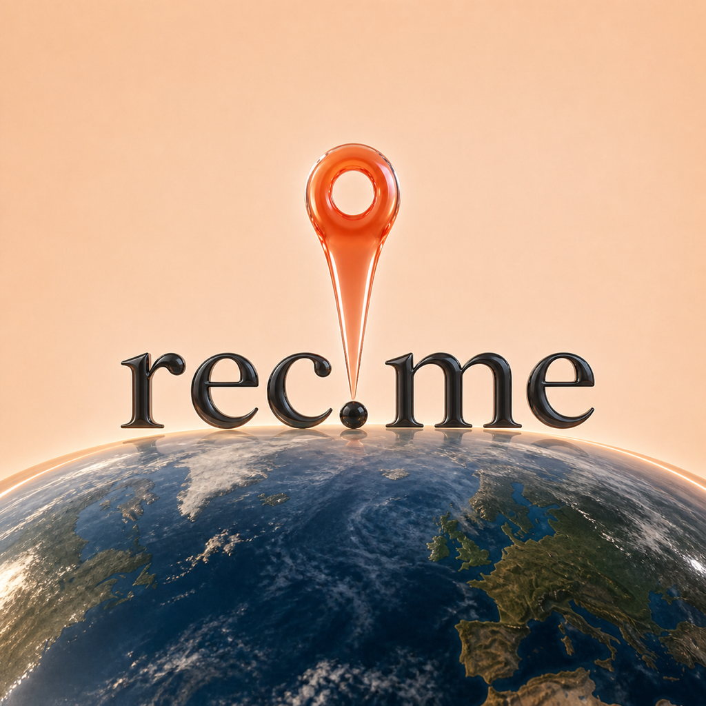
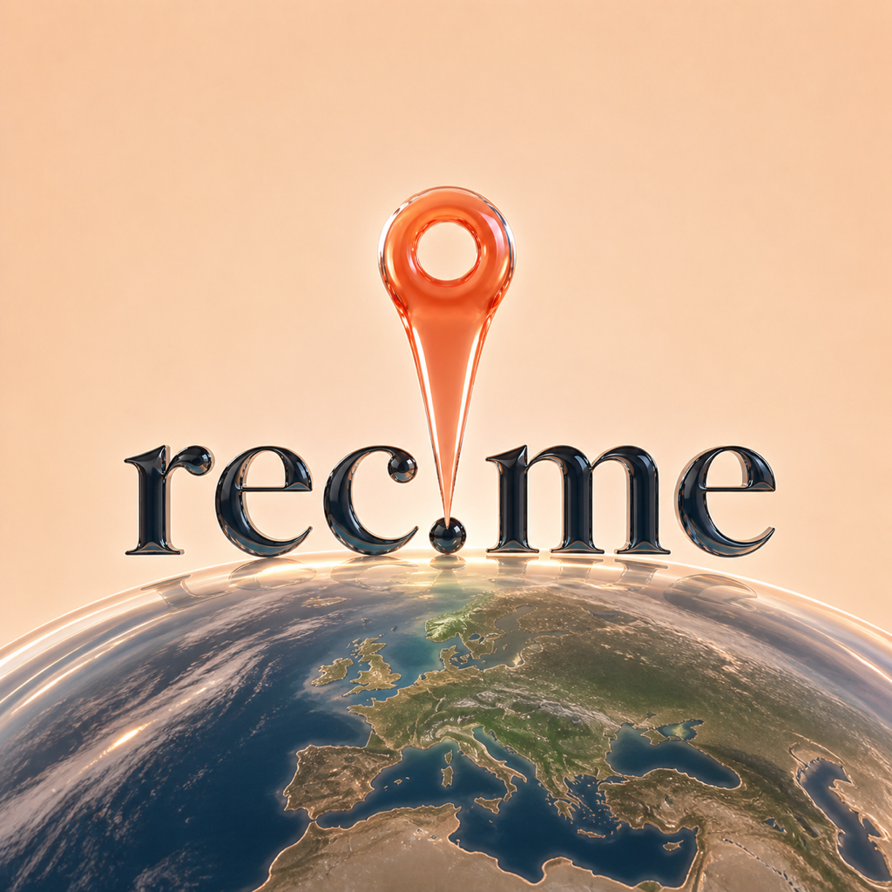
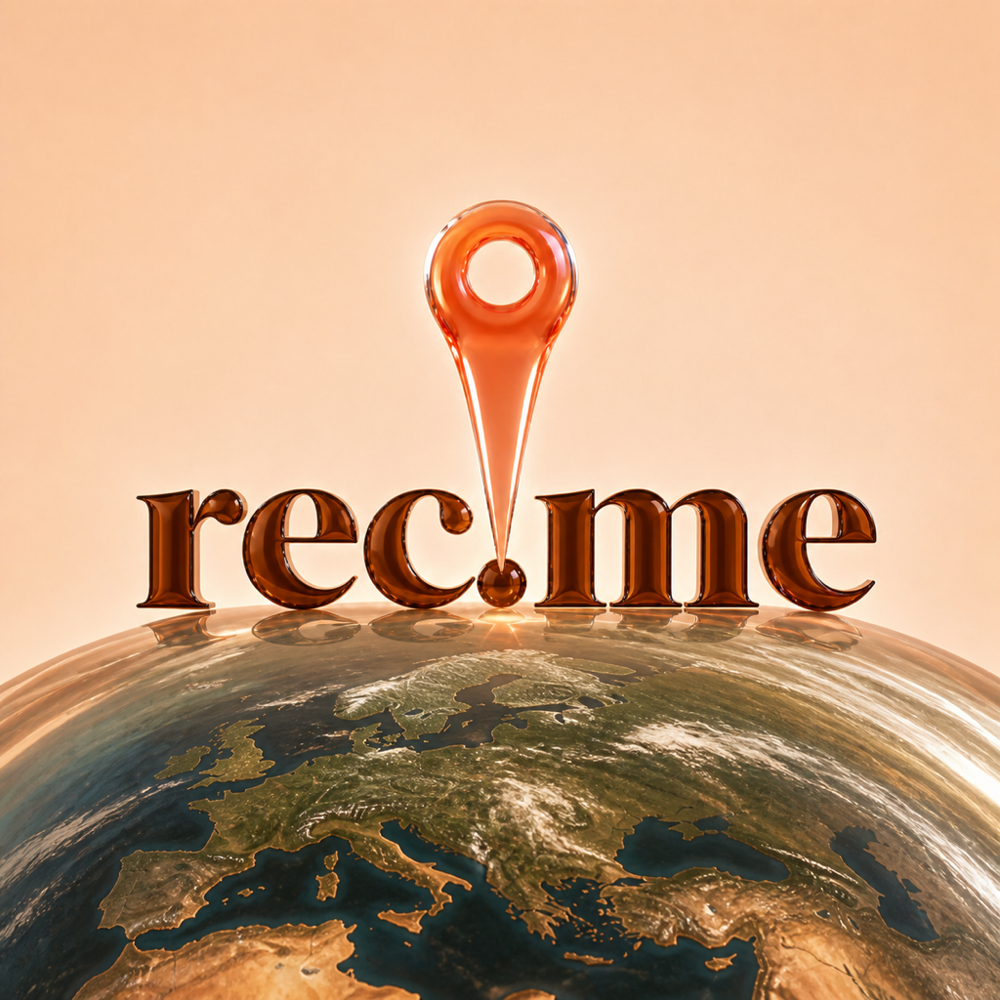
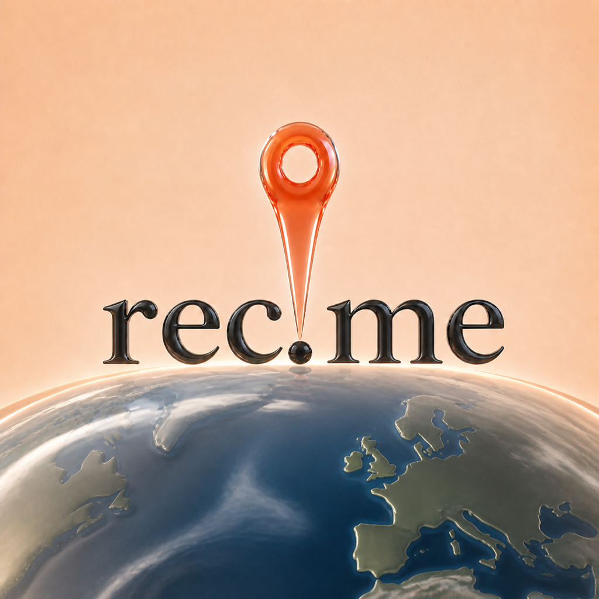

# REC-214 proper-serif / realistic-globe follow-up

Status: concept exploration only. The production AppIcon remains unchanged.

## Refined brief

- Keep the exact lowercase `rec.me` spelling and pin-to-period relationship.
- Move from the expressive first pass to a calmer, proper old-style/book serif
  with traditional bracketed details and strong small-size readability.
- Use Beli's current App Store icon only as a reference for typographic
  restraint; do not copy its wordmark or exact typeface.
- Replace the rainbow lens with one enlarged Earth half-dome that bleeds off
  the bottom and lower sides.
- Keep natural navy ocean, olive/stone land, sparse cloud white, and a restrained
  warm atmospheric rim while preserving Liquid Glass refraction.

## Directions

### I — Proper teal serif

Bottle-teal glass type with a detailed natural Earth dome. It connects most
directly to Beli's teal-serif restraint while retaining a distinct rec.me
composition.

### J — Book serif ocean dome

The cleanest proper-serif wordmark and the most balanced hierarchy. The initial
globe is realistic but still carries satellite-photo detail.

### K — Soft Roman glass

A slightly sturdier Roman serif with a higher glass rim and a quieter natural
palette. This is the strongest conservative alternative to J.

### L — Proper serif terracotta

Warm brown/terracotta glass type ties the name and pin together, but the tonal
palette becomes less crisp at 87 px.

### M — Glass atlas dome

A targeted refinement of J. The same proper wordmark remains intact while the
globe becomes a simplified, thick glass object with broad navy oceans,
olive/stone land, sparse cloud veils, and a clearer refractive rim.

## Small-size review

The `small-size/` folder contains 180 px and 87 px reductions.

- All five preserve the exact wordmark and pin-to-period idea at 87 px.
- J, K, and M have the strongest hierarchy and wordmark readability.
- I's teal wordmark remains distinctive but is slightly lower contrast.
- L's warm wordmark competes with the pin and atmospheric glow.
- M best preserves realistic globe meaning while simplifying enough detail to
  feel like Liquid Glass rather than a satellite image.

## Recommendation

Advance **M** first, with **J** retained as the more realistic comparator and
**K** as the typography challenger. Do not build new Icon Composer layer sets
for all five; wait until one of M/J/K is selected, then tune that direction in
Icon Composer. Exact built-in image-generation prompts are in `prompts.md`.

## Pin silhouette follow-up

The focused [pin iterations](pin-iterations/README.md) use J as the base and
change only the coral glass marker. They test four broader silhouettes at
1024 px, 180 px, and 87 px without replacing the production AppIcon.

## Creative riff follow-up

The [ten-direction creative riff](creative-riff/README.md) uses the wider N pin
composition as a loose anchor, then explores realistic and invented globes,
radically different marker shapes, and glossy, satin, and fully matte finishes.
