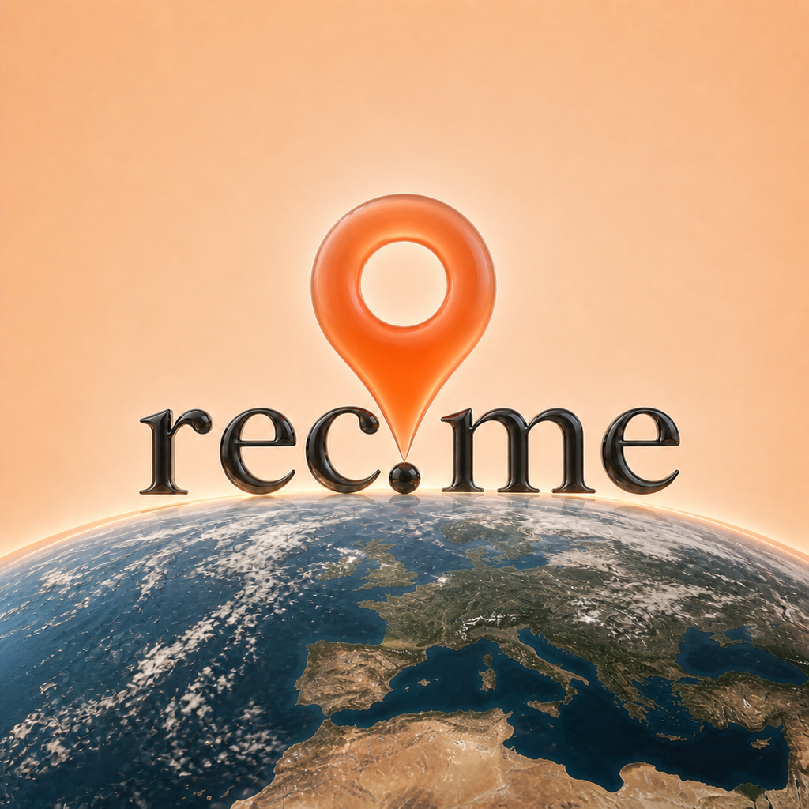
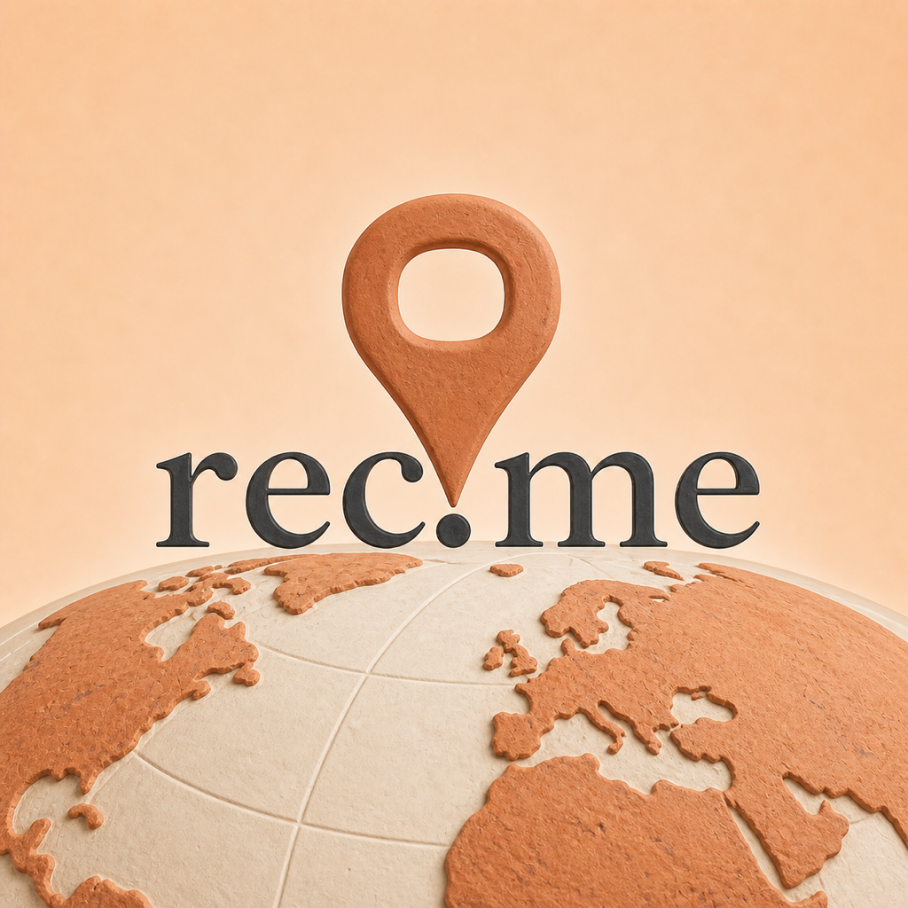
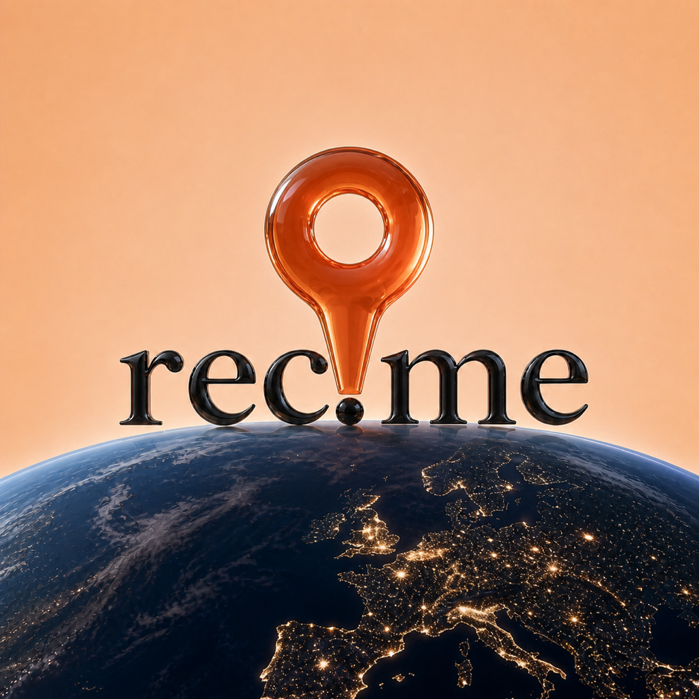
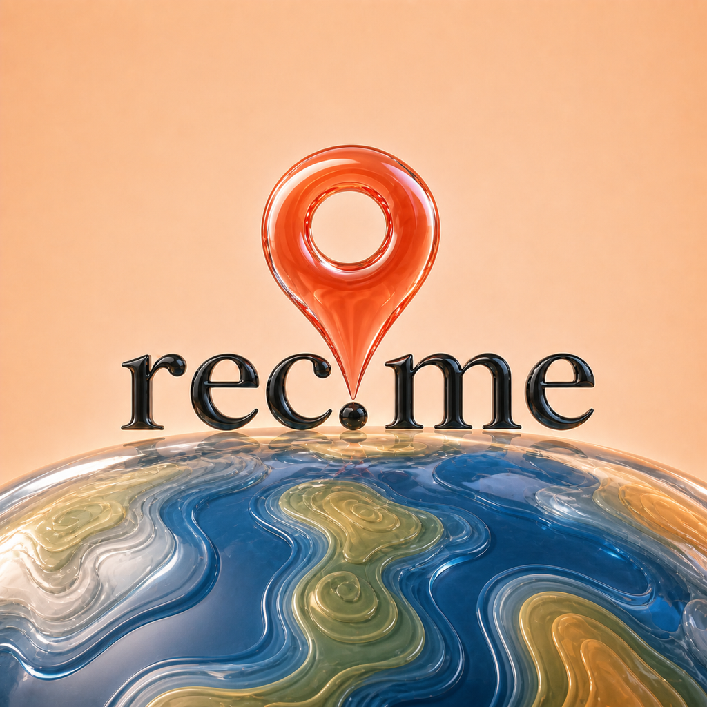
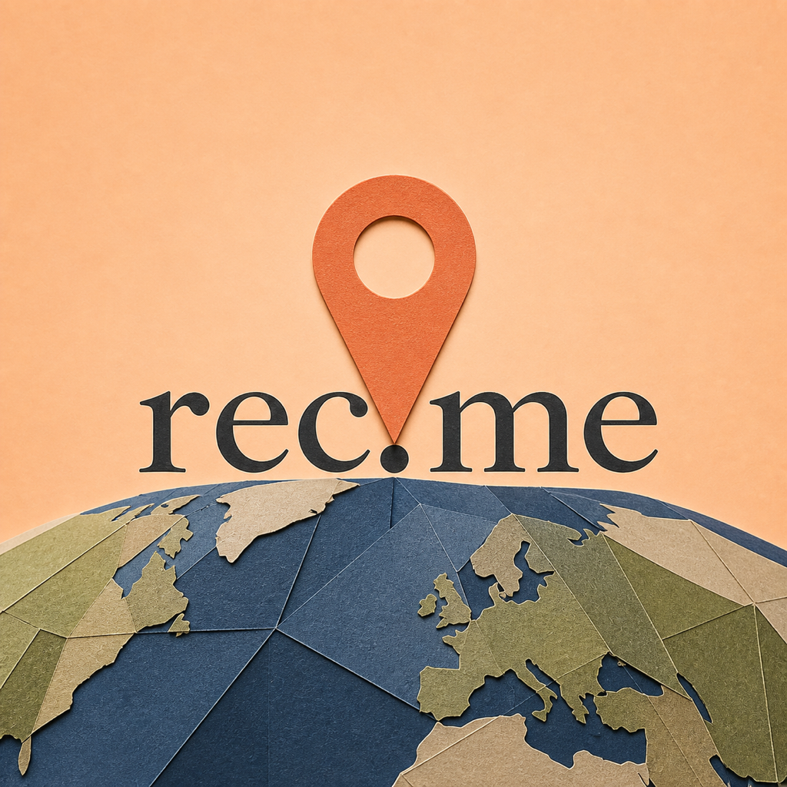
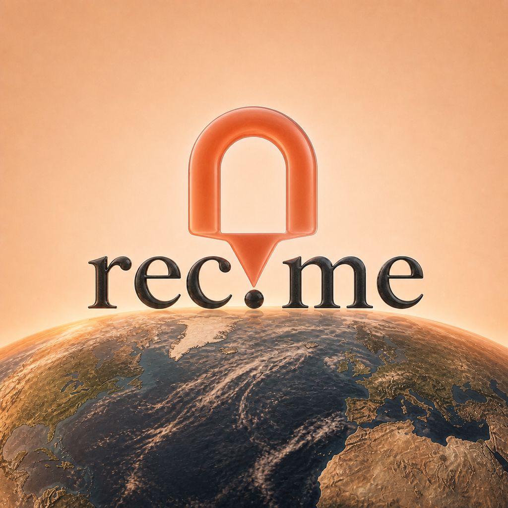
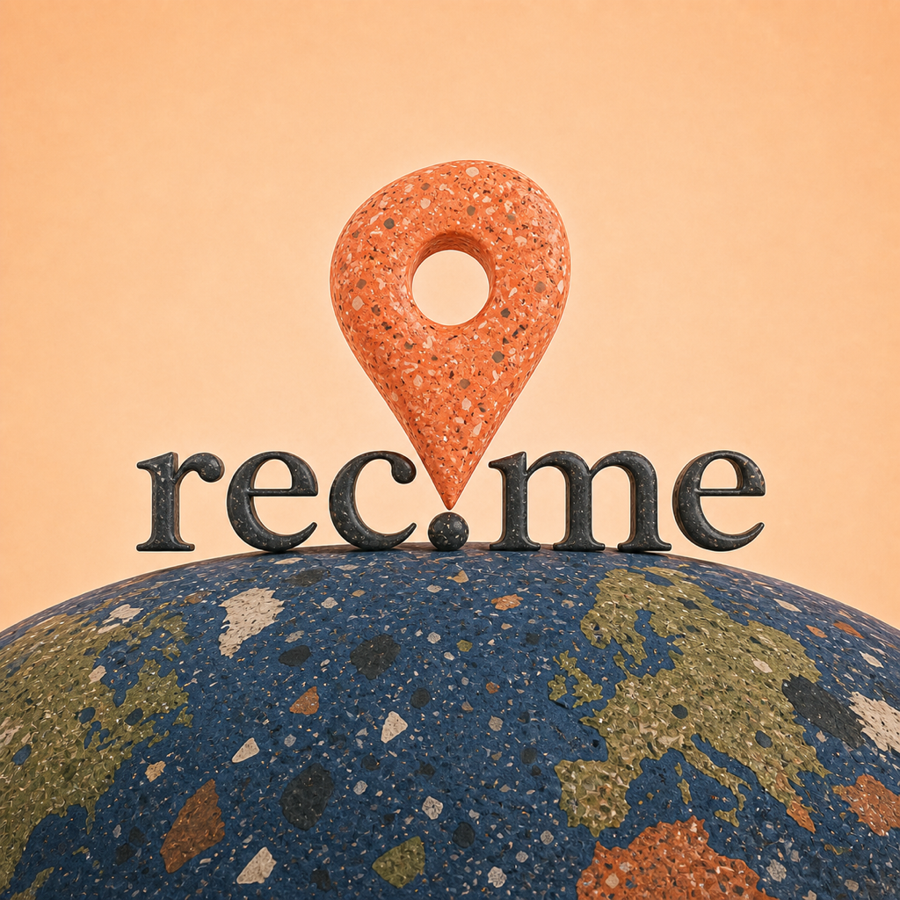
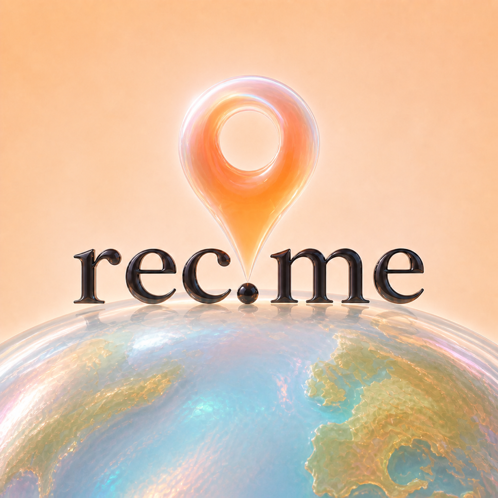
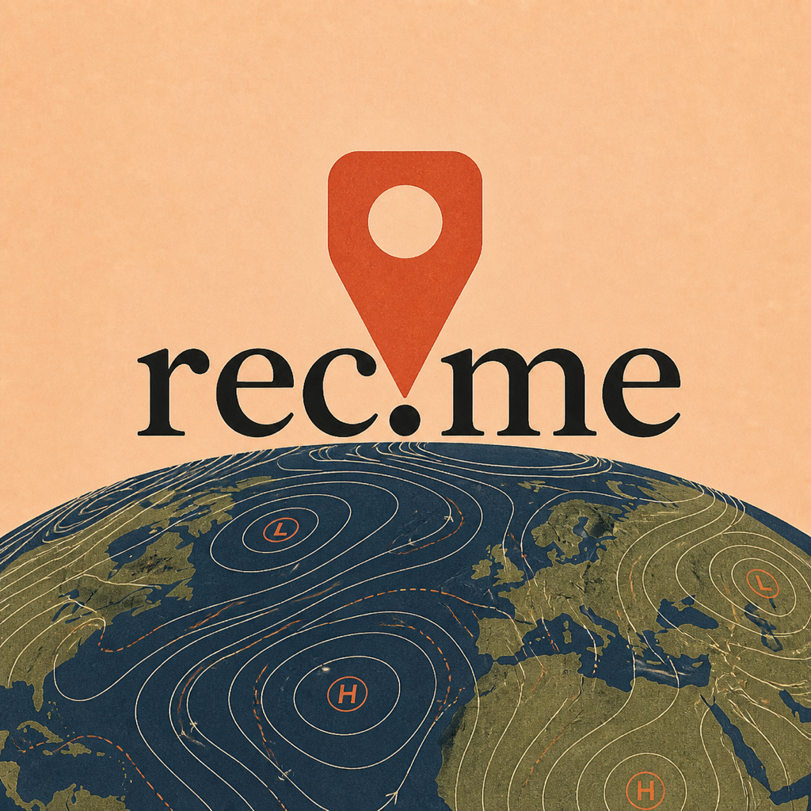
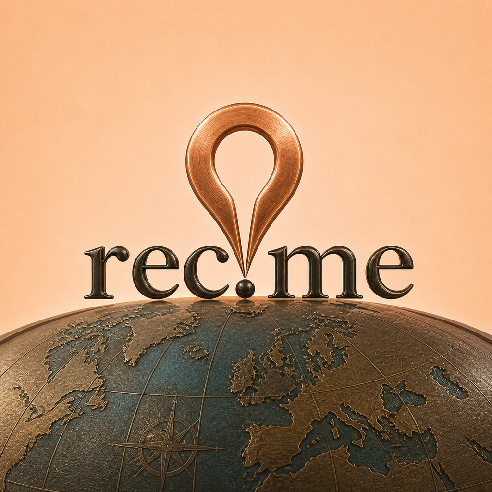

# REC-214 ten-direction creative riff

Status: concept exploration only. The production AppIcon remains unchanged.

This pass deliberately broadens the search space. Direction N is the loose
composition anchor, while the globe realism, marker silhouette, and material
finish vary from polished glass to plaster, paper, terrazzo, ink, and metal.

## R — Earth Observatory

The safest realistic evolution: daylight Earth, a wide frosted pin, and a
restrained glossy wordmark.

## S — Cartographer's Plaster

A fully matte sculptural atlas with raised terracotta continents and an
unglazed marker. Distinctive without becoming playful.

## T — Night Atlas

Nighttime Earth and a compact amber keyhole marker. High contrast and dramatic,
although the pin shape is less classically map-like.

## U — Topographic Pool

A poured-glass landscape of nested contour bands. This is the most expressive
Liquid Glass direction and still reads cleanly at 87 px.

## V — Folded Map

Layered cut paper, a flat terracotta pin, and printed typography. The strongest
unglossy graphic alternative.

## W — Horizon Dusk

A realistic golden-hour globe paired with a broad arched beacon rather than a
standard circular marker.

## X — Terrazzo Atlas

An intentionally tactile terrazzo world and pebble marker. Bold, warm, and
highly recognizable, but less refined than S at full size.

## Y — Opal Lens

A luminous opalescent globe with an inflated glass droplet marker. Beautiful at
large sizes, but the pin loses contrast at 87 px.

## Z — Inked Isobars

A matte editorial weather map with a stamped shield marker. The strongest
graphic concept, though it moves furthest from the original realism brief.

## AA — Brass Meridian

An engraved navigation instrument with an open copper horseshoe marker. Premium
and memorable, with a more heritage-luxury tone than the other directions.

## Small-size review

The `small-size/` folder contains 180 px and 87 px reductions.

- R is the clearest realistic and brand-continuous option.
- S is the most convincing fully matte direction.
- U has the best balance of creativity, Liquid Glass, and small-size clarity.
- V is the cleanest flat-material alternative.
- Z has the boldest graphic identity.
- Y is best treated as a full-size material reference rather than a finalist.

## Recommendation

Shortlist **U**, **S**, and **R**. Keep **V** as the no-gloss challenger and
**Z** as the deliberately graphic wildcard. Exact built-in image-generation
prompts are in `prompts.md`.
