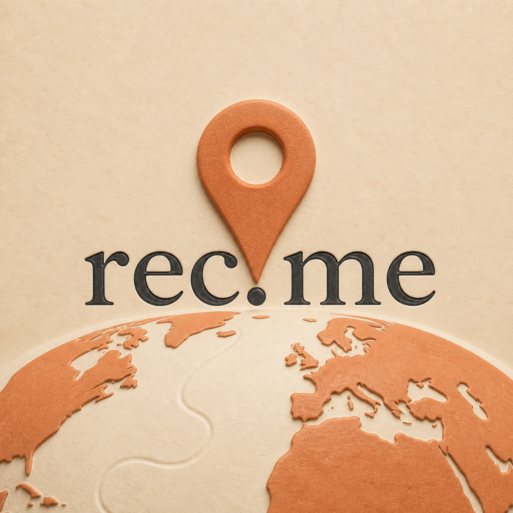
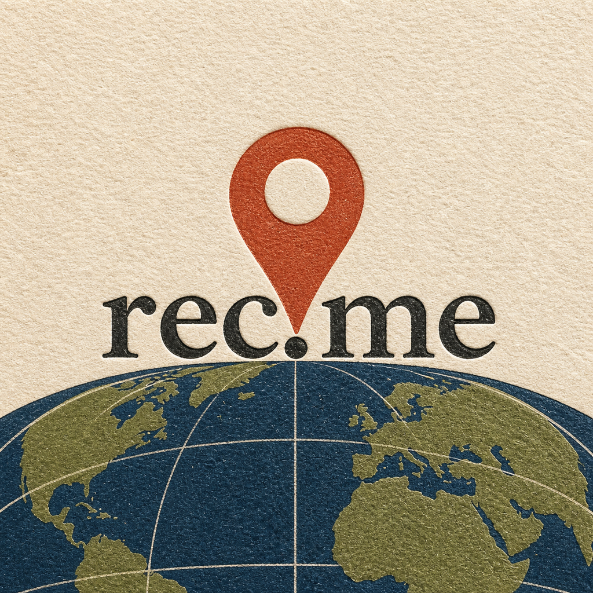
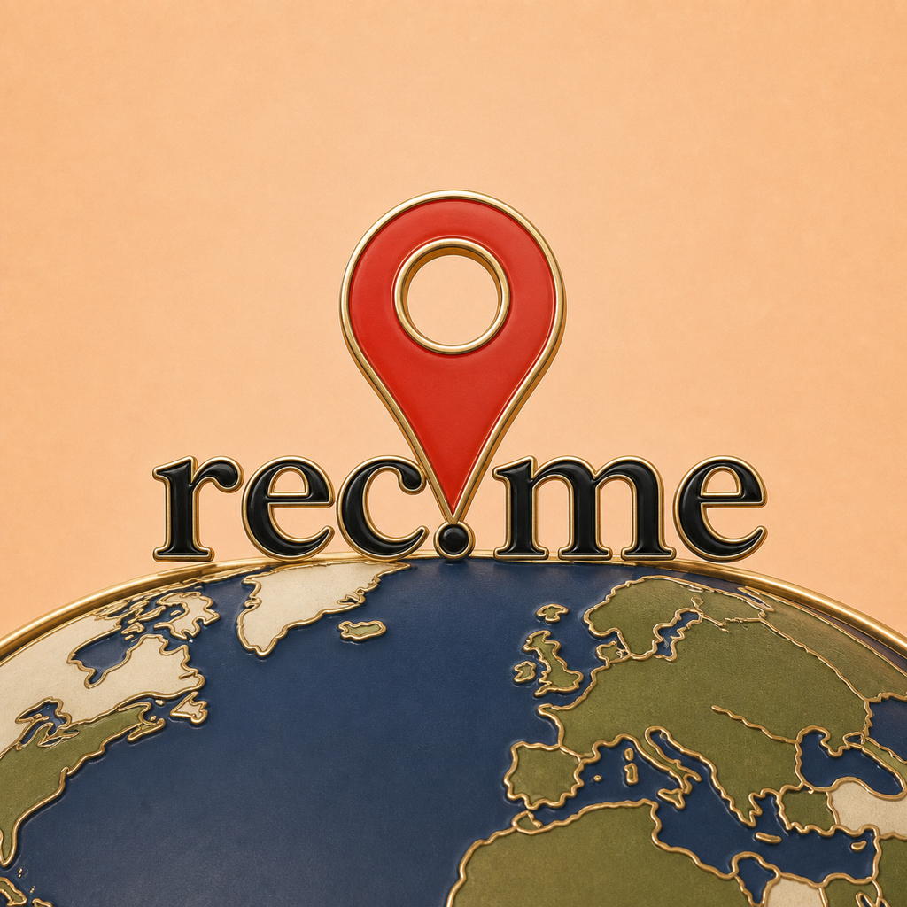
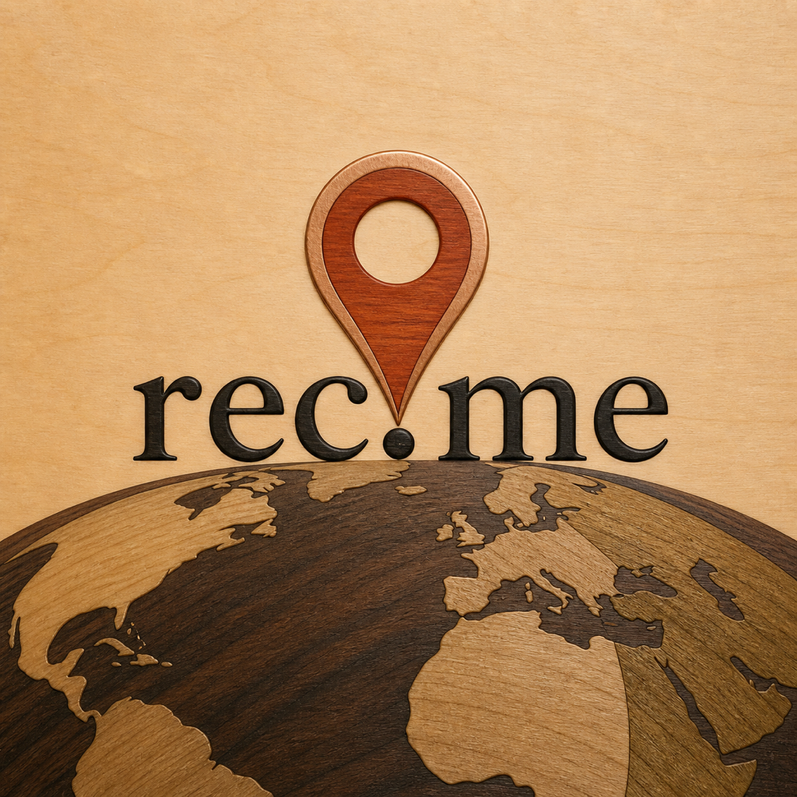
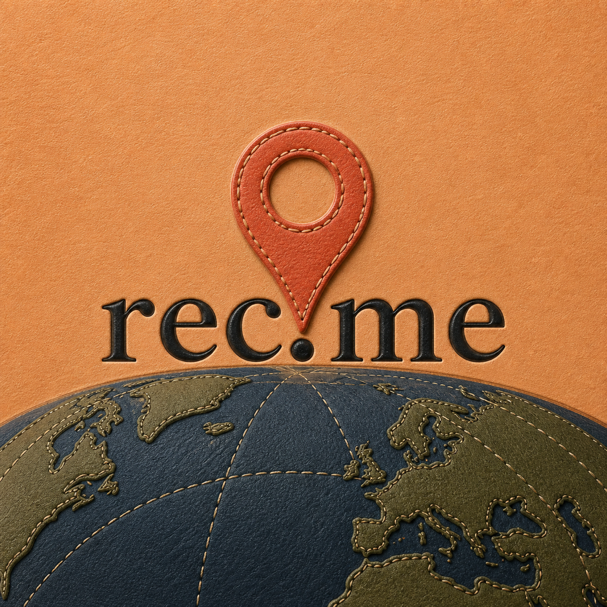

# REC-214 non-glass material pass

Status: concept exploration only. The production AppIcon remains unchanged.

This pass removes transparent glass, refraction, and liquid effects entirely.
Direction N remains the loose composition reference while every visible object
is rebuilt from an opaque physical material.

## AB — Bisque Relief

Matte ivory porcelain, raised terracotta land, and a solid clay marker. This is
the softest and most approachable three-dimensional option.

## AC — Letterpress Atlas

Cotton paper, deep ink, and a linocut marker. It is the clearest fully flat
direction and retains excellent contrast at 87 px.

## AD — Baked Enamel

Opaque enamel and fine brass dividers create a collectible travel-badge feel.
It has polish without translucency or Liquid Glass styling.

## AE — Walnut Inlay

Walnut, maple, ebony, and copper marquetry. Warm and premium, although it shifts
the identity toward crafted navigation and hospitality.

## AF — Leather-Bound Atlas

Vegetable-tanned leather, stitching, and debossed type. Tactile at full size,
but the all-warm canvas and dark globe compress at 87 px.

## AG — Slate Monument

Honed slate, limestone, basalt, and red sandstone. This is the strongest
low-sheen dimensional alternative to glass.

## Small-size review

The `small-size/` folder contains 180 px and 87 px reductions.

- AC has the cleanest hierarchy and strongest no-effects icon read.
- AD is the most immediately app-icon-like and retains the brand palette.
- AB is the best warm matte option.
- AG gives the composition depth without relying on gloss.
- AE remains legible but reads more like an artisan object.
- AF loses too much contrast when reduced.

## Recommendation

Advance **AC** and **AD** as the strongest non-glass challengers. Keep **AB**
for a softer matte direction and **AG** for dimensional weight. Exact built-in
image-generation prompts are in `prompts.md`.
