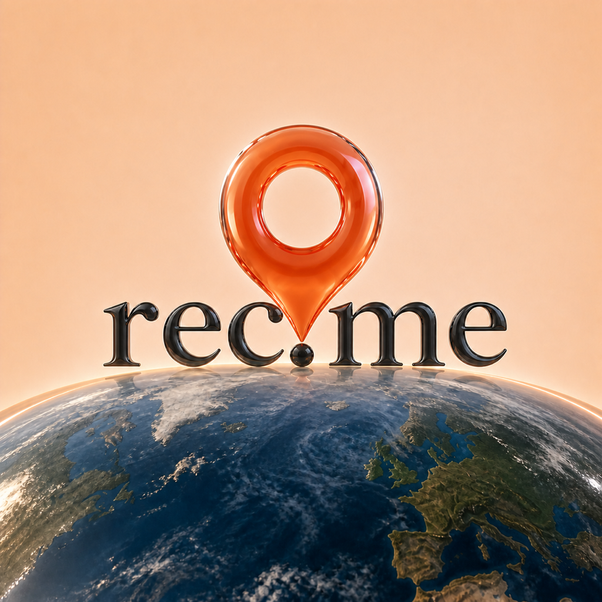
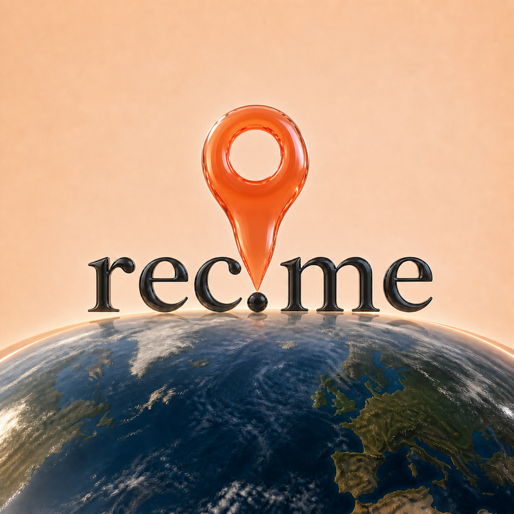

# REC-214 wider-pin iterations

Status: concept exploration only. The production AppIcon remains unchanged.

These four variants use Direction J as the base and focus on the user's note
that the pin is too narrow. The wordmark, period alignment, realistic globe,
warm canvas, and Liquid Glass treatment are intended to remain invariant.

## N — Wide classic

A familiar location-marker silhouette with a much broader ring and shoulders,
more body mass, and a shorter taper. This is the most balanced evolution of the
original pin.

## O — Rounded teardrop

Softer and more inflated than N, with broad shoulders and a smooth late taper.
It feels the most naturally liquid while remaining recognizable.

## P — Compact badge

The boldest option: an oversized circular badge with a short, wide lower body.
It has the strongest pin read at 87 px, although it dominates the wordmark more
than the other directions.

## Q — Organic pebble

A restrained organic alternative with a thicker stem and a subtly hand-shaped
glass outline. It stays closest to the source's scale while removing the
needle-like feeling.

## Small-size review

The `small-size/` folder contains 180 px and 87 px reductions.

- N has the best overall balance between the pin, wordmark, and globe.
- O feels the most premium and liquid, with slightly less visual authority.
- P is the clearest marker at 87 px but may be too dominant at full size.
- Q is the quietest change and the safest fallback.

## Recommendation

Advance **N** first and keep **P** as the bolder comparator. Exact built-in
image-generation prompts are in `prompts.md`.
