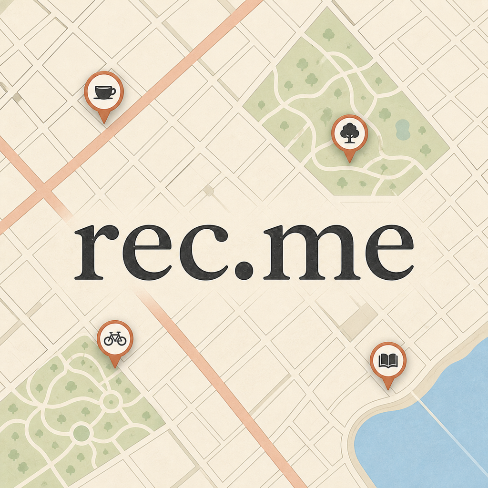
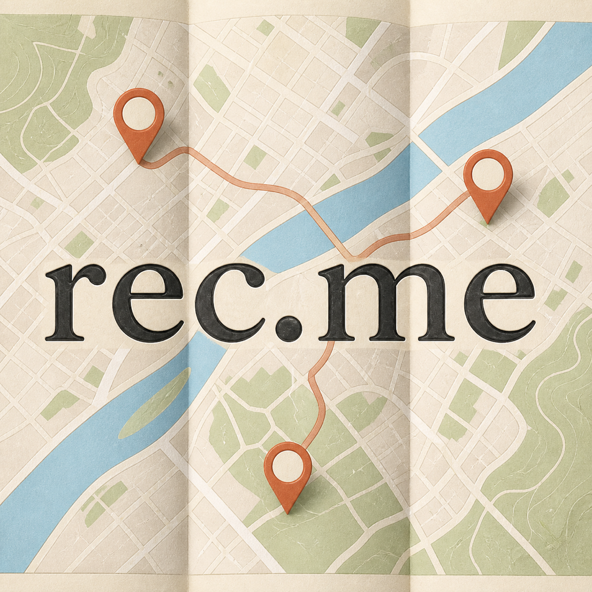
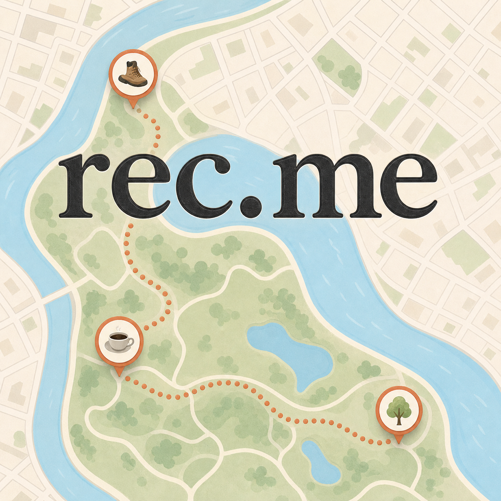
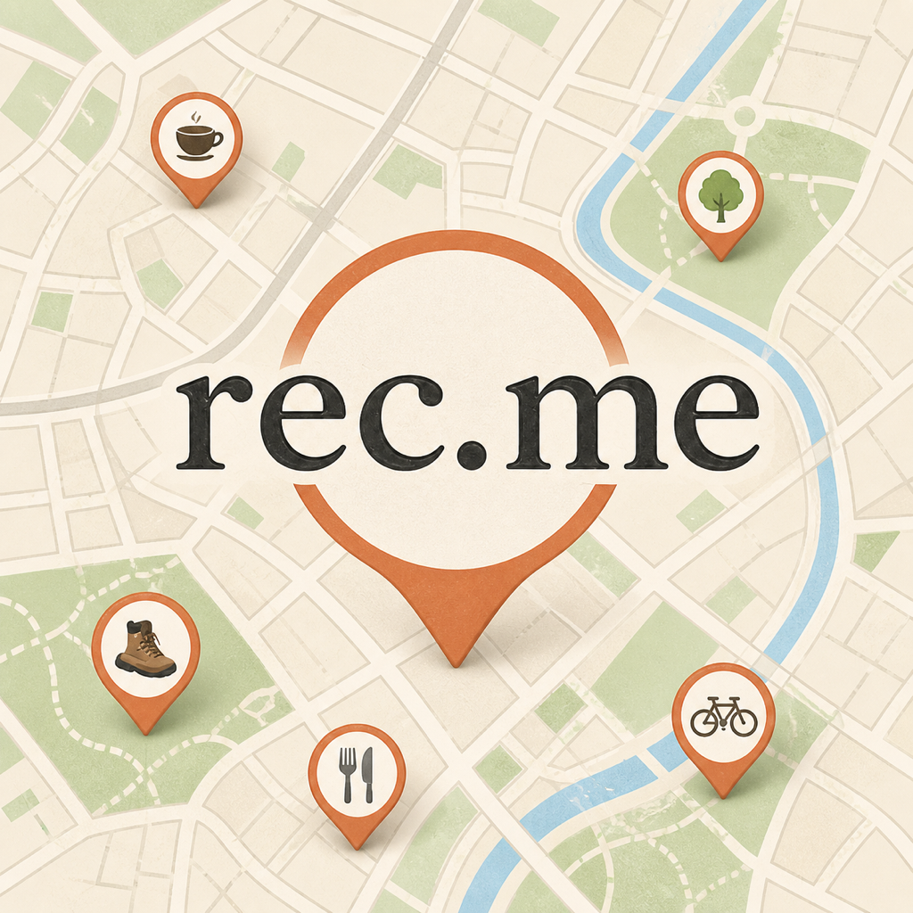
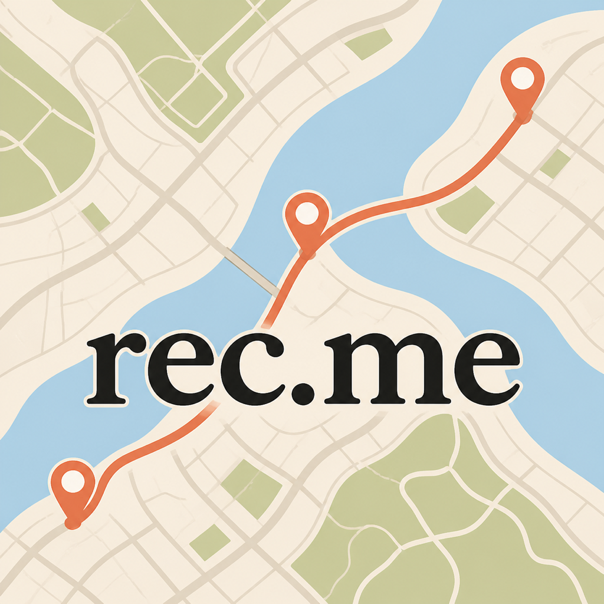

# REC-214 map-first app icon redesign

Status: concept exploration only. The production AppIcon remains unchanged.

This is a deliberate reset from the globe-and-pin family. Each icon uses a
full-bleed neighborhood map, several rec.me place markers, and the supplied
black book-serif `rec.me` wordmark as the primary overlay. The map palette and
marker language reference rec.me's own onboarding map artwork.

## AH — Neighborhood Grid

A classic diagonal street grid with parks, water, a coral avenue, and four
compact category pins. This is the safest and most immediately readable map.

## AI — Folded City Map

Three paper-map panels, a river, and a connected three-pin route. The folds
create the strongest navigation-icon cue without copying an existing icon.

## AJ — Park and Water

A green park peninsula and winding river dominate the composition, with three
trusted-place pins joined by a dotted walking path. This has the best balance
of map personality and wordmark clarity.

## AK — Pin Constellation

Five category pins surround one oversized central marker behind the wordmark.
The map stays recognizable, but the central marker becomes the main symbol.

## AL — Coral Route

A minimal river-and-land composition with a strong coral route joining three
pins. It is the boldest, highest-contrast option at small sizes.

## Small-size review

The `small-size/` folder contains 180 px and 87 px reductions.

- AJ has the best map/brand balance and the clearest environmental story.
- AL has the fastest read and strongest route silhouette at 87 px.
- AH is the safest classic map direction.
- AI remains legible, though the folds add background contrast behind type.
- AK is distinctive but the oversized center marker competes with the name.

## Recommendation

Advance **AJ** first, with **AL** as the bolder comparator and **AH** as the
conservative route. Exact built-in image-generation prompts are in
`prompts.md`.

## Tight Liquid Glass follow-up

Ryan selected AH–AK for an Apple Icon Composer pass, then asked for closer map
crops and only one or two pins. The finished editable `.icon` documents,
Composer-rendered review PNGs, 180/87 px checks, and exact source-edit prompts
are documented in [`icon-composer/`](icon-composer/README.md). `rec.me` stays
locked to the center in every direction.

Two zoomed-out AH Composer variants are included as well: one preserves the
original black category glyphs, and AM replaces them with the exact in-app
`☕️`, `🌳`, `🚲`, and `📚` emoji set.

AN adds a location-specific Santa Monica coast iteration using only the
reference map's street, beach, ocean, and park geometry. All source labels were
excluded, and the four pins use the app's `🍽️`, `🌳`, `🥐`, and `🏖️` emoji set.
