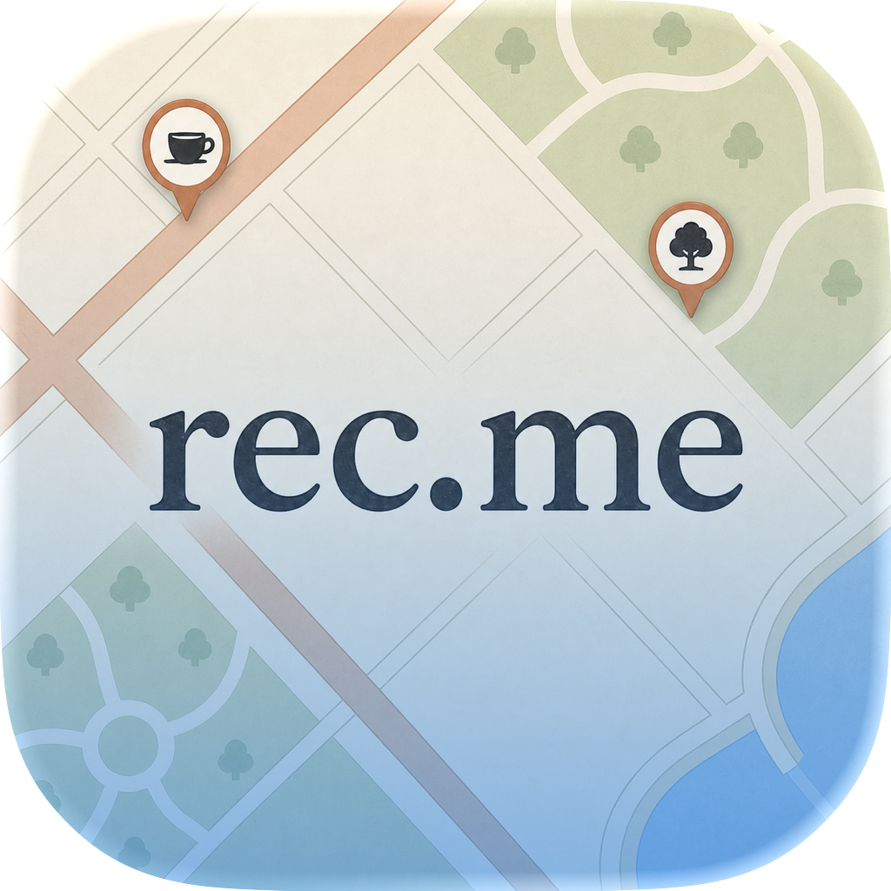
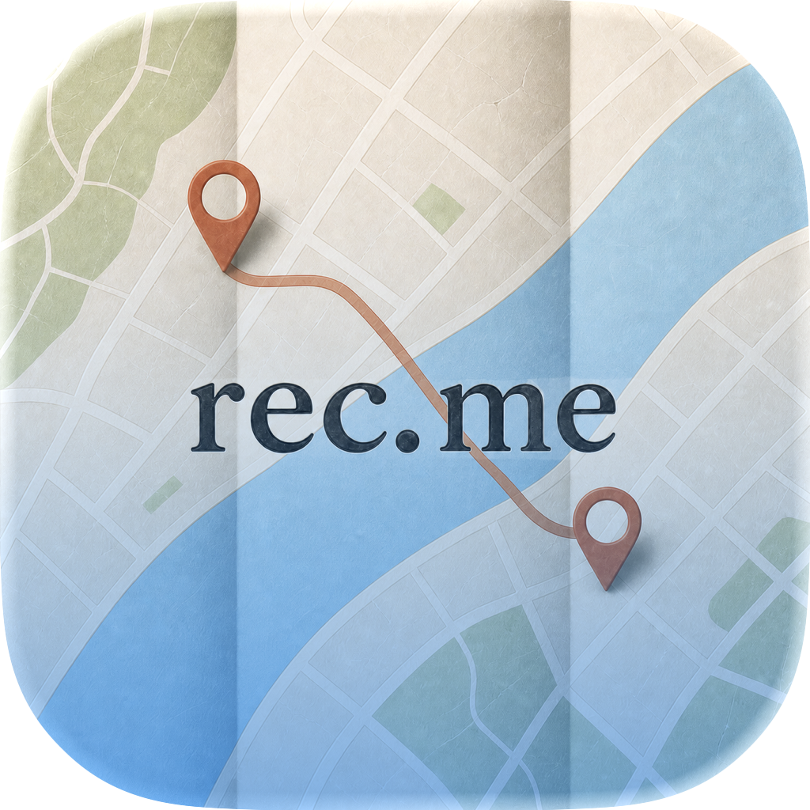
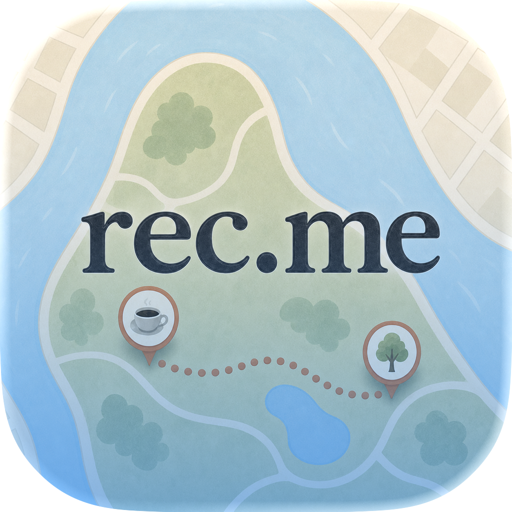
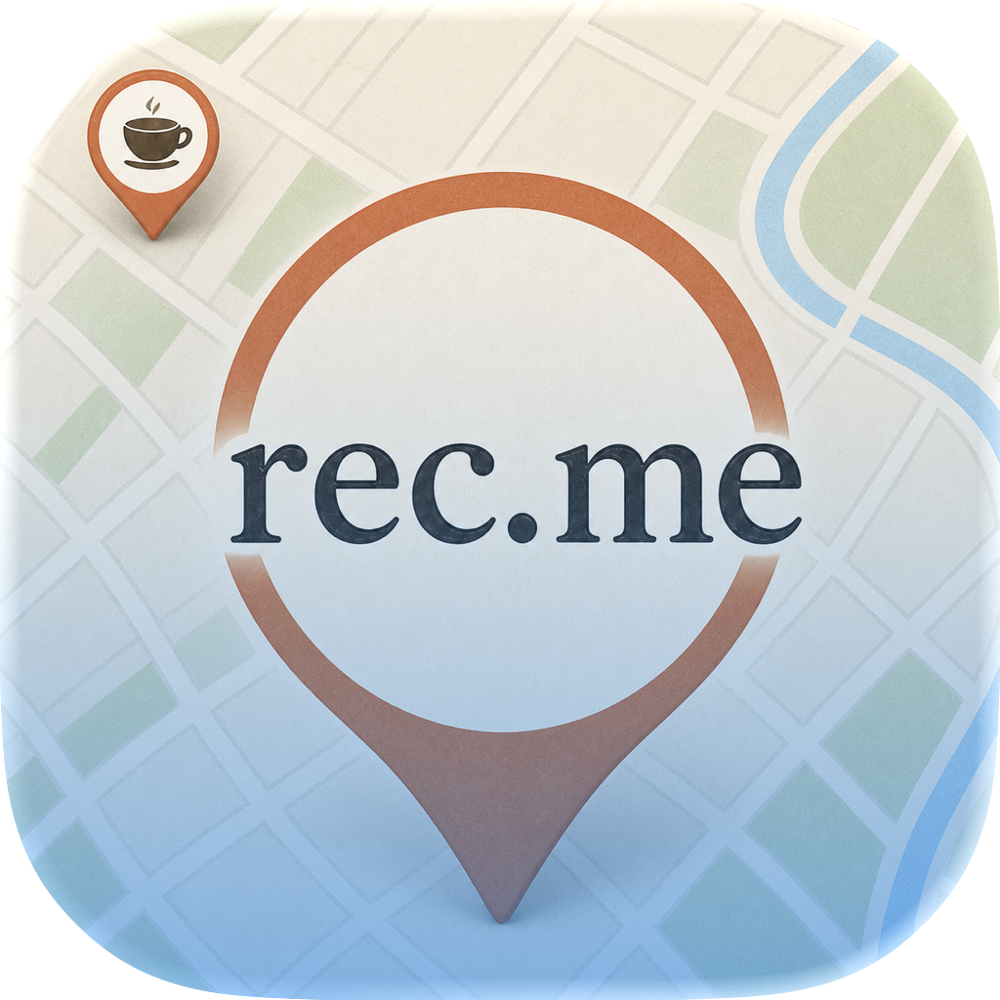
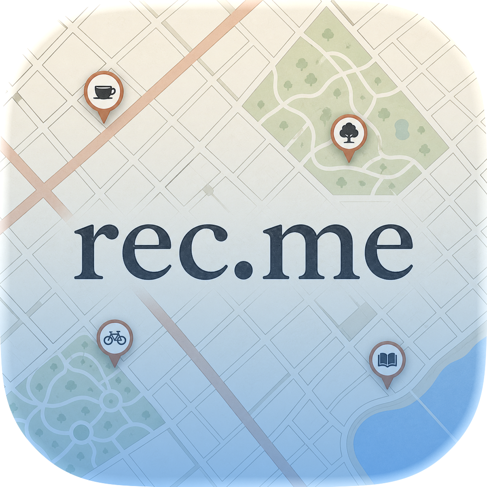
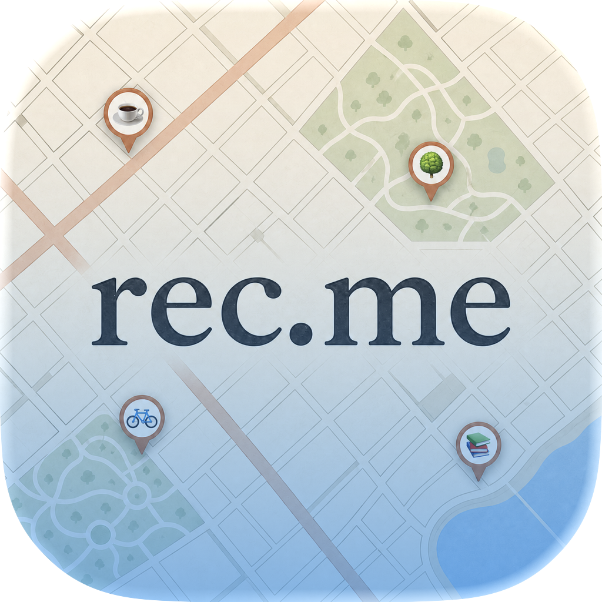
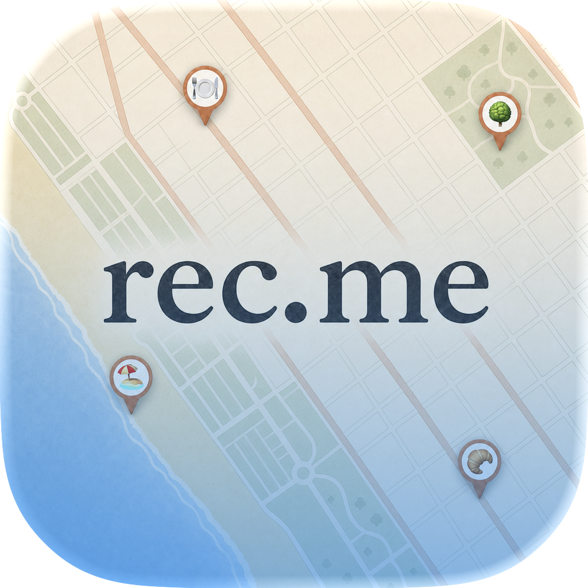

# Liquid Glass Composer pass

Status: concept exploration only. These files do not replace the canonical
production `AppIcon` master.

Ryan's follow-up asked for a closer map crop, fewer background details, only
one or two pins, and a `rec.me` wordmark that never drifts away from the center.

## Final review exports

### AH — Close neighborhood

Two category pins, one coral avenue, two large park shapes, and a cropped water
edge. This is the safest general-purpose direction.

### AI — Close folded crossing

Two route endpoints around one river crossing. The wordmark was reduced after
the first Composer render so refraction retains comfortable side bearings.

### AJ — Close park route

Two trusted-place pins and one short dotted path on a broad park-and-water
shape. This has the calmest background and strongest map personality.

### AK — Close hero pin

One oversized central pin plus one partially cropped coffee pin. This is the
boldest and most symbolic option.

## Zoomed-out review exports

### AH — Original category glyphs

This preserves the original Neighborhood Grid framing and its four black
category glyphs, while applying the same Apple Icon Composer material recipe
as the tight finalists.

### AM — In-app category emojis

This keeps the same zoomed-out map and centered wordmark, but replaces the four
pin-center glyphs with the app's native emoji vocabulary: `☕️`, `🌳`, `🚲`, and
`📚`. Their source values are defined by `WanderPlaceCategory`/
`WanderPlaceEmojiResolver` and rendered in-app by `WanderCategoryEmoji`.

### AN — Santa Monica coast

This redraws the reference's diagonal Santa Monica coast, beach, street grid,
and park placement in rec.me's warm paper-map language. It contains no copied
map labels or place names: only centered `rec.me` plus `🍽️`, `🌳`, `🥐`, and
`🏖️` pins at the four requested relative locations.

## Apple Icon Composer recipe

Editable documents live in [`final/`](final/). Each document uses one full-
bleed source layer inside a descriptively named Liquid Map group.

- Layer layout: x `0 pt`, y `0 pt`, scale `100%`.
- Group mode: Individual.
- Specular: on.
- Blur material: on, `50%`.
- Translucency: on, `50%`.
- Shadow: Neutral, `50%`.
- Review light angle: `-45°`.

The wordmark is baked into each 1024 px source at the exact canvas center, and
the Composer layer has no translation or independent scaling. This prevents
the mark from shifting between renditions.

The static review PNGs in [`../composer-export/`](../composer-export/) were
rendered by Icon Composer's bundled `ictool` using the iOS Default rendition at
1024 px. They intentionally include Apple's preview mask and alpha outside the
mask; use the editable `.icon` documents—not the preview PNGs—for any future
implementation. The 180 px and 87 px checks live in `composer-export/small-size/`.

Validation: all seven source masters are opaque 1024 × 1024 PNGs, every final
document references its expected source asset, and all seven Apple-rendered
exports passed 180 px and 87 px visual review. For the four tight renders, a
central-band pixel scan placed the dark wordmark center within 34 px of the
512 × 512 canvas center; the three zoomed-out/coastal iterations retain the
centered source wordmark with a zero-translation Composer layer.

## Recommendation

Advance **AJ** first. It remains unmistakably map-first at 87 px while the
reduced pin count and broad river/park shapes keep the Liquid Glass treatment
from turning into visual noise. Keep **AK** as the strongest symbol-forward
challenger.
