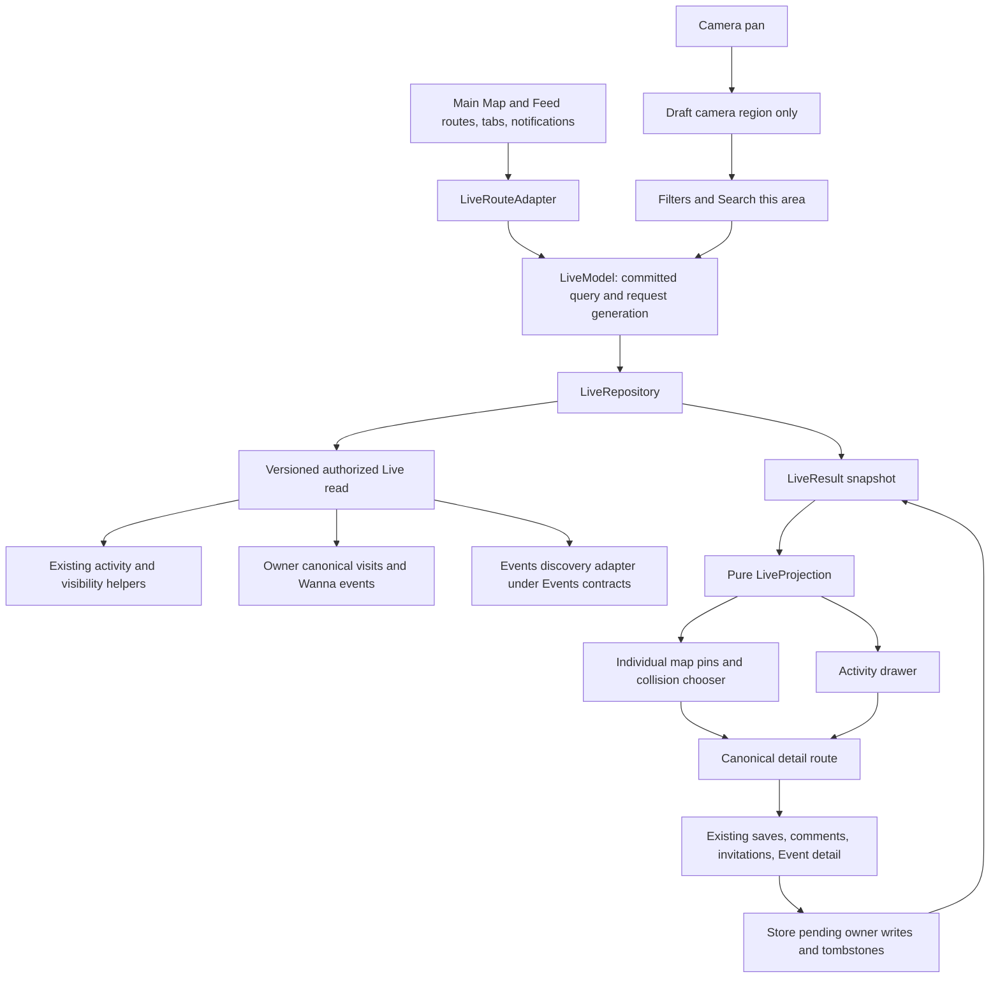
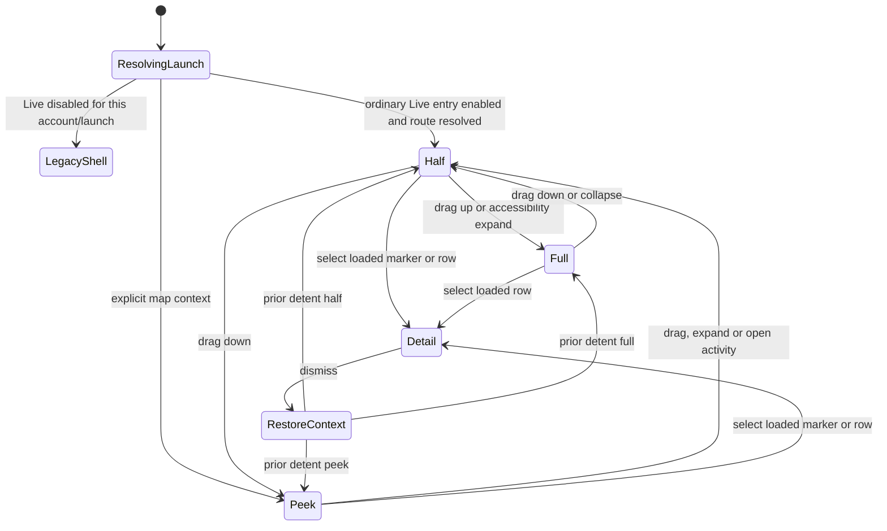
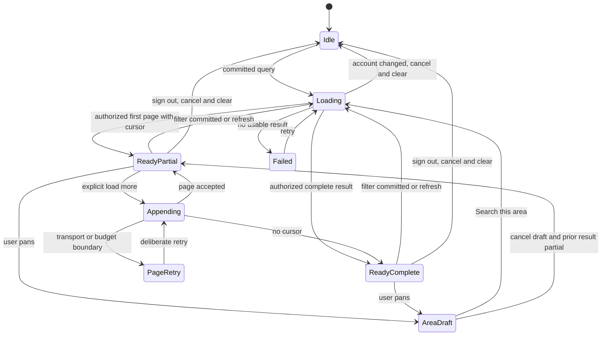
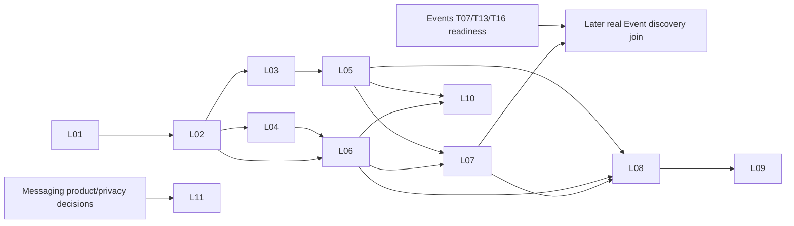

# REC-636 — Live engineering proposal

**Status: proposal for review, not implementation or approval of new visibility.** Reviewed checkout HEAD: `2800caabaeea039c7c6f6d70538e647ad90e2c9c`, October 9, 2026. This is a read-only source assessment plus a local planning artifact; no build, runtime measurement, hosted query, schema change, migration, or release was performed. Rebase the implementation plan against current integration `origin/main`, active issues/PRs, and worktrees before editing product code. Line references below belong to this checkout and will drift.

The proposed change is one SwiftUI Live surface: a persistent map and a draggable activity drawer with peek, half, and full states. Proposed primary tabs are **Live / Lists / Profile**; Add remains an action. Feed and the main map become two presentations of one query. **Profile has no major changes: its existing hierarchy, Your Map destination, owner/member Patterns, calendar and associated flows remain in place by default.** Selected Your Map capabilities may be reused or migrated into Live only after reviewing the exact capability inventory; this does not authorize replacing Your Map or redirecting its entry. Events discovery joins Live through the existing Events contract. This proposal does not redesign booking, ticketing, admission, recap, or Event lifecycle. The latest Profile-preservation clarification governs this plan; the companion `product-spec.md` contains the broader recommendations, whose unresolved decisions, including D11's proposed offline lease, still require review.

## 1. What the code does today

| Verified current fact | Source at reviewed HEAD | Implementation consequence |
| --- | --- | --- |
| Actual visible navigation is Map, Feed, optional Events, Lists, Profile. Feed retains raw enum `.discover`; `.add` exists but is not a primary tab. Add is a presented sheet. | `Wander/App/WanderRootView.swift:516`, `:2828`, `:3848` | Changing only tab labels would strand routes, walkthroughs, analytics, and foreground entry. Add a route adapter before changing the shell. The older four-tab overview is not current runtime truth. |
| Ordinary eligible foreground entry deliberately hands off to Feed; explicit destinations and active flows take precedence. | `Wander/App/WanderRootView.swift:2261` | Adapt default entry to Live without overriding notifications, in-progress Add, invitations, or explicit user navigation. |
| Feed audiences are Everyone, Only Me, Only Friends; the last means mutual follows. Selection is session-only and resets when Feed becomes active. | `Wander/Services/FeedModels.swift:3`; `Wander/Features/Feed/FeedScreen.swift:121` | Preserve semantics through migration; do not equate old Map Friends with Feed Only Friends. |
| `activity_feed` scopes Everyone to the owner plus followed actors, and Only Friends to mutuals. Current source/event visibility and bilateral blocks are enforced before cursor and limit. This is not all nearby members. | `supabase/migrations/20260923015217_feed_audience.sql:52` | Nearby is a geographic constraint on permitted records, never a new person-discovery grant. |
| `FeedRepository.activityFeed(audience:before:limit:onContent:)` exists. The API has no geography, time, type, or shared map projection. First text arrives before optional media. | `Wander/Services/RepositoryProtocols.swift:2008`; `Wander/Services/Remote/SupabaseRepositories.swift:707`, `:714`, `:797` | Reuse staged content delivery; a complete Live query needs a new compatible read contract. Client-side filtering of one Feed page cannot implement it. |
| Feed events have immutable IDs/kinds and `occurredAt`; grouping is display-only. Default page size is 20, server bound is 50. Featured implementation exists but Feed's `showsFeaturedPlaces` is false. | `Wander/Services/FeedModels.swift:26`, `:82`, `:133`, `:179`, `:237` | Preserve original event/visit targets for likes, comments, links and deletion. Do not describe Featured as a visible Feed rail. |
| Feed pagination fences account, audience and request identity, rejects repeated cursors, and preserves edits during append. Its fill-to-tile loop has no explicit aggregate page/time cap. | `Wander/Services/WanderLocalStore.swift:1732`, `:2631`, `:2702` | Carry forward these protections and add hard request/time budgets, especially when records group or become unauthorized. |
| Map has its own sources/refinements and local social projection. A real `MKMapView` is wrapped by `NativeMapView`, with virtualized annotations and a viewport index. Map Friends draws from following. | `Wander/Features/Map/MapScreen.swift:1542`, `:1599`, `:6723`, `:8797`, `:8839` | Reuse the native renderer inside SwiftUI. Do not duplicate a second map controller or keep Map and Feed independently loading under one visual shell. |
| Owner Your Map is derived from `currentUserCalendarProjection`. The store merges authoritative remote owner data with pending local edits and visits. | `Wander/Features/Profile/ProfileScreen.swift:536`; `Wander/Services/WanderLocalStore.swift:101`, `:1642` | Owner history must retain offline pending records, aliases and tombstones. It is not a cosmetic query over the current Feed page. |
| Current Your Map groups canonical place aliases, keeps mixed Check-in/Wanna status, and computes latest visit summaries. It is a place projection, not a lossless historical event timeline. | `Wander/Features/Profile/YourMapPrototypeModels.swift:204`, `:364` | Preserve this existing destination. If unique-place browsing is selected for Live reuse, keep one marker/row per canonical place and original individual history; do not use the latest-visit summary to filter all history. |
| Visits carry `visitedAt` separately from `createdAt`; repeat Wannas have stable IDs, `occurredAt`, planned date and deletion tombstones. | `Wander/Models/LocalModels.swift:387`; `Wander/Models/PlaceWannaSave.swift:3` | Historical filters must use action/visit time. Ingestion or sync time must never silently become the visit date. |
| Member maps use that member's visibility-scoped Profile presentation, distinct from the owner's calendar projection. | `Wander/Features/Profile/ProfileScreen.swift:995`, `:1106` | A member-map route cannot request the privileged owner projection. Keep its separate authorization scope. |
| Saved lenses are view `@State`. Sharing a map produces a profile route; it is not a durable, portable filter link. | `Wander/Features/Profile/YourMapPrototypeScreen.swift:138`, `:259` | Do not promise existing saved-lens migration or working shared filter links. Durable lenses would be new scope. |
| Snapshot captures the mounted map and saves owned places into a persistent stealth list. | `Wander/Features/Profile/YourMapPrototypeScreen.swift:391`, `:454`; `Wander/Services/WanderLocalStore.swift:3602` | Preserve Snapshot in Your Map and its existing lists/covers. If selected for Live reuse, “Save visible places as list” is an additional owner overflow action using the complete filtered owned projection intersected with the mounted viewport; relocating/removing the Profile action requires a separate explicit decision. |
| Events currently has an LA home-metro gate and launch-interest teaser. The access read obtains home metro, not GPS. | `Wander/Features/Events/EventsAccessModel.swift:4`; `Wander/Services/Remote/EventsAccessRepository.swift:12`; `Wander/Services/Remote/EventsInterestRepository.swift:11`; `Wander/App/WanderRootView.swift:547` | Live can relocate this entry, but cannot pretend full event discovery is already implemented or replace eligibility with viewport location. |
| Real place-plan APIs create an invitation, resolve a token, fetch the recipient inbox and open an invitation. The draft supports a suggested date and a personal message. | `Wander/Services/Remote/PlacePlanInvitationRepository.swift:4`, `:50`; `Wander/Features/Profile/CommonGroundInvitationDraft.swift:5` | Reuse the invitation journey for Wanna → plan; do not build a duplicate invitation system. |
| Activity engagement supports comments/likes. No private two-party conversation repository or messaging schema was found in the inspected production Models/Remote/RepositoryProtocols/migrations; Common Ground message mockups are not such a backend. | `Wander/Services/RepositoryProtocols.swift:2043`; `Wander/Features/Profile/CommonGroundMessagesMockup.swift` | Private contextual replies require a separately scoped feature and security design. Existing comments must not be relabeled private. |

## 2. Scope and product decisions

**Proposed for the first Live release:** unified main map/Feed shell; shared activity/map query; semantic filter controls; explicit Search this area; retained Add, list, comment/share and plan routes; compatible Events entry; route/NUX migration; launch-frozen rollout; rollback. Profile and Your Map remain their existing destinations. Additional Live owner-map capabilities depend on the selected reuse inventory below, not a wholesale Profile migration.

**Explicitly retained:** existing Profile hierarchy and entry/return behavior, Your Map, owner/member Patterns and lenses, calendar, Snapshot, account and social visibility, canonical place IDs, visit and Wanna event IDs, user notes/ratings, audience choices, lists, saved drafts, invitations, pending sync, block behavior and previously completed onboarding. This is a main-map/Feed navigation/read-model migration, not a Profile redesign or user-data reset.

**Decision gates before public activation:**

| Gate | Proposed review default | Why a decision is needed |
| --- | --- | --- |
| Social label and default audience | “Following + you” accurately names today's Everyone scope; separate “Friends” means mutuals; “Only me” means owner. | Existing Feed and Map use different Friends semantics. Labels cannot settle a new privacy policy. |
| Default time/geography and return behavior | Following + you / everywhere / past 7 days, half drawer. Nearby starts at an explicit 5km area with user-elected expansion up to 25km. If selected for Live, Your places would be owner / all time / all areas / unique places, alongside existing Your Map. | These are concrete review recommendations, not existing defaults or continuous GPS-following behavior. Live's owner capability inventory remains open. |
| Selective Your Map reuse | Keep Profile and Your Map intact; approve individual shared capabilities or additional Live affordances separately. | Sharing a renderer/projection is an implementation choice; moving a user-facing capability or changing a Profile entry is a product decision. No automatic redirect, Patterns extraction or wholesale relocation. |
| Future Events versus past activity | Distinct Upcoming and Activity sections within the same drawer/result envelope, with clearly labeled dates and independent bounded continuation inside one cursor. | Future start dates should not masquerade as recent actions, and a popularity score must not silently replace chronological history. |
| Global nearby-person discovery | **Not approved and excluded.** | Existing RLS/social grants do not authorize it. A separate product/privacy decision and schema review would be required. |
| Events availability and map styling | Preserve current market access while Events owners resolve relevant handoff policies. | Relocating discovery does not approve second-degree attendance, changed home reveal rules, new default event window or pin precedence. |
| Private reply recipients, source revocation, retention and safety | Separate later-phase decision record. | New direct messaging needs recipient eligibility, blocking/reporting, deletion/retention and delivery semantics. |
| Plan lifecycle | First reuse invitation creation/opening; acceptance, coordinated scheduling, groups or calendar synchronization are separate decisions. | Today's message/date invitation is not a mutually confirmed plan. |
| Live offline social access lease (D11) | Hide other-person content in the **new Live cache** after 15 minutes since successful access validation; owner offline policy retained. | An offline client cannot detect unseen remote revocation. This bounds Live staleness without promising immediate remote recall. Product approval is required; applying a lease to existing shared caches, Profile or Your Map requires separately explicit scope. |

### Your Map capability inventory for review

| Capability | Default retained location/behavior | Candidate Live reuse; still to decide |
| --- | --- | --- |
| Native renderer, canonical-place grouping, visibility-scoped projections | Existing owner/member Your Map behavior | Share low-level components or read adapters without moving the destination; validate both consumers |
| Owner unique-place browsing and individual visit/Wanna history | Profile → Your Map | Optional additional Your places preset in Live; decide whether needed and which history/detail controls accompany it |
| Filters, month/year ranges and session-only saved lenses | Existing Your Map/Patterns scope and state | Select useful Live filters individually; Profile and Live state remain independent by default. Any explicit one-time handoff needs review and must not silently mutate either retained context |
| Snapshot / persistent stealth lists | Existing Your Map Snapshot action and saved lists | Optional Live overflow reuse; preserve complete-owner-projection and viewport semantics; no removal or relocation by default |
| Share map card/profile link | Existing Profile/Your Map share behavior | Optional Live share affordance using the same truthful link; no promised portable filter URL |
| Patterns, member map, calendar, streaks, graph/settings/edit flows | Existing Profile hierarchy and navigation | Preservation/regression coverage only by default; any proposed user-facing move requires a separate named review decision |

For each selected capability, record **retain only / reuse in both / move an explicitly named affordance**, its source anchor, state/return contract, permission boundary, test coverage and owner. Unselected capabilities stay unchanged. Code reuse does not require making Profile a client of `LiveRouteAdapter`.

## 3. Architecture and data flow

Create a focused `Features/Live` module. `LiveScreen` owns layout; `LiveModel` owns query and presentation state; a repository owns authorized reads; a pure projector derives both list rows and map annotations. The existing store remains the writer for ordinary saves/check-ins/lists and the authoritative local owner overlay. Existing Profile/Your Map remain independently routed consumers; extracting a shared renderer or projection must preserve their current behavior. No SwiftUI view calls Supabase or Clerk directly. If Live Snapshot reuse is selected, it uses a separate explicit completeness boundary over the same owner filter semantics: a proposed `completeOwnerSnapshot(lens:)` adapter returns an authoritative complete owned projection or a retryable incomplete result. Reuse current full owner hydration, then intersect with the mounted map's projected geometry; do not run this full fetch on every pan or truncate it to Live's working window. This proposed adapter does not require moving Snapshot out of Your Map.



The diagram is a proposed dependency boundary, not an assertion that a Live RPC or full Events repository exists. Start with fixtures and adapters for comparison; production geographic/time filtering must run before pagination in the authoritative read.

### Proposed types

Names and signatures in this section are new proposals. `ownerHistory`, `memberHistory`, `uniquePlaces` and `ownerLens` describe optional extension seams for individually selected Live reuse; they do not mandate a Profile route change or inclusion in the first slice. Keep value types immutable/`Sendable` where appropriate; copy SwiftData records into value snapshots on their owning actor before background projection.

```swift
struct LiveQuery: Hashable, Codable, Sendable {
    var scope: LiveScope                  // network, ownerHistory, memberHistory
    var resultKind: LiveResultKind        // activityRecords or uniquePlaces
    var audience: LiveAudience            // followingAndSelf, mutuals, onlySelf
    var geography: LiveGeography          // all, namedArea, bounds, circle
    var time: LiveTimeWindow              // allTime or explicit [from, until)
    var kinds: Set<LiveRecordKind>         // checkIn, wanna, legacySave, collectionUpdate, event, discovery
    var categoryIDs: Set<String>
    var personIDs: Set<String>            // narrows permitted audience only
    var ownerLens: LiveOwnerLens?         // status, city/country, tags, rating, repeats
    var sort: LiveSort                    // explicit, valid for scope/section
}

enum LiveScope: Hashable, Codable, Sendable {
    case network
    case ownerHistory                    // server derives current owner
    case memberHistory(profileID: String) // ordinary authorized projection
}

enum LiveGeography: Hashable, Codable, Sendable {
    case all
    case namedArea(id: String, boundaryVersion: Int)
    case bounds(GeoBounds)                // handles antimeridian explicitly
    case circle(center: GeoCoordinate, radiusMeters: Int)
}

struct LiveRecord: Identifiable, Sendable {
    let id: LiveRecordID                  // namespaced original stable ID
    let source: LiveSourceReference       // activity/visit/wanna/event/place reference
    let canonicalPlaceID: String?
    let happenedAt: Date?                 // event/visit time; nil if genuinely unknown
    let dateProvenance: LiveDateProvenance // actual, userSupplied, legacyEstimated, unknown
    let eventInterval: DateInterval?      // future Event dates are not feed action time
    let location: LiveAuthorizedLocation? // permitted exact, approximate, or absent
    let content: LiveRecordContent        // typed authorized projection
}

// uniquePlaces returns one place-summary record with stable canonical place ID.
// Its detail repository pages the original visit/Wanna records; no synthetic visit.
enum LiveResultKind: String, Codable, Sendable { case activityRecords, uniquePlaces }

struct LiveResult: Sendable {
    let queryFingerprint: String
    let snapshotID: String
    let permissionRevision: String?
    let records: [LiveRecord]
    let nextCursor: String?
    let serverTime: Date
    let coverage: LiveCoverage            // partial, complete, or budgetLimited
    let sourceStates: [LiveSource: LiveSourceState]
}

@MainActor protocol LiveRepository {
    func page(query: LiveQuery, cursor: String?, limit: Int) async throws -> LiveResult
    func detail(source: LiveSourceReference) async throws -> LiveRecord
}

enum LiveDrawerDetent: String, Codable { case peek, half, full }
```

`LiveModel` holds `committedQuery`, `draftRegion`, `requestGeneration`, current result, selected source, drawer detent, pagination/error state and entry/return context. Camera state and drawer height are presentation, not query keys. Selection never changes an audience or silently broadens a filter. Validate impossible query combinations before sending; fail explicitly rather than silently ignoring a filter. `LiveTimeWindow` supports rolling windows and can support reviewed This month/This year reuse with an explicit calendar/time zone resolved into wire instants. Current owner/member lens facets and session-only saved lenses remain in Your Map/Patterns; do not migrate or share their state implicitly. An optional unique-place result kind is a projection, not a rewrite of visit/Wanna records.

### Proposed read contract

Add a versioned authenticated `live_query` RPC (final name/shape decided in the contract task), leaving `activity_feed`/`followed_feed` signatures untouched. Inputs: versioned typed query, opaque cursor, bounded limit. The server derives viewer identity, validates filter bounds/type cardinality, authorizes rows, applies semantic filters, sorts and then pages. For Events use a permitted summary projection governed by the Events team; do not select raw bookings/media/private feedback into the Live envelope.

The cursor encodes or authenticates scope/query fingerprint, snapshot cutoff, section continuation and the full stable ordering tuple. For historical records use `(happened_at, record_kind, stable_id)` with an explicit unknown-date partition. A changed query rejects an old cursor. Malformed/expired cursors produce a typed reset-required outcome, not an apparently successful first page. Re-check current visibility even for an older snapshot; a snapshot must never freeze authorization.

The initial rollout does not need server-materialized user-specific feeds. Prefer one narrowly scoped read assembled from canonical records with indexed queries; measure plans before adding denormalization. Index design must follow actual query plans and existing indexes, with likely pressure on actor/type/time/ID, canonical place joins and geospatial bounds. Circle candidates use an indexable bounding box plus exact distance on permitted location; never geofence by a withheld private home's true coordinate and leak it through membership/counts.

For anonymous place recommendations, reuse only the existing approved place-level aggregate policy, with no contributor or private save data. Treat it as its own record kind and filter semantics; no fabricated actor/date. If the first version cannot satisfy this projection under the shared query, retain explicit place search access and defer the aggregate kind instead of adding unrelated pins.

## 4. Map/list parity and historical correctness

1. **One committed query, one result generation.** Map and drawer publish from the same accepted `LiveResult`. They do not run independent social/Feed queries. An async response must match account, query fingerprint, generation and source permission scope before publication.
2. **Parity means matching records, not identical row and marker counts.** Activity mode preserves one identity per activity, with a collision chooser making every overlapping activity reachable; unique-place mode has one marker/row per canonical place with its individual history behind it. Every mappable loaded row belongs to exactly one annotation descriptor. Selected pins take priority, then the newest eligible item, while the chooser retains overlapping IDs. List-created activity without a location remains in a labeled **Not on map** group; no fake pin is placed at an actor's home.
3. **Loaded coverage is honest.** Initial 20 records produce pins for the geocoded subset of those 20 records. Appending extends both together. Say **20 loaded** and provide Load more in both map and list mode; do not show an exact total without the server's count for this query or label loaded pins as every match in the area. V1 uses individual pins and no numbered clusters, consistent with the design direction. Aggregate spatial paging/clusters are a separate future product/design decision requiring the same query/snapshot membership and a matching list route before showing unloaded results.
4. **Bound the client working set.** Proposed ceiling: 200 loaded records per window, all retained in the annotation descriptor set when geocoded. Native viewport virtualization and the collision chooser reduce view work without silently dropping eligible descriptors; do not impose a hidden top-100 pin cutoff. When advancing beyond the window, retain a cursor/anchor stack and evict map/list pages together with an explicit window affordance. Do not discard history; load older windows on demand. Marker virtualization alone does not bound network, decoding or retained media.
5. **Do not endlessly fill grouped cards.** At most two page requests or two seconds of fill work per explicit load action, then surface available rows and a continuation. Duplicate/repeated/unchanged cursors end with a retryable error. Exact budget numbers are targets to validate, not measured current behavior.
6. **Keep record and place metrics distinct.** Example: 12 visits and 3 Wanna events at 4 canonical places means 15 activity records or 4 unique-place results, according to the explicit result kind. Activity pin/collision selection retains all 15 reachable identities; if Live unique-place browsing is selected, it presents 4 place summaries with individual history without replacing Profile's Your Map. Label these separately. A Check-in and Wanna at the same place remain independently queryable and retain their original IDs; a past Wanna does not imply current renewed interest.
7. **Owner history must use the record date.** `LocalPlaceVisit.visitedAt` governs visits, `PlaceWannaSave.occurredAt` governs Wannas, and Feed action time remains the relevant activity contract. Event attendance/history uses the canonical visit date/Event contract, not recap submission, import, fetch or sync time. `plannedDate` is future intent, not a completed visit. Do not invent a visit for a save summary.
8. **Unknown imported dates remain unknown.** Current Your Map falls back from latest visit to parent `visitedAt` to `savedAt` (`YourMapPrototypeModels.swift:407`). The new historical model must distinguish legacy estimates/unknowns rather than misrepresenting `savedAt` as an actual visit. Preserve stored values. Date repair/backfill, if desired, needs its own reviewed policy and migration; REC-636 does not rewrite historical rows.
9. **Owner offline merge preserves pending intent.** Reuse the store's canonical alias and dirty-row precedence; reconcile local IDs to remote IDs without duplicate rows/markers. Server tombstones and acknowledged deletion revisions defeat stale pages. A failed refresh may retain same-account owner data marked offline, but cannot reinterpret nonauthoritative data as a complete all-time archive.

All currently declared `FeedActivityKind` cases require explicit mapping (`FeedModels.swift:30`):

| Existing kind | Live row/filter | Geography and identity |
| --- | --- | --- |
| `place_been` | Check-in | Original activity + visit ID; historical visit occurrence time; eligible place pin |
| `place_want_to_go` | Wanna | Original activity/Wanna ID and occurrence time; no invented future plan; eligible place pin |
| `place_saved` | Legacy saved-place compatibility, included in All activity | Preserve original ID/copy/provenance; never fabricate a new visit from the parent status; map only when permitted place resolves |
| `list_created` | Collection updates, included in default All activity | Original list/activity IDs; Not on map when no single eligible coordinate |
| `list_item_added` | Collection updates, included in default All activity | Original list/item/activity IDs and accessible place pin, else Not on map |

Grouped cards retain list badges, list destinations and every underlying engagement identity. The new `uniquePlaces` projection never counts collection updates as additional owned places. Add future Event/discovery/plan cases only when the corresponding contract exists; unknown cases decode safely instead of masquerading as Check-in.

### Geography behavior

Audience, area, time and record type are independent semantic controls, not unlabeled icon states. Presets resolve to explicit fields: Following is the existing authorized viewer/followed network everywhere for 7 days; Nearby keeps that audience, uses an initial explicit 5km area around granted location or chosen city, and offers expansion up to 25km. A candidate additional Live Your places preset would use owner/all-time/uniquePlaces only if selected in the capability review; Profile → Your Map stays unchanged. Eligible public Event/place discovery remains separately labeled. A named area is stable even when the camera moves. An optional drawn circle is an explicit committed center/radius bounded from 100m to 25km, with Apply/Cancel/Clear and accessible Center here/radius picker alternatives, not continuous user tracking. Draw previews issue no request per drag frame. Store only when the user elects to retain the filter, and keep it account-scoped.

Pan/zoom updates `draftRegion` and exposes **Search this area** once meaningfully different from the committed area. It does not issue a query, alter the circle, or remove list rows. Search this area commits a bounds query, clears the old cursor and selection, starts one request generation, and preserves drawer detent. Choosing to replace an active circle must be visible; do not silently reinterpret a circle as a bounding box. Moving the drawer or selecting a marker never triggers a geographic read. Location denial supports manual place/area entry and current map navigation.

## 5. Presentation state and interaction

Keep the `MKMapView` instance alive across detent and query changes. SwiftUI composes header, filter summary, map, drawer and Add. Prefer system sheet detents if they meet the app's tab/bar and map-interaction requirements on supported iOS versions; prove this in a small integration spike before choosing a custom drag controller. A custom drawer needs explicit scroll/drag gesture arbitration and VoiceOver adjustable actions, not just a drag offset.





The model tracks data state and detent separately; empty, stale, offline and partial are explicit result properties. Pin selection synchronizes an accessible drawer row and exposes “Show on map” from rows. Full drawer prioritizes list scrolling; the map stays mounted and does not consume touches through the drawer. Live's tab bar is visible in half/full and hidden only in peek, which always retains count/expand controls; this rule does not override detail/editor/modal navigation contracts. Full mode has a Map pill to reach peek. Map attribution and controls clear the drawer and home indicator. Large Dynamic Type may raise peek/half minimum height or start full; all actions retain 44pt targets. Reduce Motion avoids camera/drawer choreography. Repeated tab taps have one documented reset policy; returning from a detail restores the originating query, selected row and scroll anchor.

Profile → Your Map continues to open its existing destination with its existing back behavior; it does not enter Live by default. Keep Patterns in its current place within the Profile/Your Map hierarchy, with owner/member lens state, month/year filters and session-only saved lenses intact. Member maps keep their current profile navigation and authorized projection. If reviewed capabilities are reused in Live, expose only those selected affordances and give them their own explicit entry/return state; do not make code sharing a reason to redirect Profile routes. Any approved additional Live owner preset would use `.ownerHistory`, `.uniquePlaces`, `onlySelf`, `.allTime`, `.all`; a member read would still require `.memberHistory(profileID:)` and ordinary authorization. Do not promote decorative chart data into an analytical claim.

## 6. Existing-user migration and rollback

Add a `LiveRouteAdapter` instead of changing the persisted/raw meaning of `.discover` or deleting legacy routes. Keep a compatibility table with fixtures:

| Incoming intent | Live-enabled destination | Live-disabled destination |
| --- | --- | --- |
| Feed / `.discover` / ordinary foreground entry | Live activity context, compatible network scope | Existing Feed |
| Map and map search | Live map context, translated source/refinements or existing search sheet | Existing Map |
| Map “Friends” | Following scope, not mutual-only | Existing Map Friends |
| Feed “Only Friends” explicit context | Mutuals scope | Existing Feed audience |
| Owner Your Map | Existing Your Map in the current Profile hierarchy; no automatic Live redirect | Existing Your Map |
| Member map / Patterns | Existing member-map/Patterns destinations and authorized data; current back/lens behavior | Existing destinations |
| Owner Patterns | Existing location and behavior within Profile/Your Map; no extraction or relocation | Existing destination |
| Events entry | Live Events type/section if eligible; same truthful unavailable/interest state until discovery exists | Existing eligibility-gated Events teaser |
| Activity/check-in comments, shared visits, invitations | Resolve canonical detail first; appropriate Live/Profile sheet and return context | Existing destination |
| Add, quick capture, imported draft, widget action | Existing Add/import flow over Live with draft preservation | Existing flow over Map |
| List or list-invite link | Lists | Lists |
| Shared profile/map link | Authorized Profile; do not invent lens state from absent link data | Existing Profile |

The implementation must also cover the exhaustive source-derived payload matrix below. `WanderWidgetShared/WanderWidgetDeepLink.swift:78` defines existing deep-link cases; `Wander/Services/PushNotificationManager.swift:283` defines notifications; `Wander/App/WanderWidgetLaunchRequest.swift:97` defines Add launch destinations. Root currently consumes these in `WanderRootView.swift:2828`. Do not migrate by matching only a URL's tab label.

| Existing source intent | Preserve exactly | Live-enabled handling |
| --- | --- | --- |
| `.feed`, notification `.discover` | Pending request identity and explicit-versus-ordinary entry priority | Live Following/half, unless the explicit route specifies another context |
| `.map` | Map presentation intent and compatible default-map filter | Live map context through translated query |
| `.quickCapture`, notification quick capture | Capture action and current draft | Existing Add `.hereNow`, over Live |
| `.addSearch(query:)` | Query text in memory/form only | Existing Add search; never log query |
| `.quickSearch(query:)` | Optional submitted query and original search behavior | Existing unified map/search flow, returning to Live |
| `.nearbyPlace(candidateID:)` | Widget snapshot identity/expiry and candidate resolution | Reuse current valid-snapshot candidate; expired/missing candidate falls back to here-now, never a guessed place |
| `.calendarReservation(reservationID:)`, notification reservation | Reservation ID and authenticated resolution | Existing reservation Add route; not a completed visit |
| `.profileCalendar`, `.profileCalendarDate(date)` | Calendar date validity and day-versus-calendar destination | Profile calendar/day, preserving calendar intent and date |
| `.sharedProfile(profileID:)`, notification profile | Profile identity | Current authorized Profile and member-map scope |
| `.sharedPlace(placeID:)`, notification place | Canonical place ID | Current authorized place detail within Live context |
| `.sharedActivity(activityID:)`, notification activity comments | Original activity ID | Open its authorized engagement detail regardless of current paged-window membership |
| `.checkInActivity(userPlaceID:visitID:)`, notification check-in comments | **Both** user-place and visit IDs | Resolve the existing visit-to-activity conversation; never substitute a group ID |
| `.sharedList(listID:)`, notification list | List ID and current membership/role | Lists detail |
| `.listInvite(token:)`, notification list invite | Invitation token | Existing acceptance/access route in Lists |
| `.placePlanInvitation(token:)` | Existing token validation, expiry and preview/inbox behavior | Existing plan invitation presentation; never convert token to message delivery |
| notification `.sharedVisit(participantID:generation:)` | **Both** participant ID and invitation generation | Existing shared-visit acceptance route; prevent stale-generation actions |
| notification `.people(mode:)` | Existing people mode | Existing Profile/people screen, with Live as return context where applicable |
| notification `.drafts(extractionJobID:)` | Optional extraction job ID | Existing draft/review recovery, not a blank Add form |
| notification `.importReview(batchIDs:)` | Full batch-ID set | Existing import review with exact batch scope |
| Add `.importHub`, `.importInbox`, `.importReview(batchIDs:)` | Existing intake/review and pending work | Same Add sheet destinations over Live |
| Add `.nearbyPlace(candidate)`, `.search(query)`, `.calendarReservation(id)` | Resolved typed input, not a lossy tab-only translation | Same typed Add destination, retained on auth interruption |
| Future canonical Event route | **Future contract, absent from today's deep-link enum** | Implement with Events T01/T09/T16; no invented currently supported URL |

Source completeness becomes an enum-driven test: every existing deep-link, notification and Add destination gets a mapping case; unknown future cases fail compilation or a contract fixture. Auth-pending routes queue until session validation and consume once. Account switches resolve again under the new account instead of displaying a previous account's detail. Flag-off runs use current handlers and original payloads, not a reverse lossy translation.

Preserve current default-map preference until explicit translation is possible; no destructive one-way conversion. Version only new presentation/checkpoint keys. Old and new apps must still read existing data. No SwiftData schema change should be necessary for the initial shell; if a new cached projection is persisted, use a disposable versioned cache rather than replacing canonical records.

Register proposed Boolean `live_surface` in `FeatureFlagKey` with a false bundled default, matching hosted registered-key constraint/global row and normal tester UI. An optional separately gated `live_event_discovery` can follow only when Events is ready. Names are provisional. Freeze the resolved Live shell configuration once per account/process after normal flag resolution, so foreground refresh does not swap tabs under a user. Existing device overrides already use a launch snapshot; this proposal additionally makes the Live consumer's layout decision immutable for that session. Account switch cancels state and resolves the other account's configuration without leaking the prior result.

NUX has real Map/Feed target IDs, content version 15, semantic IDs of `surface.target`, and persisted checkpoints (`FirstVisitWalkthrough.swift:3`, `:18`, `:126`, `:135`, `:595`, `:635`). Add a versioned Live walkthrough/checkpoint adapter, preserving completed old onboarding and the original tutorial memory/draft. Map the first incomplete semantic checkpoint to its valid Live counterpart **or retained destination**; a missing tab/anchor is not permission to mark an uncompleted tutorial complete or require an optional Live feature. If a candidate Live owner shortcut is absent, personal-map teaching uses the retained **Profile → Your Map preview/Explore → full Your Map** route. Fixture every stored version/state encountered in the source, including rollback and both present/absent shortcut configurations. The concrete mapping starts with:

| Stored semantic group | Live mapping and invariant |
| --- | --- |
| `map.mapAdd`, `map.mapAddAgain`, `map.mapSearch`, `map.mapMoreFilters` | Live header Add/search/filter anchors, without recreating a saved tutorial memory |
| `map.mapFeatured`, `map.mapFriends`, `map.mapYou` | Explicit discovery, Following and Only me scope teaching; add Your places teaching only if that Live capability is selected; preserve following versus mutual distinction |
| Any owner-map lesson targeting an unselected/absent Live Your places shortcut | Teach/open retained Profile → Your Map preview/Explore and preserve its normal back behavior; do not create the shortcut, skip the semantic lesson or wait forever for a missing Live anchor |
| `map.mapMemory`, `map.mapPinLegend`, `map.mapTabs`, `map.mapSendoff` | Same memory/pin meaning, half-drawer navigation explanation, semantic sendoff completion |
| `feed.feedActivity`, `feed.feedCircle`, `feed.feedRecent`, `feed.feedSurfaceSwitch` | Expanded Live activity/card/grouping and map/drawer controls; advance only after mapped semantics are taught |
| Feed/search/invite target groups | Existing unified search, people search and invitation paths in Live; preserve input/back state |
| `add`, `saveFlow`, `placeDetail` groups | Existing form/permission/privacy flow with the same draft and completed steps |
| `lists`, `listDetail`, `listEditor`, `profile` groups | Existing destinations; keep Profile map target pointing to existing Your Map and retain calendar/Settings/graph targets; no Profile checkpoint remap merely because Live exists |
| Events checkpoint | Truthful eligible teaser/interest or actual Events entry, never invented RSVP; defer incompatible unfinished teaching until applicable |
| Auth pending, founders welcome pending, native permission prompt or explicit route pending | Preserve those existing gates and pending intent first; do not show returning-user migration copy or consume NUX completion |
| Flag rollback with incomplete Live step | Map back to the corresponding old semantic checkpoint once; keep completed steps and memory, no reentrant loop |

New users receive revised in-context orientation after existing identity/permission flow and the applicable founders-welcome gate; existing users get a separate optional migration card once per account/experience version only after it actually renders. Test upgrade during Add, blocked prompts, saved onboarding drafts, old checkpoint return, fresh signup and flag rollback. Do not replay signup or request native permissions again. Migration teaching defers behind explicit destinations and does not consume unrelated notification-primer budgets.

Rollback means disable new Live activations at the next eligible launch and retain legacy main Map/Feed screens/routes during rollout. Existing Profile/Your Map remain supported destinations in both configurations. Do not delete owner data, lists, event records, invitations, outbox work or caches needed by active drafts. Backend contracts stay additive and old RPCs remain supported. An urgent authorization defect is stopped server-side immediately; a launch-frozen client flag is not a security kill switch. In the running app a disabled capability produces an explicit unavailable/retry state rather than displaying stale protected results. Remove only superseded main Map/Feed implementation after route coverage, upgrade/rollback evidence and a defined supported-client window are accepted; this does not authorize deleting Your Map or other Profile flows.

## 7. Authorization, caching and invalidation

**Server boundary:** use the established authenticated identity helper; caller-selected profile IDs narrow member reads but never choose the privileged viewer. Every returned record must pass current block, account status, source visibility and source-deletion checks. Apply the same authorization to map counts, collision choices, list records, detail, media, share and engagement. An invisible row cannot affect a visible count, density heatmap, area membership or existence hint.

The existing activity RPC is intentionally `SECURITY DEFINER` because private Feed helpers/tables are not client tables, with pinned `search_path` and authenticated-only grants (`20260923015217_feed_audience.sql:3`). A new read should reuse audited predicates; it must explicitly justify its execution mode after reviewing every prior definition/helper. Do not choose invoker/definer by habit or “fix” a permission error by expanding grants. Test `prosecdef`, `proconfig`, volatility, return type and execute privileges; anonymous access stays denied unless an independently approved public projection requires it.

Events location and media stay under the authoritative handoff: exact home visibility has time/entitlement constraints; RSVP is not attendance; admission is not historical completion; private feedback never enters Feed/Map/Profile; recap media requires the defined published/admitted/completed gates. Approximate coordinates are the only geometry delivered without exact rights. Do not cache withheld exact data beneath a blurred marker. Live does not extend the existing home-metro market permission.

| Cache or state | Proposed key and lifetime | Required invalidation |
| --- | --- | --- |
| New Live result pages | Account + query fingerprint + contract version + snapshot/permission scope; memory first, optional bounded account cache; other-person display lease only if D11 is approved | Account/sign-out; block/unblock; follow change; visibility/deletion; permission revision; explicit refresh; source capability withdrawal; approved Live lease expiry |
| Map/list projection | Result identity + accepted store revision + filter version | Every accepted record/tombstone or local-write change; publish map and list atomically |
| Owner local overlay | Account + canonical source IDs + operation/deletion revision | Acknowledged sync, alias reconciliation, deletion, authoritative owner refresh; retain unacknowledged writes |
| Detail and engagement | Original activity/visit/Wanna/event identity plus account authorization | Source deletion, block, visibility change, engagement mutation, refreshed denial |
| Media/location | Account + source/event + permission/source version; valid-until where required | Removal, entitlement expiry/revocation, sign-out, source change; deny stale fallback on protected access failure |
| Camera/detent/scroll | Account + route context; presentation only | Explicit reset or incompatible route; no data fetch merely from detent changes |

Use the current `presentationRevision` and invalidation boundary as an initial signal (`WanderLocalStore.swift:810`), but keep the new projector independently testable. Cancellation alone is insufficient: compare request generation at publication and after staged media delivery. On a locally initiated block/delete, logout/account switch or received revocation signal, prune affected Live projections/detail/media immediately and revalidate; preserve existing cross-app invalidation behavior, and never let late pagination resurrect removed rows. An offline client cannot observe an unseen remote change immediately. D11 proposes a 15-minute other-person display lease for the **new Live cache**, measured from successful access validation, after which that Live content hides behind Reconnect to refresh your people; owner offline data keeps the existing policy. This is a product gate, not an implemented guarantee or a change to Profile/Your Map. Reconnect/foreground revalidates before expired Live data reappears; push invalidation is a hint, never authorization. Reading through a shared store does not reset the lease or authorize deleting/expiring its data for other surfaces: keep the lease in Live's presentation/cache boundary. Any broader shared-cache or Profile policy needs explicit scope and separate review. Protected Events access uses its stricter entitlement/expiry rules. A failed network call never becomes “no activity” or “no RSVP.”

## 8. Events and Wanna → plan reuse

The authoritative Events sources are `docs/designs/astir-events/engineering-handoff.md:3`, `engineering-contracts.md:3`, and `implementation-tasks.md:13`. They explicitly distinguish proposed APIs from implemented ones. In particular:

- **T16** owns event pins and inline place/feed history, dependent on T07 publishing/location controls and T13 canonical history (`implementation-tasks.md:30`). Reconcile its presentation target to Live rather than implementing both old Feed/Map and Live independently.
- Events `EventView`, `event_view`, `complete_event_checkin` and related names are proposed contracts, not existing production RPCs (`engineering-contracts.md:85`, `:264`). Live receives an authorized summary and routes into that experience; it owns no booking state machine.
- Preserve a single canonical Event-linked visit and original engagement identity. Do not call ordinary save/check-in again to mark Been; completion, personal post deletion and access rights are distinct (`engineering-contracts.md:245`, `:275`).
- Separate upcoming discovery from activity history; exact map attendance/default-window/precedence choices remain governed by Events (`engineering-contracts.md:241`). Event launch-interest signup remains functional while Events discovery is unavailable.
- Events T12's shared SMS/push outbox is for transactional Event communication. It is not a direct-message conversation product (`engineering-contracts.md:283`). Reuse eligible delivery infrastructure only after its contract exists; do not conflate consent, recipient visibility, or access.

**Wanna → plan, incremental path:** select an authorized Wanna/context → choose an eligible person → create the existing `CommonGroundInvitationDraft` → review message/date → call the existing `PlacePlanInvitationRepository.create` → show its truthful share/inbox outcome → retain the original Wanna identity. Reuse `CommonGroundLiveData` and `CommonGroundPersonEvidence` rather than deriving “both want to go” from parent Been/Wanna status. Current record evidence excludes fulfilled historical Wanna snapshots from renewed interest (`CommonGroundPersonEvidence.swift:46`).

Current create authorization permits a sender's own saved place or a recipient's save already readable to the sender, checks blocks, preview ownership, rate limits, expiry and hashed token identity (`supabase/migrations/20260921181633_one_sided_place_plan_invitations.sql:3`). Do not weaken that rule for a Live button. Current creation uploads intentional share artwork to the existing public preview bucket; it is unsuitable for confidential reply content. A plan invitation is not proof the recipient accepted, booked, attended or agreed to a time. Unknown create outcomes need an idempotent/status-recovery extension before adding automatic retries; the current create contract returns a new token and does not expose an operation ID.

**Later contextual private replies are new work.** Proposed small contract: `ContextualReplyContext` references the original activity/place/Event without copying private source content; `ConversationID`, participant membership, `ReplyDraft(operationID, body)`, bounded message cursor, send/receipt states and a `PrivateReplyRepository`. Add narrow authenticated conversation/message commands, bilateral block enforcement, eligibility checks on creation/read/send, rate limits, report/delete paths, account-scoped encrypted-at-rest platform storage as appropriate, and aggregate-only notifications. Define whether an existing conversation survives source deletion separately from whether its source preview remains readable. Preserve pending drafts and distinguish sent/accepted/delivered/read. No reply UI ships as a “small field” on top of public `addComment`.

## 9. Failure handling and performance targets

| Failure | Required behavior |
| --- | --- |
| Filters change while a request/media load completes | Cancel and fence; old result cannot appear under the new filter label. |
| User pans rapidly | No automatic network churn; retain committed data and one Search this area affordance. |
| Pagination returns duplicates, repeated cursor, empty authorized page or excessive grouping | Stable-ID dedupe, capped fill, visible continuation/error; no unbounded loop or false complete count. |
| Permissions/source disappear mid-session | Remove affected Live record/marker/collision choice/detail once known; if approved, enforce D11 only on the new Live social cache offline. Preserve existing Profile/shared-cache policy unless a wider change is explicitly scoped; no late Live media or pin resurrection. |
| Owner saves while old page loads | Local operation/tombstone wins; merge aliases once after sync and invalidate both projections. |
| No location permission or unavailable home area | Manual area entry and all-area/last explicit context; no forced location gate. |
| Network failure, expired cursor or partial Events outage | Preserve appropriate same-account ordinary data; explicit stale/retry/source-unavailable state; never turn failure into zero matches or successful event eligibility. |
| Area contains more records than the window | Honest partial coverage, bounded Load more/window navigation; never silently omit data while claiming all results. |
| Add/notification arrives while drawer/detail is active | Root presentation arbiter resolves one route, preserves draft/return context, and prevents default foreground entry from winning later. |
| Optional Live Snapshot reuse during map transition/partial load | If selected, resolve the **complete** owned-place projection under the committed lens/circle and intersect with the actual mounted viewport. Preview that count and “Visible in this map area”; if completeness is unavailable, disable creation with loading/retry. Feed page size never truncates the list. Freeze camera, query and membership for capture; source invalidation rebuilds the preview and requires reconfirmation. Before confirmation, a dedicated snapshot preview renders the complete capture set using the same camera/lens, with a full matching count/list; the image and stored list cannot disagree because the Live browsing map had only 20 records loaded. Disable confirmation until enumeration and full preview rendering finish, with retry/cancel that restores Live state. Panning changes this capture membership without changing the query. Save the existing stealth-list contract once; entire off-screen-circle saving is separate future scope. Existing Your Map Snapshot remains unchanged. |
| Unknown date, invalid coordinate or private approximate location | Unknown-date/unmapped partition or permitted approximate geometry; no fallback to ingestion timestamp, `(0,0)`, or hidden true coordinate. |
| Old client/new backend or new client/old backend | Old APIs remain valid; Live gated on required capability. No fallback that ignores audience/geography/time filters. |

These are **proposed acceptance budgets, not measurements**. Calibrate on the smaller supported phone and a representative current phone before rollout; performance must not weaken authorization or completeness labeling.

| Measure | Initial target | Evidence |
| --- | --- | --- |
| Drawer drag and map interaction | 60fps target; no main-thread work above 16.7ms per ordinary frame; p95 filter projection below 50ms for a 200-record window | Instruments frame/hang trace on hardware; large Dynamic Type and reduced motion runs |
| Warm open | First usable same-account ordinary cached content within 250ms | Signposts separating shell render, projection and media |
| Cold authorized query | p95 first text/content within 1s on defined test network; soft loading after 300ms, explicit retry after bounded transport timeout | Device timing plus server query plan/latency; do not count image completion as first content |
| Query work | Default page 20, hard request limit 50; at most 2 fill pages/2s per load intent; one active page request per query | Instrumented repository/fake counts and hosted test fixture |
| Retained records/pins | 200 records/window; all geocoded descriptors retained with native viewport virtualization and reachable collision choices; no numbered clusters or hidden top-N drop | Projection invariant tests and 10k-owner-history navigation fixture |
| Media | Text/pins independent of photos; at most 4 concurrent thumbnails and small visible-row prefetch; cancellation on scope change | Network instrument, image-cache memory measurements |
| Memory | Target less than 30MB additional Live working-set growth over the measured existing Map baseline during repeated paging/filters | Hardware memory plateau after 20 query/detent cycles, excluding required OS map cache variability |
| Panning requests | Zero result fetches per pan until Search this area | Request counter/UI automation |

Record safe timing/count metrics only: source surface, coarse filter categories, detent, result count bucket, partial/complete state, latency bucket and coarse error class. Never log precise center/radius/bounds, place names, source IDs, profile/recipient IDs, raw searches, notes/messages, URLs or private payloads. Add `live` surface deliberately to analytics contracts/dashboard; keep historic `discover` series comparable rather than silently rewriting history. New successful engagement actions emit both raw event and the existing mapped engagement event where applicable. `docs/analytics.md:230` and `:283` remain the privacy/validation contract. The current app replay deliberately leaves ordinary app-owned content readable (`docs/analytics.md:27`); a later private-reply feature must explicitly mask the whole composer/conversation, its quoted source and notification previews through the supported replay controls, or suspend capture while presented. Verify actual replay output before enabling that feature; event-property filtering alone cannot protect screenshots.

## 10. Verification matrix

No tests below were executed in this planning task. Each implementation slice carries its own tests; final integration validates the joins rather than postponing all verification. Profile/Your Map preservation tests are mandatory. Tests for Live unique-place browsing, owner lens sharing or Live Snapshot apply only to capabilities selected for reuse; their detailed contracts below do not silently add them to the core scope.

| Area | Unit/contract evidence | Database/integration evidence | Native UI/device evidence |
| --- | --- | --- | --- |
| Query semantics | Canonical query normalization, every filter AND/OR rule, invalid combination, query fingerprints, circle/bounds/antimeridian/date boundary fixtures | Filter before pagination; disjoint area/time/type pages; circle boundaries; stable sort ties; tampered/mismatched/expired cursors | Filter summary and reset, Search this area, circle replacement, no query on pan/detent |
| Social privacy | Following versus mutuals versus owner fixtures; member scope cannot use owner adapter; proposed D11 Live-only lease expiry/clock cases and no shared-store bypass | Owner/follower/mutual/stranger/blocked/deleted/private-account/source visibility matrix; source removed between pages; count/collision-choice parity; Live lease expiry does not mutate existing Profile/shared-cache policy | Block while detail open, account switch during media/page load, denied detail, Live offline expiry/revalidation, unchanged Profile behavior |
| History / Profile preservation | Repeat visit/Wanna IDs, canonical aliases, mixed status, counts versus places, unknown/estimated dates, timezone/DST, import date versus actual date; selected-reuse contract fixtures | Owner history older than Feed page; pending local merge; tombstone and stale pagination; no duplicate Event visit; shared code preserves both consumers | Existing Profile hierarchy, Your Map, owner/member Patterns, lenses, calendar, Snapshot and return paths unchanged; selected Live owner reuse tested separately; years-old record reachable, save/delete/relaunch offline/online |
| Projection parity | Exact mapping of loaded record IDs to annotation descriptors/collision choices; unmapped partition; each row represented once | Same snapshot/query across sections; permission changes remove both; partial coverage never presented as total | Pin ↔ row navigation, same selection on half/full, no hidden query change or dropped overlap |
| Paging/caching | Cursor-loop caps, single-flight, append merge, request-generation fencing, window eviction and restore anchors | Missing page/media/Events source, retry behavior, no legacy fallback dropping filters | Endless-scroll edge, retry without jump, 10k records in windows, detent changes preserve scroll |
| Navigation upgrade | Legacy route table fixtures; `.discover`, `.map`, Add, owner/member, comments, lists, widgets, old raw values; NUX with candidate owner shortcut present and absent | Existing invitation/notification identity resolves unchanged; absent owner shortcut maps personal-map teaching to retained Profile → Your Map, never a missing anchor | Fresh install, returning user, upgrade with active Add/draft/checkpoint, foreground explicit route precedence, retained Profile route taught correctly |
| Flags/rollback | Registry/UI completeness, remote decoding, next-launch device override precedence, per-account immutable Live configuration | Registered-key constraint/global row and old API compatibility | Toggle On/Off/reset and relaunch, switch account, no live tab swap, server unavailable state |
| Events integration | Decode permitted summary and route fixture; distinguish startsAt/admission/completion | Join Events T16/T17 tests: home reveal/expiry, approximate membership, no feedback leakage, preserved canonical visit and post-deletion completion | Event discovery → existing canonical Event journey; LA/outside/unknown gate; no fabricated RSVP success |
| Add/Snapshot/plans | Existing store actions and source IDs; once-only list creation; complete owner projection ∩ committed lens/circle ∩ mounted viewport independent of paged results; invitation error/draft preservation | Existing plan grants/block/expiry/rate limits; no auto-retry duplicate creation; incomplete owner projection cannot create truncated list; >200-place preview/image/membership parity independent of loaded browsing page | Save, Wanna, Add return, pan/draw/capture Snapshot stealth list, invitation composer/open/inbox |
| Accessibility/layout | Detent reducer, focus restoration, selection semantics | — | Current phone + smaller phone, VoiceOver, AX text sizes, keyboard, safe areas, home indicator, dark/light and Reduce Motion |
| Analytics/performance | Event allowlist, lifecycle cardinality, privacy filters, request counters and projector budgets | Safe test-account events and query plans | Hardware traces, memory plateau, no coordinate/search/message payload or sensitive reply replay |

Extend existing suites rather than replace them: `NavigationContractTests`, `WanderForegroundEntryTests`, `FirstVisitWalkthroughTests`, `FeatureFlagTests`, `FeedAudienceTests`, `FeedPaginationTests`, `FeedModelsTests`, `ActivityEngagementTests`, `YourMapPrototypeTests`, `MapAnnotationVisibilityTests`, `MapSnapshotListTests`, `PlaceWannaSaveTests`, `CommonGroundPersonEvidenceTests`, `PlacePlanInvitationTests`, `EventsAccessTests` and corresponding UI suites. Add focused `LiveQueryTests`, `LiveProjectionTests`, `LiveModelTests`, `LiveRouteAdapterTests`, `LiveMigrationTests`, `LiveUITests` and SQL contract tests.

Before app implementation commits, run the full native suite using the repository's supported destination/tooling plus relevant UI evidence. Regenerate with XcodeGen for membership changes; no hand-edited generated project. For new/changed client RPCs, extend and run the repository's rolled-back hosted smoke tests and verify grants/RLS metadata; a local fake or unit test alone is insufficient. Keep environment/tool/auth failures explicit. Run analytics checks for changed instrumentation. No release or hosted activation is implied by passing tests.

## 11. File ownership, tasks and rollout

| Existing file/seam with line anchor | Proposed change | Conflict owner |
| --- | --- | --- |
| `Wander/App/WanderRootView.swift:516`, `:2100`, `:2261`, `:2828`, `:3848` | Root Live switch, compatible route adapter, foreground/presentation arbitration | Shell integrator only |
| `Wander/App/FeatureFlags.swift:63`, `:236`; `docs/feature-flags.md:7` | Registered flags and immutable Live launch consumer | Shell integrator; DB flag migration serialized |
| `Wander/Features/Map/MapScreen.swift:1331`, `:6726`, `:8839` | Extract reusable renderer/projection seams in a small behavior-preserving PR; retain old screen during rollout | Map owner only |
| `Wander/Features/Feed/FeedScreen.swift:56`, `:121`; `Wander/Services/FeedModels.swift:82`, `:133` | Reuse row content/engagement identity with new result model; retain legacy until rollback window closes | Drawer owner, coordinated Feed seams |
| `Wander/Services/WanderLocalStore.swift:810`, `:1642`, `:2631`, `:3602` | Minimal owner overlay/invalidation adapter; optional individually approved Snapshot reuse; no wholesale store rewrite | Store integrator only |
| `Wander/Services/RepositoryProtocols.swift:2008`, `:2043`; `Wander/Services/Remote/SupabaseRepositories.swift:707` | Keep old protocols/APIs intact; add `LiveRepository` separately | Query owner |
| `Wander/Features/Profile/ProfileScreen.swift:351`, `:536`, `:995`; `YourMapPrototypeScreen.swift:527` | Preserve existing hierarchy/routes, Your Map and Patterns. No mandatory feature edit; only narrowly reviewed shared-component extraction or selected capability handoff with regression coverage | Profile owner reviews any shared seam; no parallel Profile redesign |
| `Wander/Features/Onboarding/FirstVisitWalkthrough.swift:595`, `:635`; `OnboardingState.swift:69` | Versioned target/checkpoint adaptation and upgrade fixtures | Shell/NUX owner |
| `Wander/Features/Events/EventsAccessModel.swift:4`; `EventsAccessRepository.swift:8` | Discovery/teaser entry adapter; preserve market access | Events owner, agreed T16 interface |
| `Wander/Services/Remote/PlacePlanInvitationRepository.swift:4`; `CommonGroundInvitationDraft.swift:5` | Reuse existing plan flow and add Live source context | Invitation owner, later slice |
| `supabase/migrations/20260923015217_feed_audience.sql:11` and prior Feed/visibility migrations | Read ancestry; new additive query migration and SQL/smoke coverage, never edit applied migration | Single migration owner |
| `docs/designs/astir-events/engineering-contracts.md:225`, `:245`; `implementation-tasks.md:30` | Integration contract note/cross-link only; Events remains authority | Events contract owner |
| New `Wander/Features/Live/*`, `Wander/Services/Live/*`, relevant tests | Small new model/query/projection/layout files instead of enlarging Map/store monoliths | Assigned by lane |
| `project.yml`, generated `Wander.xcodeproj/project.pbxproj` | XcodeGen membership/configuration only | One project integrator |

Estimates below are rough **active engineering hours**, including tests and review iteration, excluding product decisions, signing, release and external service waits. They are work packages, not promises or one PR per row. Do not add the entire existing Events program to the Live estimate; dependency readiness is reported separately.

| Task | Deliverable and exit criterion | Depends on | Owner lane | Hours |
| --- | --- | --- | --- | ---: |
| L01 | Contract/decision fixtures, current-main drift audit, source/route inventory, explicit Your Map capability selection and map/drawer integration spike | Product gates for audience/default semantics; Profile preservation is fixed | Shared + shell integrator | 8–14 |
| L02 | Typed query/result/projector and fakes; record/place/pin/collision identity invariants pass | L01 | Data | 12–20 |
| L03 | Additive authorized Live query, stable cursor, historical provenance handling, SQL grants/privacy tests and smoke coverage | L01, L02 contract | Data / migration owner | 24–40 |
| L04 | SwiftUI shell with mounted native map, accessible three-detent drawer, selection and explicit area search | L01, L02 fixtures | UI / map owner | 24–40 |
| L05 | Repository integration, bounded paging/windowing, account fencing, local owner overlay and Live cache invalidation; approved D11 lease isolated to new Live cache, no implicit Profile/shared-cache policy change | L02, L03; can scaffold against fixtures; D11 for lease implementation | Data / store integrator | 20–32 |
| L06 | Exhaustive payload-preserving route adapter, unchanged Profile/Your Map/Patterns/lens/calendar/Snapshot contracts, NUX stored-step/founders/auth-pending/rollback fixtures and flags; implement only the owner-map capabilities selected in L01 | L02, L04 shell seam; selected reuse decisions if any | UI / shell integrator with Profile reviewer | 20–32, provisional pending inventory |
| L07 | Relocate truthful Events teaser/interest entry, preserve eligibility, and provide adapter seam/contract fixtures; no fabricated inventory or RSVP | L03–L06; existing access/interest APIs | Events + data | 10–18 |
| L08 | Joined native/SQL/upgrade/rollback/accessibility/performance/analytics validation; address findings | L03–L07 | Joined | 20–32 |
| L09 | Controlled rollout evidence, legacy route compatibility window and operational rollback rehearsal | L08 and explicit activation approval | Integrator + product owner | 6–10 |
| L10, later | Contextual Wanna → existing invitation journey, truthful outcomes; decide idempotency recovery gap | L05/L06; recipient and plan decisions | Invitation owner | 12–22 |
| L11, later | Private reply contract, backend/privacy, client inbox/send/read state, abuse controls and end-to-end tests | Approved messaging decisions; notification foundation reviewed | Separate messaging lane | 60–100 |
| E-Live, conditional later | Activate real Event discovery/history through the L07 seam and Events T16/T17 evidence | L07 plus Events T07/T13/T16 and applicable product/privacy gates | Existing Events lanes | Use/reconcile Events T16's existing 12–24h integration estimate; do not double-count |

Core L01–L09 retains a **provisional 144–238 active-hour planning envelope**, to be re-estimated once L01 selects the precise Your Map reuse inventory; it does not budget or authorize wholesale Profile relocation. The core ships with Profile/Your Map intact and the truthful current Events teaser/interest flow plus a compatible seam; the full future Events program does not block that exit. Later invitation/replies add **72–122 hours** under a separately approved scope. E-Live is conditional on the Events program and reconciles its existing integration budget rather than hiding or double-counting that work. A second engineer can work UI against L02 fixtures while the data lane proves L03; both join on L05/L06. Do not parallel-edit root, MapScreen, store, migrations or project files. Publish small interface patches first and assign the integration file owner before work begins.



Rollout phases:

1. **Contract and prototype:** agree unresolved filter/entry semantics, measure drawer integration, build deterministic sparse/dense/owner/blocked/unknown-date fixtures. No production data changes.
2. **Compatible foundation, default off:** additive read and typed client adapters; legacy screens continue. Prove full query semantics and privacy with old clients supported. A comparison harness may compare authorized IDs/counts in test runs, but never log raw private result payloads.
3. **Controlled account testing:** Live enabled through the standard flag platform; cover upgrade, all routes, small/large phone and owner history. Keep the Events teaser/interest route until real Events dependencies pass.
4. **Broader approved rollout:** after L08 acceptance and explicit activation, compare safe error/latency/engagement aggregates, retain next-launch rollback and server capability controls. Any visibility/parity/data-loss defect stops expansion.
5. **Later capability slices:** integrate Events discovery once its authority gates pass; reuse invitations; separately implement private replies. Remove superseded main Map/Feed presentation only after the compatibility window is accepted and rollback no longer requires it. Profile/Your Map remains in place; any later selected capability migration requires its own reviewed inventory.

Implementation work should be split into linked REC-636 child issues and bounded PRs, with validation and restart state in their existing durable records. This proposal does not create issues, assign people, change status, implement schema, or authorize release.

### Acceptance traceability

| Product requirements | Engineering coverage and responsible tasks |
| --- | --- |
| R01–R05 unified surface, drawer, chronology, audience, geography | Sections 3–5, SQL/filter/parity tests; L01–L05 |
| R06–R09 owner history, Snapshot, routes, migration | Preserve existing Profile/Your Map hierarchy and complete owner projection; selected reuse inventory plus record/place correctness; payload and checkpoint matrices without automatic Profile remapping; L01/L05/L06 |
| R10–R12 capture, sparse states, plans | Existing writer/idempotency boundaries, failure catalog and invitation reuse; L05/L08, later L10 |
| R13/R14 replies and Events | Section 8 privacy/lifecycle separation; core L07 teaser seam, conditional E-Live and later L11 |
| R15–R19 accessibility, revocation, performance, rollout, analytics | Sections 7/9/10, D11 Live-cache-only product gate and flag rollback; broader cache policy requires explicit scope; L04–L09 |
| R20 coherent review | Source baseline, current-versus-proposed labels, D1–D11 review decisions, prototype gaps and rebase requirement; L01/L08 |
