# Native review captures

REC-636 · October 9, 2026 · Fictional data in the standalone SwiftUI app

These are native iPhone simulator captures, selected after visual inspection. Large: iPhone 17 Pro. Compact: iPhone SE (3rd generation). Both run iOS 26.5. JPEG copies preserve the complete screen, reduced only to a maximum 1600-pixel edge for repository storage. The original PNGs and test results remain in the issue-specific evidence directory documented in [validation](validation.md).

Use the [native prototype](../../../../preview/rec-636-live/README.md) to evaluate motion, scrolling and navigation. Stills cannot establish gesture or accessibility behavior. Profile is a structural continuity representation with sample data; these images do not propose a new Profile design.

## Map and activity

| Map + activity — large | Map + activity — compact |
|---|---|
| 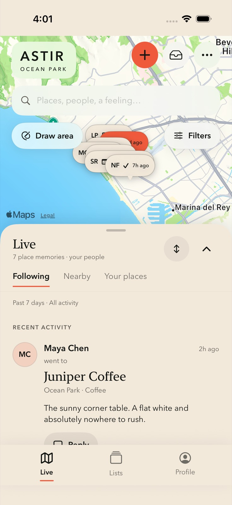 | 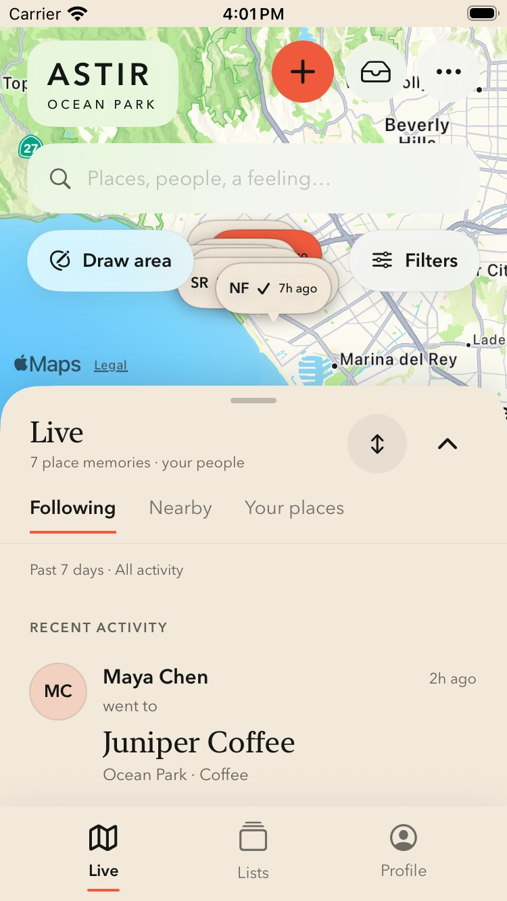 |

| Full activity — large | Full activity — compact |
|---|---|
| 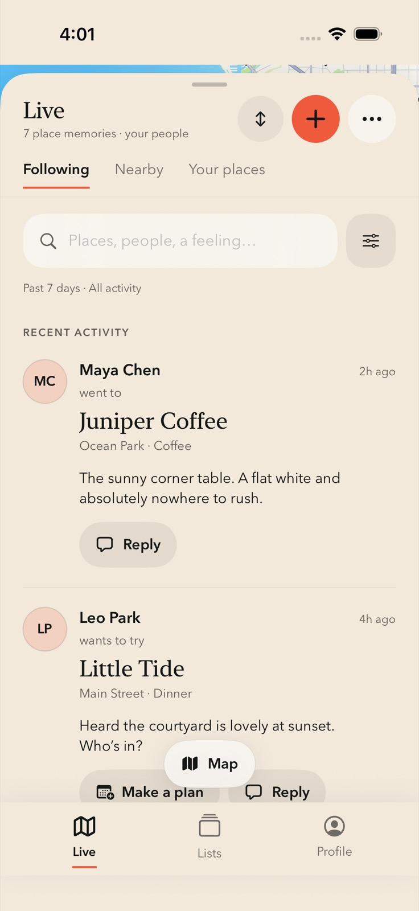 | 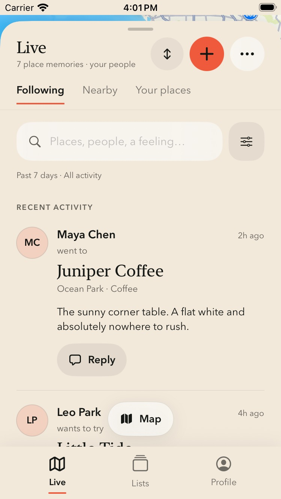 |

Inspection: controls, bottom navigation and map attribution are visible. The compact half state exposes less activity and supports expanding to read it. Dense map pills overlap in this prototype; production clustering/collision behavior is a required engineering task. The floating Map action can cover a small portion of scrolling content; content remains scrollable, and its final production placement should be reviewed at large text sizes.

## Profile continuity

| Existing section order | Your Map and calendar remain in Profile |
|---|---|
| 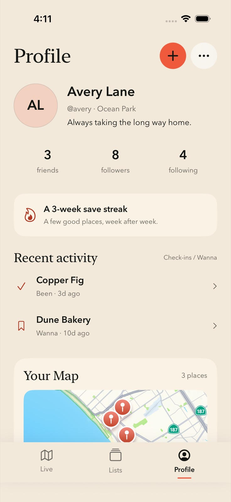 | 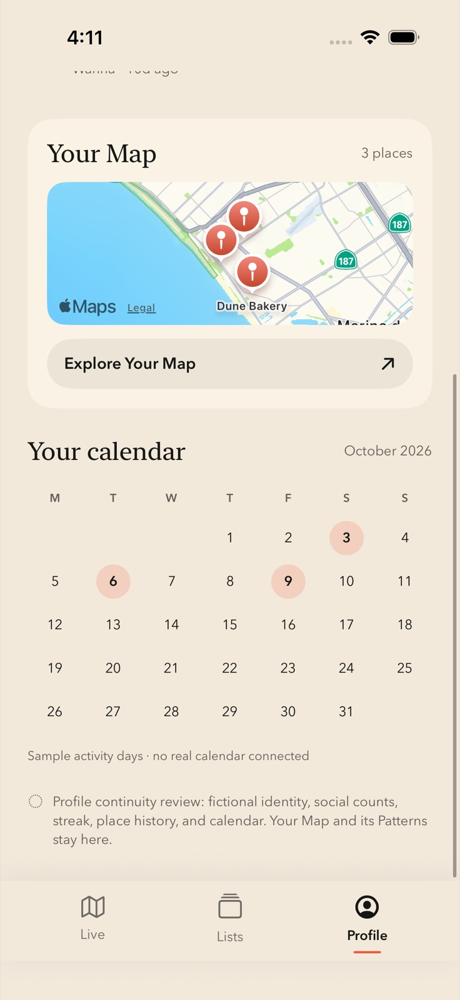 |

| Your Map — large | Your Map — compact |
|---|---|
| 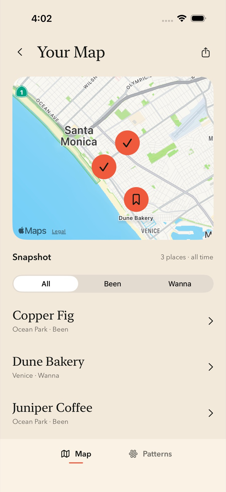 | 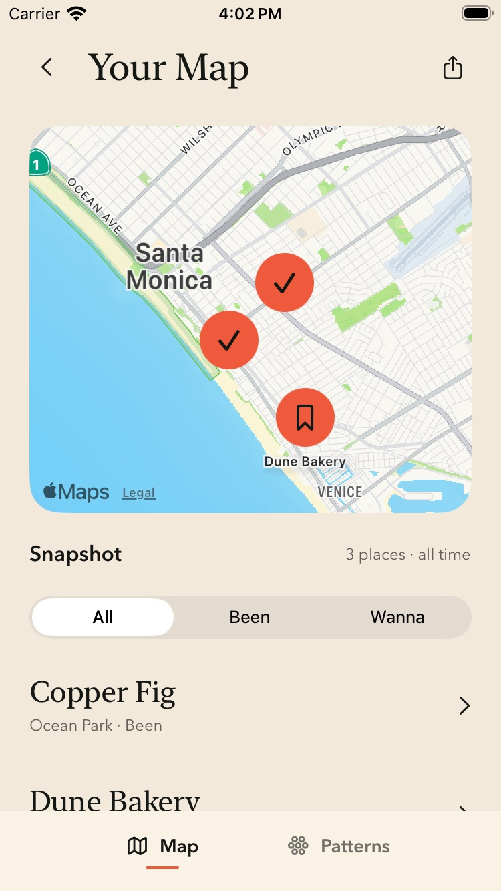 |

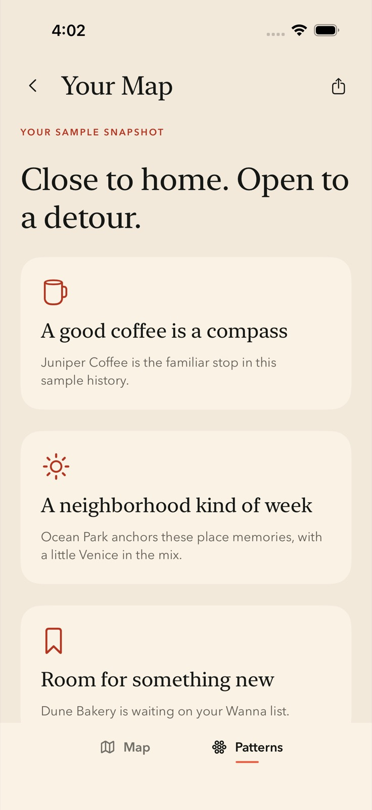

Inspection: the map stays inside Profile navigation and retains a Back to Profile entry. Patterns remains a mode of Your Map. Advanced production lenses, computed analytics, share generation and Snapshot creation are intentionally outside the fixture app.

## Gentle transition and sparse states

| Optional transition | Quiet week |
|---|---|
| 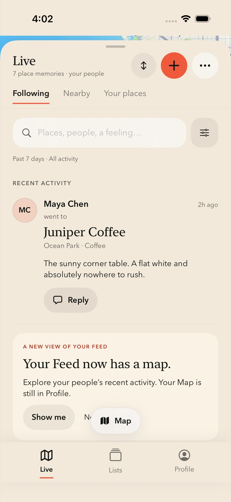 |  |

| Simulated offline | Empty activity |
|---|---|
| 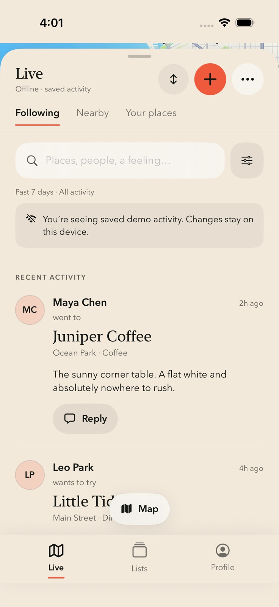 | 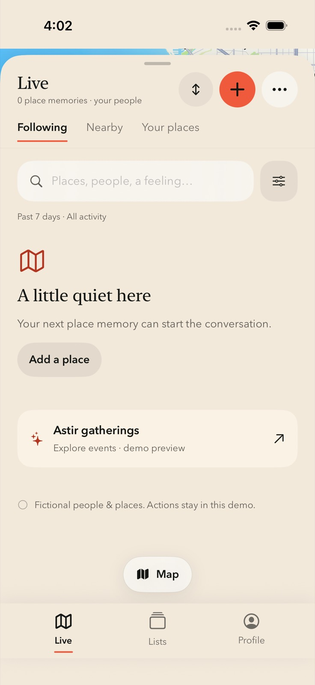 |

Inspection: the transition follows the first memory instead of blocking launch. Sparse, empty and offline are explicit local review scenarios. The offline fixture does not test networking or production cache authorization.

## Dark appearance and circle controls

| Map peek — large | Draw area — compact |
|---|---|
| 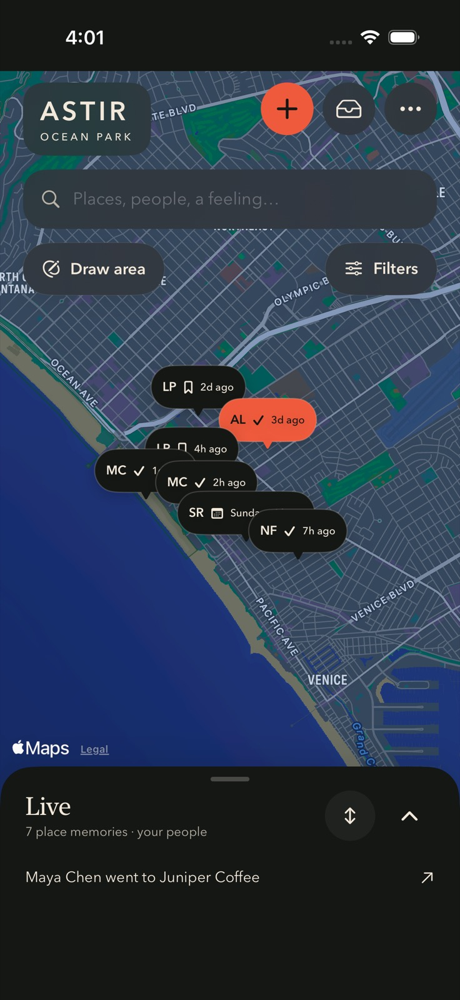 | 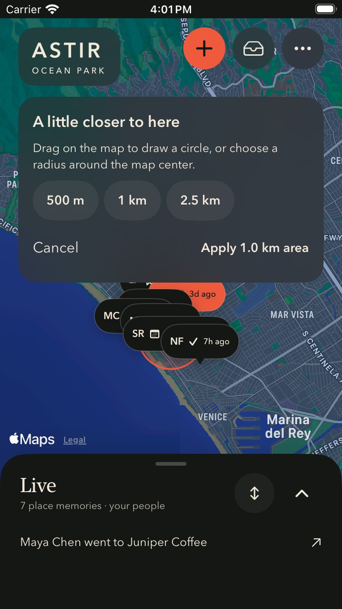 |

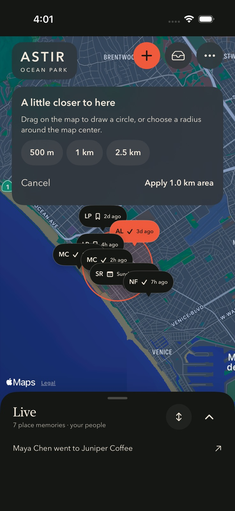

Inspection: radius alternatives and Apply/Cancel stay reachable on both sizes; map attribution remains above the drawer. These captures use the prototype Reduce Motion override. D4 still decides whether geographic drawing is the intended circle-control behavior.

## Accessibility text

| Large phone | Compact phone |
|---|---|
| 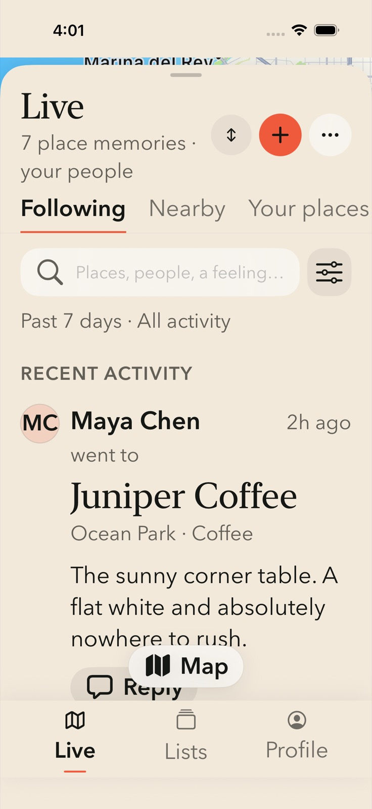 | 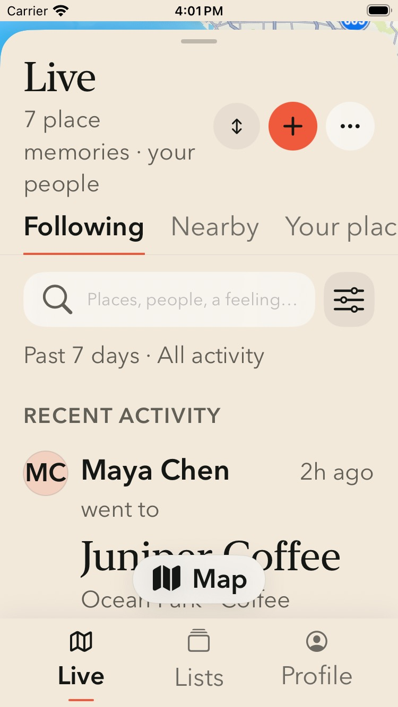 |

Inspection: primary text wraps and content scrolls. The scope rail scrolls horizontally; the compact frame does not show every scope at once. These captures do not prove VoiceOver reading order or focus. Those and real-device gesture behavior remain validation gates.

## Local connection and planning previews

| Demo plan | Demo inbox |
|---|---|
| 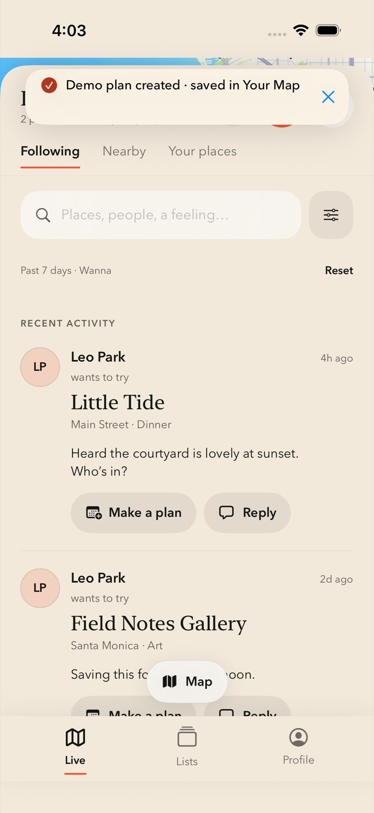 |  |

Plans and replies are session-local demonstrations. No message, invitation or notification is delivered. Production invitation reuse and private messaging are separately scoped in the engineering plan.
