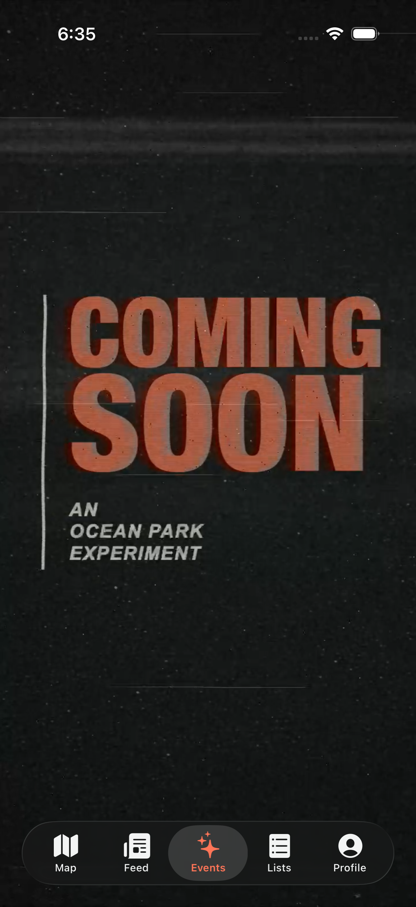
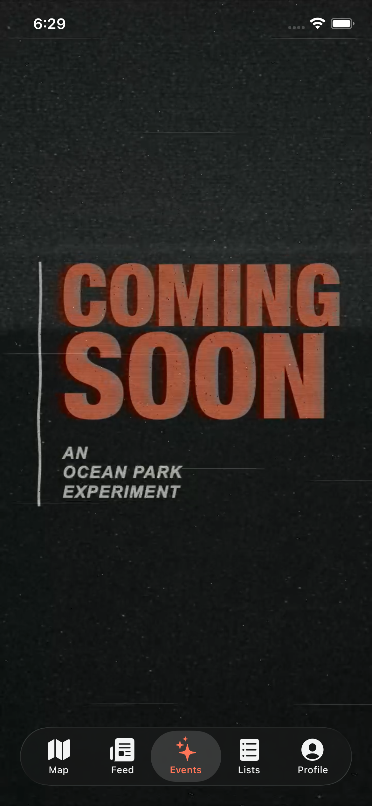

# Validation — REC-528

The implementation was built through the workspace `ios-work` helper using its
shared per-checkout cache, two compiler jobs, and serial test execution.
The final unit run includes current main through `94b6389`; the generated
Xcode project was regenerated to retain both the Events and Ocean Park files.

- Full `WanderTests`: **2,016 passed, 0 failures**.
- New Events lifecycle/media/layout unit tests: **5 passed**, included above.
- Standard iPhone 17 Pro: **2 Events UI tests passed**, including native tab
  placement, repeated switching through all other tabs, foreground restoration,
  and five measured Profile → Events cycles.
- Compact iPhone 16e: **Events navigation/foreground UI test passed**, with
  all sixteen tab changes and both native screenshots.
- Analytics schema/dashboard check and all **5 dashboard tests passed**.
- The eight-second app export was decoded and checked: 720 × 1560, 24 fps,
  H.264, no audio; 2,253,389 bytes. The immediate JPEG is 368,436 bytes.
- The bundled-asset browser preview was checked at 320 × 568, 393 × 852,
  and 440 × 956. Geometry unit coverage also checks iPad compatibility bounds.

## Compact-run diagnostic

The first compact run failed its first Map selection assertion: the screen
recording remained on Events after XCTest synthesized a tap. There was no
visible system alert. An unchanged rerun passed all sixteen tab changes and
the background/foreground check. No test assertions were relaxed and no app
code changed between runs. The cause is unconfirmed; preserve this as an
intermittent observation if a device tap is missed during review. Both result
bundles are retained in the local motion-study evidence directory.

## Simulator measurements

These are a baseline for the whole app during a Profile → Events cycle on the
iPhone 17 Pro simulator, not a device frame-pacing or input-to-display result.
XCTest's clock includes tap synthesis and automatic idle waits. No prior
performance baseline or regression threshold was supplied.

| Metric | Mean | Range |
|---|---:|---:|
| Cycle clock, including automation | 3.531 s | 3.407–3.706 s |
| App CPU time during cycle | 0.771 s | 0.700–0.849 s |
| Peak physical memory | 108.84 MB | 107.42–110.71 MB |
| Ending physical memory | 104.85 MB | 103.53–105.86 MB |

The five ending-memory samples stayed within a 2.33 MB band; this is not a
long-term leak test. Separately, the lifecycle
unit test confirms that twenty exit/reentry cycles create only one player,
pause its rate immediately on exit/background, and empty the queue on teardown.
Reduced Motion and inactive selection create no decoder. No per-frame view
state or live effects code runs in the production screen.

A physical-device frame-pacing/energy profile has not been performed. The
simulator metrics must not be presented as a zero-hitch or 60/120-fps guarantee.

