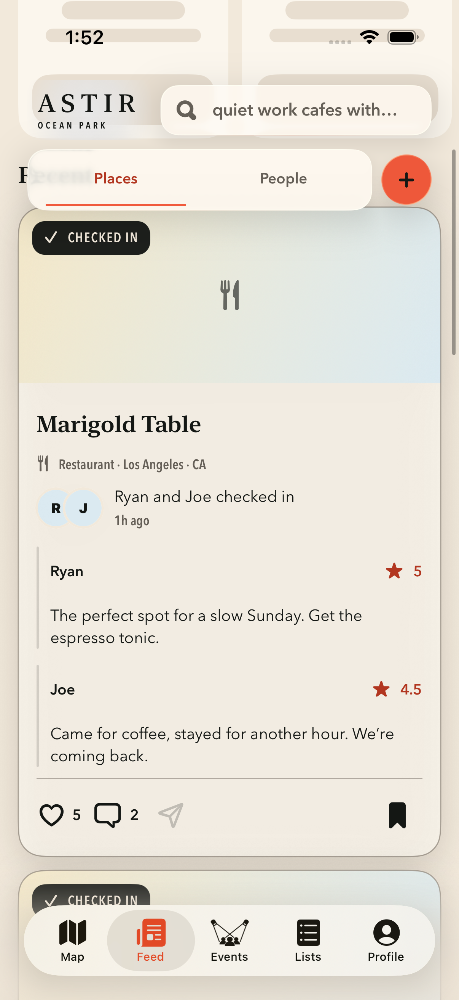
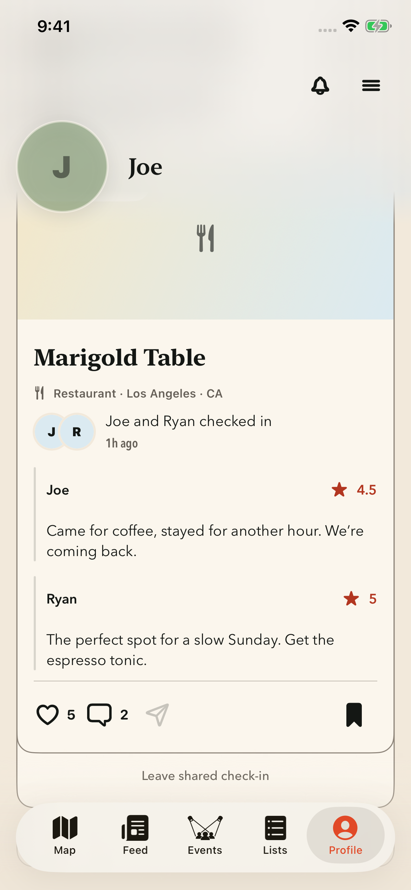
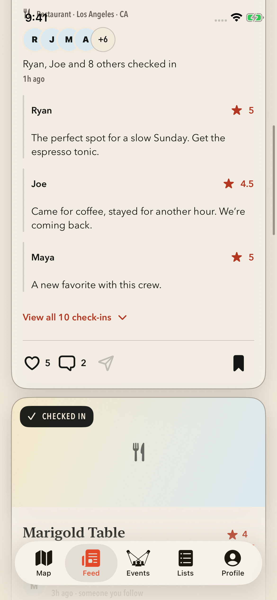
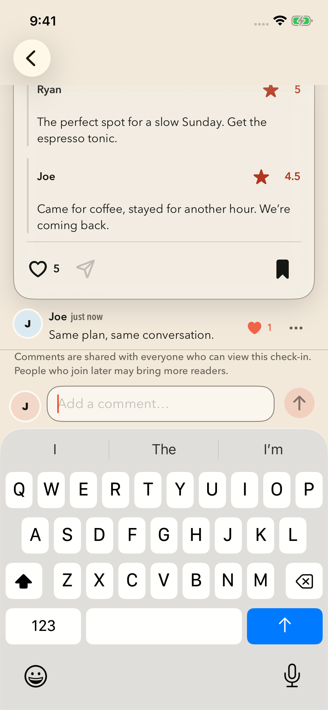
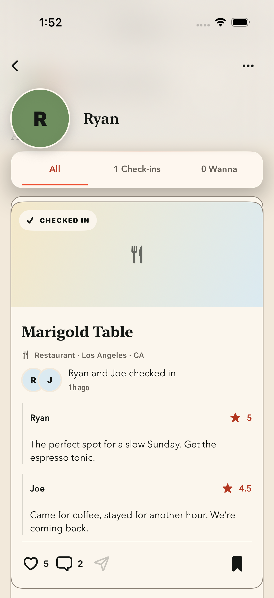

# Joint check-ins: native captures

Unmodified simulator screenshots from fictional UI fixtures on September 22, 2026. The controls and cards are the implemented SwiftUI screens. The creation flag remains off in production.

| Feed: one shared post | My activity: Joe first |
| --- | --- |
|  |  |

| Ten people, collapsed | Shared discussion and comment likes |
| --- | --- |
|  |  |

[Large text in dark appearance](joint-large-text-dark-collapsed.png). Joe profile, shared-comment, ten-person and dark captures: compact iPhone 16e, iOS 26.3.1, result `Test-Wander-2026.09.22_01-38-34--0700.xcresult` in the managed cache. This run passed all ten feed/profile UI tests; a unit fixture failure is documented separately.

See [validation and rollout gates](../implementation-validation.md) for precise test scope, other-device evidence, and remaining checks. Screenshots do not establish server authorization, production readiness, or completion of all 88 acceptance cases.

## Other participant’s activity

The two-person Feed and Ryan-profile captures use standard iPhone 17 Pro, iOS 26.1 compatibility. Source: `Test-Wander-2026.09.22_01-52-39--0700.xcresult`; all three final feed/profile UI cases passed.

## iPad compatibility window

[Ryan’s activity, with Ryan first](joint-ryan-profile-ipad.png) · [Large text in dark appearance](joint-large-text-dark-ipad.png)

Unmodified captures from the existing iPhone compatibility window on iPad Air 11-inch (M3), iOS 26.3.1. Source: `Test-Wander-2026.09.22_01-46-52--0700.xcresult`; all 2,449 unit tests and five joint UI cases passed.
