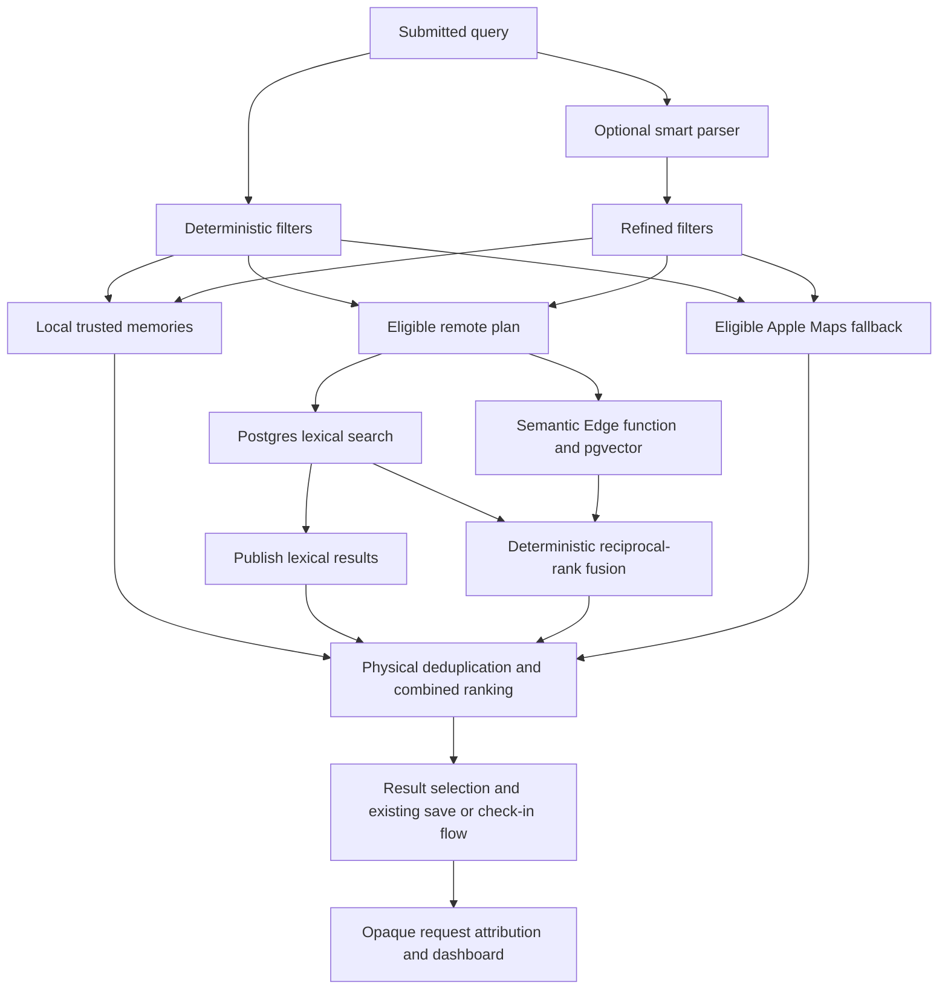

# Search integration and delivery measurements — 2026-09-05

REC-384 / PR #551 is integrated with main `c520292` (REC-409 import redesign).
This report measures progressive delivery and validates how Search's providers
compose. It does not claim a new live relevance score or a hosted rollout.

## What improved

- Remote lexical matches publish while semantic retrieval continues. The final
  fused response refines only the rec.me portion of the combined list.
- Smart-parser refinement replans rec.me and Apple Maps when their effective
  filters change. Old candidates clear, canceled completions cannot restore
  them, and queries the remote API cannot enforce stop remote retrieval.
- Trusted memories, community matches, and Apple Maps retain their existing
  physical deduplication, eligibility, source labels, and cross-corpus ordering.
- Selection rank measures the displayed list. Provider attribution survives
  fusion, and a save captures its attribution before asynchronous work begins.
- Opaque submission IDs connect retrieval, selection, conversion, and
  reformulation. Raw queries and place/profile/candidate IDs remain excluded
  from analytics. Request outcome counts exclude uncorrelated legacy events.
- The relevance lab and dashboard checks are maintained in the repository.

## Controlled delivery benchmark

`testControlledProgressiveDeliveryBenchmark` exercises the actual backend
orchestrator with stub providers delayed by 40 ms (lexical) and 400 ms
(semantic), for ten samples on an iPhone 17 Pro simulator, iOS 26.3.1.

The old await-both behavior's first delivery is represented by the measured
terminal completion of those same requests. This isolates delivery behavior;
it is not a second binary comparison or a production network benchmark.

| First remote delivery | p50 | p95 |
|---|---:|---:|
| Await both providers | 412.9 ms | 422.9 ms |
| Publish lexical immediately | 42.9 ms | 43.2 ms |

The measured p50 first delivery is about **9.6 times earlier**, an **89.6% lower
wait**. Semantic completion still takes its full duration; this change improves
time to useful remote results, not embedding speed. The existing 1,000-memory
local Search benchmark measured p95 **21.2 ms**, below its 50 ms gate. These
numbers come from the September 5 parser-integration run. The earlier run
measured 421.1 ms versus 42.9 ms for first-delivery p50, with local p95 22.6 ms.

## Query result walkthrough

The deterministic fixture submits **“quiet place to read”** through the actual
backend and combined ranking policy. Names below are synthetic; they are not
claims about real places or live Apple Maps results.

| Stage | Displayed order |
|---|---|
| Lexical partial | Neighborhood Cafe · Cedar · Harbor · Corner |
| Semantic refinement | Neighborhood Cafe · Harbor · Cedar · Rainroom · Corner |

Neighborhood Cafe is a trusted memory. Cedar is lexical-only. Harbor appears
in both lexical and semantic results and gets their combined evidence. Rainroom
is semantic-only and survives despite lacking a literal query match. Corner
comes from Apple Maps. A second MapKit representation of Harbor is removed.
The test asserts both displayed orders, deduplication, and provider provenance.

Separate tests cover refined category/area/favorite/friend constraints, named
owner and non-follower exclusion, unchanged requests, provider fallback, empty
completion, and a canceled plan finishing after its replacement for the same
query.

## How the pieces connect

Both rec.me providers use the same server eligibility helper for visibility,
blocks, category, area, favorite, and social scope. The client plans those hard
constraints before retrieval. The semantic provider embeds the complete phrase;
lexical search receives its unconsumed text. RRF uses lexical weight 1.0,
semantic weight 0.9, and rank constant 12, with canonical-place deduplication
and a maximum of 20 results.

The combined ranker then scores query relevance across all three corpora and
uses source priority to break equivalent matches. RRF order is preserved within
equivalent relevance/source bands; it is not the sole ordering of the entire
screen. Featured on the map continues to use its separate explicit network,
taste, and community ranker, with no vector or LLM call on map movement.

## Relevance evidence and its limits

The [historical real-corpus scorecard](2026-08-15-real-relevance-scorecard.md)
contains 74 judgments across 12 queries from 210 saves and 114 ratings. Overall
nDCG@5 was 56.9% for lexical, 77.7% with explicit reranking, and 84.1% for hybrid.
That is a 6.4 percentage point hybrid gain over explicit reranking.

| Historical query | Lexical | Explicit rerank | Hybrid |
|---|---:|---:|---:|
| Quiet coffee shop where I can work | 86.9% | 100.0% | 100.0% |
| Outdoor drinks in Santa Monica | 0.0% | 67.7% | 84.2% |
| Healthy lunch in Santa Monica | 0.0% | 70.0% | 98.3% |
| Date-night restaurant in Los Angeles | 92.3% | 46.6% | 40.9% |

The date-night regression remains material. The historical lab also used richer
structured tags than production's minimized semantic document. Its private
judgment artifacts are not available in this checkout, and the refreshed
production-faithful pool needs 17 additional human judgments. Today's synthetic
tests therefore establish implementation behavior, not new real-world relevance
gains or approval of ranking-weight changes. No weights were changed.

## Verification

| Check | Result |
|---|---|
| Search unit tests | 57 passed |
| Final full unit suite | 1,843 cases: 1,829 passed, 14 failed |
| Clean main `c520292` unit suite | 1,831 cases: 1,817 passed, the same 14 failed |
| Relevance-lab fixtures | 27 passed |
| Analytics/dashboard checks | 6 passed; eight sections, 17 insights |
| Generic iOS Simulator build | Passed |
| Focused Search UI flows | All 3 passed on the dedicated simulator |

There are **no PR-only unit failures** in the verified final comparison. The
14 shared cases cover existing import recovery/matching/timeouts, Map and
navigation/widget source contracts, and list-projection ordering. The full
unit suite is not represented as passing.

The Search tests cover progressive/fallback delivery, same-query cancellation,
refined constraints, cross-corpus ordering/deduplication, provider provenance,
and local performance. Existing remote repository tests verify lexical RPC
parameters and the full-query semantic Edge Function boundary. UI coverage
targets entry, empty state, navigation/back, guided typed results, and shared
list-picker membership persistence; it is not a full-app UI sweep.

Unit validation used iPhone 17 Pro for the PR and iPhone 17 for clean main,
both on iOS 26.3.1. Two UI cases in the shared-simulator rerun ended with signal
kill; all three subsequently passed on an isolated iPhone 17 Pro simulator.
The interrupted run remains a recorded limitation of that test environment.

## Remaining live verification

This Mac lacks the recorded Supabase operations credentials and project
registry, so current hosted flag state, embedding coverage/staleness, and
backfill health could not be verified. The last recorded hosted check was
August 29 and is not represented as current. Remote API boundary tests and
local Search UI checks do not substitute for an authenticated production smoke.

Before rollout, run the read-only hosted health checks and signed-in Search
smoke, then decide whether to apply the checked-in dashboard. Before changing
retrieval weights, complete the 17 judgments and rerun the production-faithful
blind evaluation. This work performs no hosted mutation or TestFlight release.
