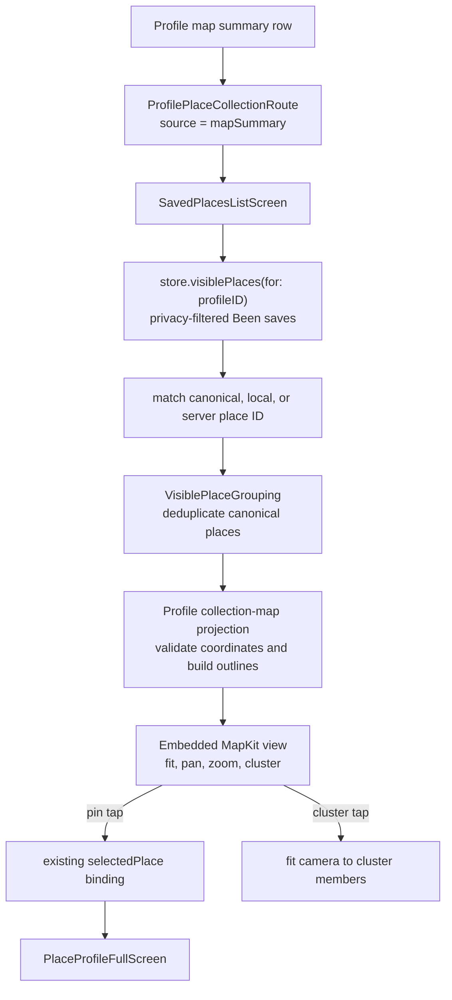

# REC-111 — Filtered Place Map

Status: implemented and validated; ready for review and testing
Linear: [REC-111](https://linear.app/recme/issue/REC-111/add-detailed-map-view-for-filtered-place-lists)
Owner: Ryan
Implementation branch: `codex/rec-111-filtered-map`
Pull request: [#159](https://github.com/joelipshutz/wander/pull/159)

## Outcome

When someone opens a Profile “Your map” summary such as Countries → United
States, the destination begins with a full-bleed, interactive Apple map of the
places represented by that summary. A pin opens the same private place detail
as the corresponding row. The existing searchable/filterable rows remain the
complete, accessible fallback for unmapped and coincident places.

## What Already Exists

- `ProfileOwnerHome` already emits exact `placeIDs` for Places, Cities, and
  Countries summaries.
- `ProfileScreen` already routes those summaries to `SavedPlacesListScreen`,
  which resolves the IDs against privacy-filtered `VisiblePlace` values.
- Row selection already opens `PlaceProfileFullScreen` with the correct save
  summaries and add-visit action.
- REC-95 established the shipped MapKit vocabulary: muted standard map,
  category-emoji pins, current/social save outlines, cluster-to-zoom behavior,
  truthful partial/unmapped states, native Apple attribution, and 44-point tap
  targets.
- `MapRegionFitter`, `VisiblePlaceGrouping`, and the map-pin outline primitives
  are reusable without changing the main Map screen or REC-95 list map.

## Scope Lock

The implementation is deliberately limited to the Profile map-summary route.
Calendar-date drill-ins and the top-level Been/Wanna/In Common lists do not gain
a map. Route provenance will be explicit; behavior will not depend on parsing a
`"map-"` ID prefix.

The map and mapped/total count reflect the places in the currently visible
rows. Search, type, and tag controls update annotations without refitting the
camera, so the map stays truthful without snapping around while a person types.
The initial camera is fitted from the full upstream summary collection.

Not in scope:

- Main Map-tab changes, the REC-95 saved-list map, or a new map design language.
- A pin-to-row rail, photo loading, live-location behavior, or network requests.
- Backend, schema, RLS, sync, visibility, persistence, or analytics changes.
- Calendar pages, Been/Wanna pages, or secondary-filter-driven camera refits.
- TestFlight, build-number changes, or release messaging.

## Experience Contract

```text
┌──────────────────────────────────────────────┐
│ ‹                    United States           │
├──────────────────────────────────────────────┤
│                                              │
│       interactive Apple map, full width      │
│        category pins and count clusters      │
│                                              │
│  18 places                     Apple / Legal │
├──────────────────────────────────────────────┤
│  Search United States                        │
│  type filters                                │
│  tag filters                                 │
│                                              │
│  complete private place rows                 │
└──────────────────────────────────────────────┘
```

- The map sits outside the destination’s padded content stack so it reaches
  both screen edges.
- Its bounded height preserves normal vertical page scrolling on small phones.
- Map interaction is pan and zoom only; no pitch or rotation, because the
  screen-space cluster projection assumes a north-up map.
- A single pin is a 44-point button with the place category emoji and existing
  current/social save outlines. Activation opens that place immediately.
- A cluster is a 44-point count button. Activation zooms while the measured
  viewport can materially tighten. At maximum useful zoom, it names and opens
  one deterministic representative; every member remains independently
  reachable through the rows.
- Native Apple Maps attribution remains visible and tappable, with no opaque
  overlay or full-surface interception.
- The count/status copy is outside the Apple attribution zone and is never the
  only representation of mapping completeness.

## State Matrix

| State | Map surface | Rows | Accessibility / recovery |
|---|---|---|---|
| Empty summary | Same-height warm empty panel: “No places to map” | Existing no-results row | No fake fallback region; clear label |
| One mapped place | Pin with a useful minimum regional span | Place row | Pin and row both open the same detail |
| Several nearby places | Pins or count clusters | All rows | Cluster says count and “Zooms in” |
| Dispersed places | Fitted overview with padded extrema | All rows | Pan/zoom remains available |
| Partial coordinates | Valid pins plus “N mapped of M” | All M rows | Unmapped places remain reachable in rows |
| No valid coordinates | Same-height panel: “Locations unavailable for M places” | All M rows | No `(0,0)` annotations or misleading LA fallback |
| Search/type/tag active | Pins and count match filtered rows; camera stays put | Matching rows only | Camera never snaps while typing |
| Search/type/tag has no matches | Map remains at the current camera with no annotations and “No matching places to map” | Existing no-results row | Clearing filters restores pins without losing map context |
| Dynamic Type / small phone | Bounded map; status copy wraps below it | Rows retain native flow | 44-point pin/cluster targets, no clipped attribution |
| Reduce Motion | Camera jumps without custom animation | Unchanged | No spring/zoom animation requirement |

The screen already resolves its content from the local privacy-filtered store,
so REC-111 does not invent loading, offline, or remote error states that this
destination cannot truthfully observe.

## Data And Interaction Flow



Projection is pure and store-independent. Each annotation carries a stable
canonical group ID, one representative `VisiblePlace`, a valid coordinate,
precomputed outline semantics, category emoji, and accessibility text. Invalid
coordinates affect the mapped/total status but never produce an annotation.

Camera state belongs to the map view. It fits the unrefined collection once on
creation using `MapRegionFitter`; subsequent row-filter or store publications do
not overwrite a person’s pan or zoom. The annotation projection and count use
the refined rows. Clustering is cached and recomputed only when annotation
coordinates, measured viewport, or camera-end region change. Implementation
must avoid repeated store scans or per-pin photo/backend work.

## Failure Modes And Guardrails

1. **Route ambiguity:** calendar and map summaries currently share one route
   shape. Add an explicit source enum and test both constructors.
2. **ID drift:** summary IDs may be canonical, local, or server IDs. Preserve
   the existing three-alias match before projection.
3. **Invalid coordinates:** drop invalid, non-finite, and near-zero coordinates
   from annotations, retain their rows, and show partial/unmapped copy.
4. **Duplicate saves:** group aliases before projection so one real place gets
   one pin with aggregate current/social outline semantics.
5. **Crowded maps:** cluster at a 52-point screen distance and make cluster taps
   fit only their member coordinates.
6. **Large country collections:** compute clustering on camera-end events with
   precomputed dictionaries; benchmark a synthetic 900-annotation projection
   against a 250 ms debug-test budget. If the existing pairwise clusterer misses
   that gate, replace only this projection with a bounded spatial-hash/anchor
   implementation rather than changing REC-95 globally.
7. **Gesture contention:** keep map height bounded and validate that vertical
   page scrolling remains possible above and below the map.
8. **Attribution obstruction:** do not cover the native legal strip with status
   copy, buttons, or hit-testing overlays.
9. **Selection mismatch:** a pin returns the exact representative
   `VisiblePlace` already accepted by `PlaceProfileFullScreen`; no second lookup
   by display name.

## Implementation

1. Add `MapKit` to `ProfileScreen.swift` and make collection-route provenance
   explicit (`calendar` versus `mapSummary`).
2. Add a small internal, unit-testable route policy, ID matcher, and
   collection-map projection beside the
   destination. Reuse `VisiblePlaceGrouping`, `MapPinOutlineBuilder`, and
   `MapRegionFitter`.
3. Add a destination-local embedded map and pin/cluster views. Keep them free of
   `WanderStore`, navigation, photos, and backend calls.
4. Place the map before the padded search/filter/row stack only when the route
   source is `mapSummary`; feed it refined row annotations plus the unrefined
   initial region.
5. Wire pin selection to the existing `selectedPlace` destination and cluster
   activation to member-only camera fitting.
6. Add focused route/projection tests in the existing Profile insights test
   target. Do not edit the concurrently active `ProfileOwnerHome.swift` or
   `NavigationContractTests.swift` work.
7. Run focused and full simulator tests, benchmark 900 annotations, then capture
   current-phone, small-phone, and large-Dynamic-Type screenshots of a
   deterministic United States route.
8. Run a real VoiceOver pass on the small phone: focus order, pin/cluster labels
   and hints, activation, partial-map status, and Apple/Legal focusability.

## Implementation Tasks

Synthesized from the engineering and design reviews. Each task is required on
this branch.

- [x] **T1 (P1, human: ~45m / Codex: ~10m)** — Profile routing — Make map-summary provenance and ID matching explicit.
  - Surfaced by: architecture review — calendar and map-summary routes currently become indistinguishable and matching is private.
  - Files: `Wander/Features/Profile/ProfileScreen.swift`, `WanderTests/ProfileInsightsPresenterTests.swift`
  - Verify: route-policy and canonical/local/server ID tests pass.
- [x] **T2 (P1, human: ~2h / Codex: ~25m)** — Profile collection map — Build the full-width embedded Apple map with truthful current-row annotations.
  - Surfaced by: information architecture and journey review — REC-111 requires an interactive map at the top whose pins match the list.
  - Files: `Wander/Features/Profile/ProfileScreen.swift`
  - Verify: search/type/tag changes update pins/count without camera refits; pin and cluster activation work.
- [x] **T3 (P1, human: ~1h / Codex: ~15m)** — Map projection — Preserve grouping, outline, and partial/unmapped semantics.
  - Surfaced by: failure-mode review — aliases, duplicates, and invalid coordinates can otherwise create wrong or fake pins.
  - Files: `Wander/Features/Profile/ProfileScreen.swift`, `WanderTests/ProfileInsightsPresenterTests.swift`
  - Verify: focused projection tests pass for aliases, duplicates, and invalid/zero coordinates.
- [x] **T4 (P1, human: ~45m / Codex: ~10m)** — Map performance — Cache clusters and enforce the large-set budget.
  - Surfaced by: performance review — the shared clusterer is pairwise and must not run repeatedly during body evaluation.
  - Files: `Wander/Features/Profile/ProfileScreen.swift`, `WanderTests/ProfileInsightsPresenterTests.swift`
  - Verify: synthetic 900-annotation clustering completes within 250 ms in the debug test.
- [x] **T5 (P1, human: ~1h / Codex: ~15m)** — QA — Validate phones, Dynamic Type, gestures, VoiceOver, attribution, and the full suite.
  - Surfaced by: responsive and accessibility reviews — screenshots alone cannot prove interactive annotation or legal-attribution access.
  - Files: `docs/agent-log.md` and retained QA artifacts only.
  - Verify: focused/full test commands and manual QA matrix recorded in the handoff.

## Test Plan

```text
unit
├── map-summary route opts in; calendar route stays out
├── route matching accepts canonical/local/server IDs
├── projection keeps only valid annotations
├── invalid place remains represented in total count
├── canonical duplicate saves collapse to one pin
├── aggregate current/social outlines survive projection
├── pin selection preserves the exact representative place
└── 900-annotation clustering stays below the 250 ms debug budget

existing geometry regressions
├── empty, single, dispersed, antimeridian fitting
└── cluster membership and zoom-region fitting

integration / build
├── focused ProfileInsightsPresenterTests
├── full WanderTests suite on an installed simulator
└── generic iOS Simulator build

visual / interaction
├── iPhone 17 Pro: United States, standard text
├── iPhone 17e: United States, standard text
├── iPhone 17e: Accessibility Extra Large
├── pan, pinch, cluster zoom, pin-open, back-navigation
├── vertical page scrolling around the embedded map
├── VoiceOver focus, labels, hints, activation, and partial count
└── Apple / Legal unobscured, focusable, and tappable
```

The prescribed iPhone 16 Plus / iOS 18.6 runtime is not installed on this
machine. Validation will use the installed iPhone 17 Pro and iPhone 17e on iOS
26.5 and will record that substitution explicitly rather than claiming the
unavailable gate passed.

## Reviewed Decisions

- The approved REC-95 visual vocabulary is reused; no competing mockup or new
  design direction is introduced.
- Pins and mapped/total copy represent the currently visible rows; the initial
  camera comes from the upstream Profile summary and does not auto-refit.
- Map-summary provenance is explicit and calendar drill-ins remain unchanged.
- Pins open existing place detail directly; there is no new focus rail.
- Clusters open a named deterministic representative when another viewport-fit
  zoom would be a no-op; all rows remain the reachability fallback for every
  other unmapped or coincident place.
- No backend request or data contract is added.

NO UNRESOLVED DECISIONS

## GSTACK REVIEW REPORT

Plan-eng-review and plan-design-review completed against the existing REC-95
engineering/design contract. All review findings were resolved in this plan;
there are no open critical issues or user decisions before implementation.

- Information architecture: 10/10
- Interaction states: 9/10
- User journey: 9/10
- AI-slop risk: 10/10
- Design-system compliance: 10/10
- Responsive behavior: 9/10
- Engineering architecture: 9/10
- Failure-mode coverage: 9/10
- Test strategy: 9/10
