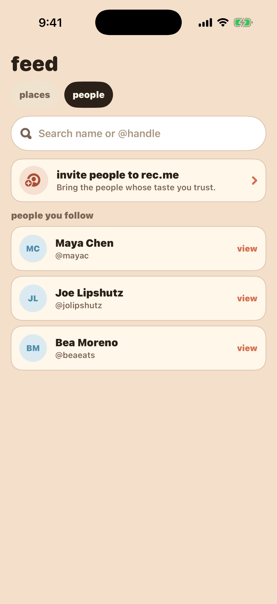
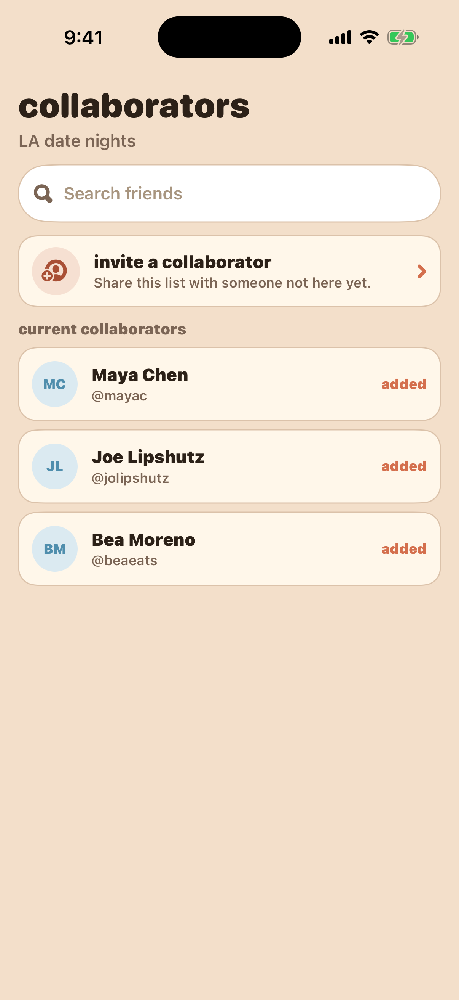
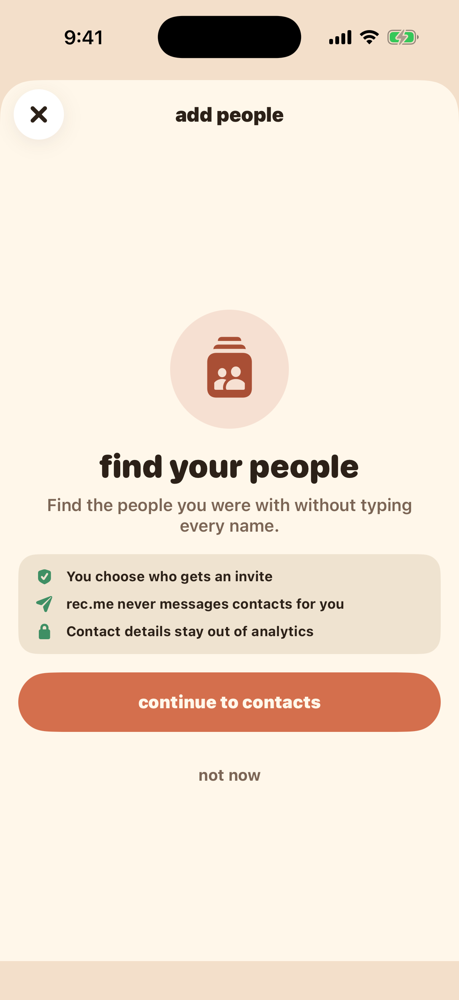
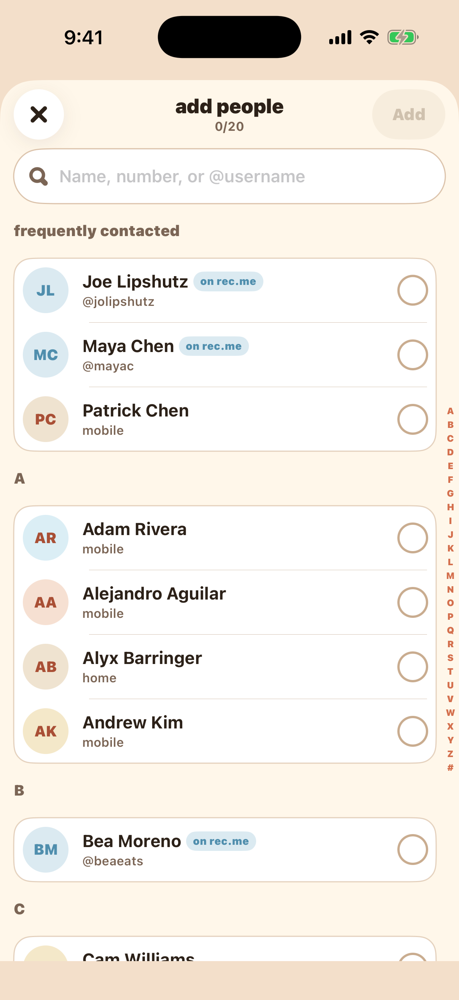
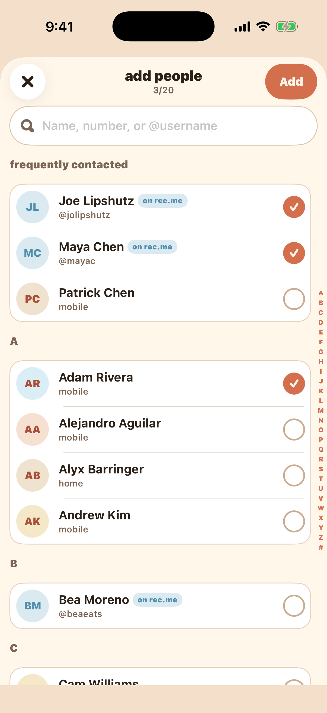
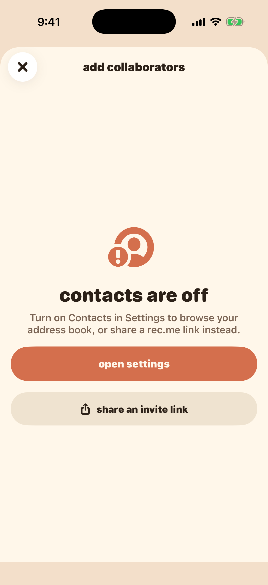
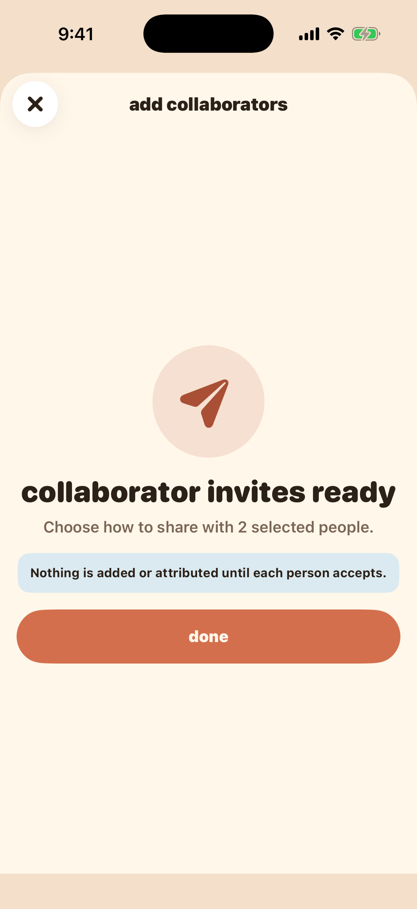

# REC-224 invite mockups

This milestone turns the attached "Add members" recording into a reusable
rec.me SwiftUI pattern. The check-in Friends picker, Feed People, and list
collaborator flows all use the production entry point. The shared picker now
requests native Contacts access after the branded primer and loads the phone's
contacts through `SystemContactProvider`.

## Direction to review

- Keep the invite entry point directly between search and the existing-person
  list in check-in Friends, Feed People, and list collaborators.
- Use one contact picker with surface-specific copy rather than three divergent
  flows.
- Identify contacts who already use rec.me, while preserving the acceptance
  contract: nobody is added or attributed until they accept.
- Ask for Contacts access only after a branded primer, and retain a share-link
  fallback when access is denied.
- Never place contact names, phone numbers, resource ids, or address-book data
  in analytics.

## Gallery

| Check-in entry | Feed People entry | List collaborator entry |
| --- | --- | --- |
|  |  |  |

| Permission primer | Contact picker | Selected contacts |
| --- | --- | --- |
|  |  |  |

| Permission denied | Invite handoff |
| --- | --- |
|  |  |

Compact-screen checks are captured in `checkInEntry-small.png` and
`contacts-small.png`.

## Debug routes

Launch with `-WanderInviteMockup <page>`, where `<page>` is one of:

`checkInEntry`, `feedPeopleEntry`, `listCollaboratorEntry`, `permission`,
`contacts`, `selected`, `empty`, `denied`, or `success`.

## Intentionally not wired yet

- privacy-preserving phone/email normalization and rec.me account matching
- native share-sheet result and cancellation handling
- scoped invite tokens, deferred deep links, and acceptance reconciliation
- PII-free funnel analytics
