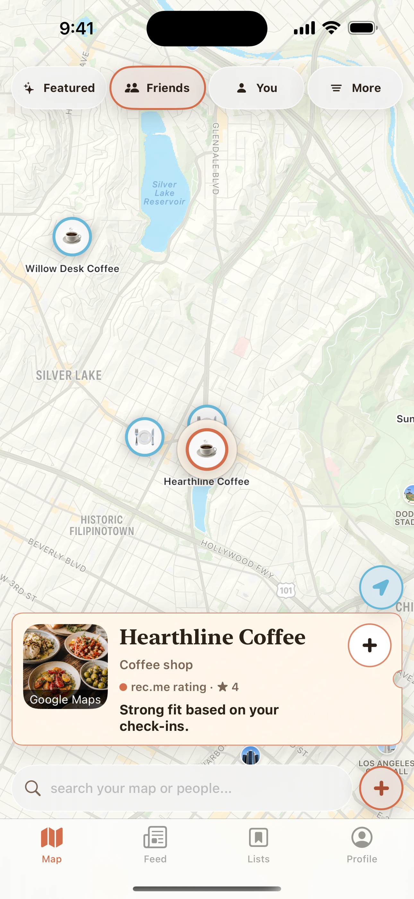
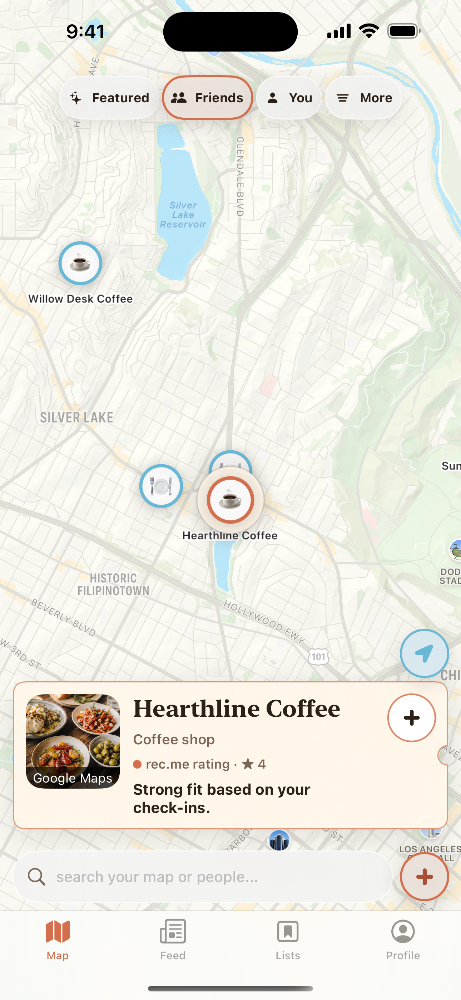
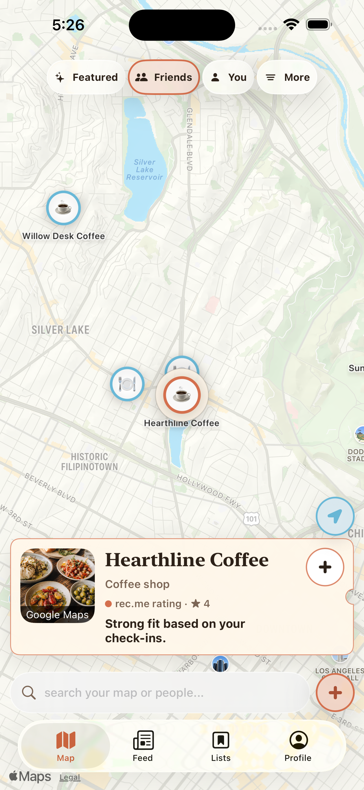
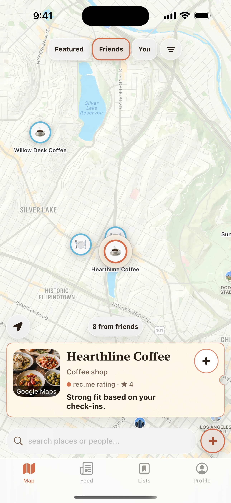
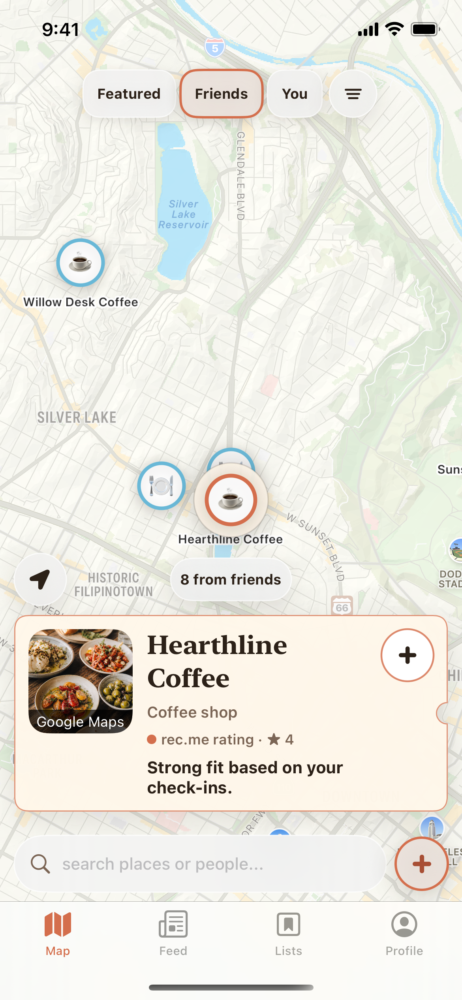
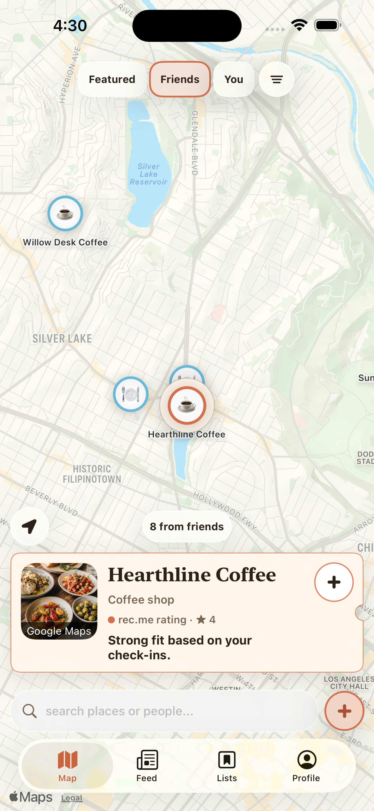

# REC-278 Map UI layout options

Reference: Joe's August 16 map screenshot. The shared hierarchy is filters at
the top, the map as the dominant canvas, place context above a bottom search
dock, and the tab bar last.

## Recommendation

Joe selected **Option B**. It keeps the reference's clearer top-filter and
bottom-search hierarchy, uses wider icon-and-label filter capsules, and retains
44 pt hit targets without adding a new map utility element.

| Option | Depth | What changes | Tradeoff |
| --- | --- | --- | --- |
| A | Rearrangement only | Moves existing filters to the top and existing search/add controls to the bottom. | Lowest implementation risk, but the filter row remains visually heavy. |
| B | **Selected** compact hierarchy | Keeps A and shrinks filter visuals to their content while retaining 44 pt hit targets. | Better map-to-chrome ratio with almost no behavior change. |
| C | Polished utility layout | Keeps B, uses text-only source filters, turns More into a compact icon, neutralizes recenter, adds a passive result count, and makes the utility row adapt to the selected card's height. | Strongest hierarchy and closest to the reference; introduces one new informational element. |

## Option A — rearrangement only

Checkpoint: `1c3bcca0`

## Option B — compact filters

Checkpoint: `8035e745`

Native iOS 26 Liquid Glass capture of the exact Option B checkpoint:

## Option C — polished utility row

The same layout on the smaller iPhone 16e. The utility row is laid out above
the card instead of using a fixed offset, so a wrapped place title cannot cause
an overlap.

Native iOS 26 glass rendering was also checked on an isolated iPhone 16 Plus
simulator.

## Preserved behavior

- Featured, Friends, You, and More keep their existing selection/filter logic.
- More filters still opens beneath the top row and keeps its current sections.
- Search focus, typeahead, add, recenter, place selection, walkthrough targets,
  tab navigation, and map data are unchanged.
- Every interactive control retains at least a 44 pt hit target.

## Deferred follow-up

The selected-place ticket remains unchanged in the landed Option B. A separate
follow-up can make it more image-led and horizontally pageable like the
reference; that changes the place-browsing treatment, not just the Map control
hierarchy.

The current ticket is intentionally opaque: its custom ticket surface uses the
warm `surfaceBone` fill at 98% opacity. Making that fill merely translucent would
blur the pale map and lower text contrast. To match the supplied preview, the
recommended treatment is a full-bleed place photo, a bottom-to-top dark gradient,
white place metadata, and native dark/clear glass only for the save/share/tag
controls. This preserves legibility while gaining the depth Joe is asking for.

## Validation

- Full option-branch scheme: 1,259/1,259 tests passed on iPhone 16 Plus / iOS
  18.6 before the final `origin/main` update.
- Post-merge overlap suite: 174/174 passed across Map layout, navigation, place
  presentation, focused search, More filters, edge collapse, floating actions,
  and both attached save flows.
- Focused More-filter UI suite: 3/3 passed on iPhone 16e / iOS 18.6.
- Visual inspection: iPhone 16 Plus and iPhone 16e / iOS 18.6, plus an isolated
  iPhone 16 Plus / iOS 26.2 native-glass check.
- Focused search now places typeahead above search and search above the keyboard;
  passive map utility controls hide until focus ends.
