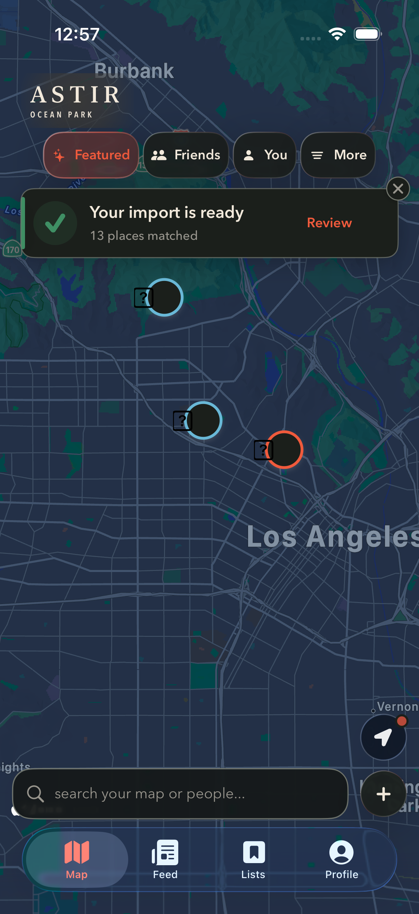
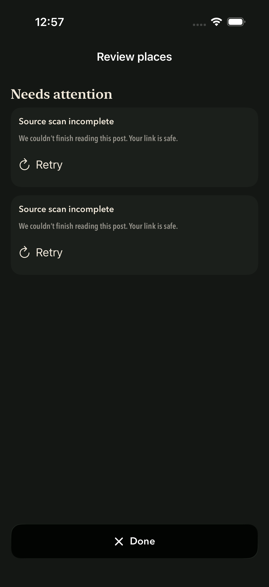
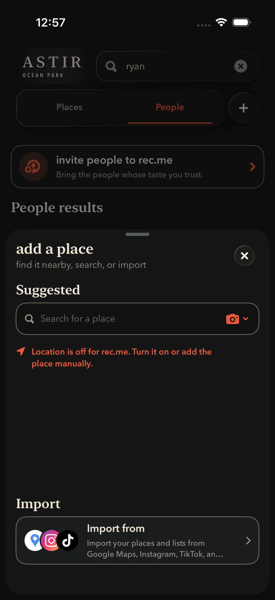
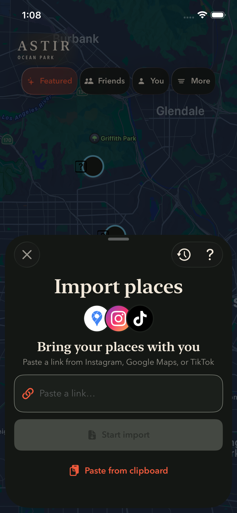
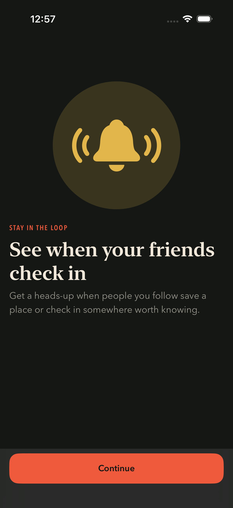
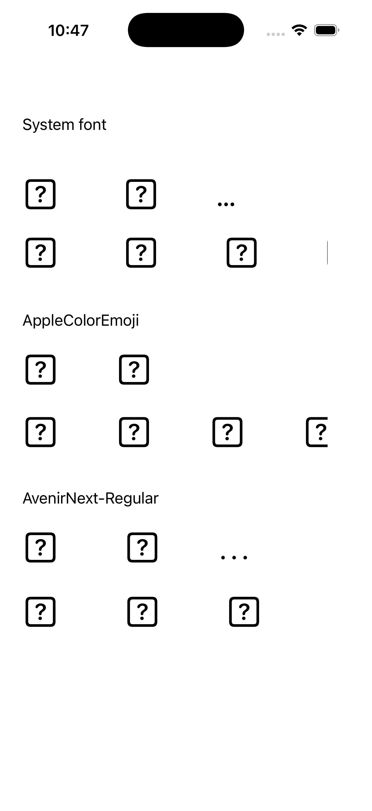

# REC-397 final local QA

The eight requested fixes are implemented in `codex/rec-397-astir-consistency`, including main `c520292` and its import redesign. The original fixes are in `d30f298`; main integration is `ed5b5d6`. This report covers the final follow-up to that integration.

| Request | Local implementation |
| --- | --- |
| Ignore taps on the live current-location indicator | Disable its native annotation interaction and callout, deselect it defensively, and ignore passive taps on its bounds. |
| Dismiss the keyboard whenever Plus/Add opens | Central presentation helper and presentation-state guard dismiss the keyboard. |
| Search rails bleed to the screen edge | Shared rail layout applied to the three horizontal Search sections. |
| Invitation badge above its button | Badge is an outer overlay with explicit stacking priority. |
| Dark filters and tabs | Adaptive surfaces and appearance environments applied to the affected components. |
| Neutral Astir masthead blur | Desaturated material without a colored fill. |
| Dark map in system dark mode | Native map appearance follows the adaptive brand mode. |
| Visible Apple sign-in logo | Native black sign-in button retains the white Apple mark. |

New-main coverage includes import review, history, report, save/sync banner, compact entry sheet and ready toast, onboarding, and notification upsells.

## Final follow-up

- The DEBUG production-view import capture now uses the shared adaptive appearance modifier. The previous forced light scheme caused black status-bar text over its dark content.
- The map selection/dismissal performance test now runs a complete warm-up interaction and uses `waitForNonExistence` for dismissal. It retains the physical map tap and three-second deadline. The corrected test passed in isolation and again in the focused suite. No production gesture changes were required in this follow-up.
- The compact import test comment now describes its existing three-point accessibility-bound tolerance accurately.

## Validation

- Xcode simulator build-for-testing: passed.
- iPhone 17 Pro / iOS 26.3.1: **58 passed, 0 failed**. Includes Astir theme contracts, map hit testing, Add keyboard dismissal, toast anchor/dismissal, canonical import source recovery, notification upsells, selection/dismissal, and selected-pin pan.
- Fresh iPhone 16e / iOS 26.3.1: **2 passed, 0 failed**. Includes dark recovery and compact import layout through a long URL, keyboard entry, and three open/close/drag cycles.
- Selected-pin pan: **3.479 s application CPU over 5.176 s test elapsed time**. These are simulator scenario measurements, not frame timings or before/after improvement claims.
- The selection/dismissal hitch test passed twice, but the simulator emitted **no numerical hitch samples**. It does not establish zero hitches or physical-device frame pacing.
- Xcode was verified open at the REC-397 worktree with Branch Chooser `codex/rec-397-astir-consistency` and iPhone 17 Pro selected.

Result bundles from this pass:

- `/private/tmp/rec397-map-finish-full-cycle.xcresult`
- `/private/tmp/rec397-final-qa-large.xcresult`
- `/private/tmp/rec397-final-qa-small.xcresult`

This is focused verification. The full app suite was not repeated in this capture pass, and the earlier unrelated full-suite failures are not claimed fixed. These screenshots and measurements precede the final landing integration of REC-441 from main `4e6c8ca`; the final combined-build validation is recorded in PR #563.

## Screenshots

All screenshots below were captured from the final local build during this pass.

| Dark map and import-ready toast | Dark import recovery |
| --- | --- |
|  |  |

| Add after People search: keyboard dismissed | Compact import on iPhone 16e |
| --- | --- |
|  |  |

| Import after its third opening | Notification upsell |
| --- | --- |
|  |  |

## Simulator emoji limitation

The question-mark emoji placeholders reproduce in a standalone UIKit/CoreText diagnostic that does not include rec.me code, on both the original simulator and a freshly created iPhone 16e. System font, explicit AppleColorEmoji, and Avenir all exhibit the problem. CoreText resolves AppleColorEmoji to the runtime's missing `System/Library/Fonts/Core/AppleColorEmoji.ttc`; the runtime contains a separate CoreAddition font. This isolates the observed defect to the simulator environment, rather than establishing an app regression. Confirm emoji on a physical iPhone or repaired runtime before release; no iPhone was connected for this pass.

## Publishing

Joe subsequently requested landing on main. Git authentication is available, and main `4e6c8ca` (REC-441 performance work) integrated without conflicts. PR #563 includes the Astir foundation from #552 and targets main; its current checks and merge state are the durable landing record.

No TestFlight release is part of this work. The separate REC-426 accessibility matrix and physical-device frame-pacing checks remain release follow-ups.
