# REC-409 iOS Design Review

Date: 2026-09-03  
Runtime: iPhone 17 and 375×667 compact simulator, iOS 26.5  
Scope: final production direction plus DEBUG SwiftUI state gallery

The named iOS design-review rubric was run against simulator captures because this handoff explicitly requires the newest iOS simulator. No dimension scored below 7.

| Dimension | Score | Evidence |
|---|---:|---|
| Typography hierarchy | 9/10 | Editorial headings, named-content labels, and metadata weights remain distinct at both widths. |
| Spacing rhythm | 8/10 | Cards and controls follow shared spacing tokens; the compact import detent keeps every action visible without opening full-height. |
| Color hierarchy | 9/10 | Terracotta carries primary/import state, green is reserved for completion, and failures remain red. |
| Touch targets | 10/10 | Status, toolbar, candidate, copy, retry, and disclosure controls meet the 44pt minimum. |
| Loading, empty, and error states | 9/10 | Processing, no-match, offline pending, terminal failure, and completed-report states are intentional. |
| Accessibility | 8/10 | Icon-only controls expose labels and selected state; compact-width captures remain legible and scrollable. |
| Animation discipline | 9/10 | Disclosures and selection use one short zero-bounce transition; save completion adds no blocking animation. |
| iOS idiom alignment | 10/10 | Native draggable sheets, navigation stacks, safe-area insets, and Liquid Glass controls are used throughout. |
| Information density | 9/10 | Master controls align with row columns; possible matches stay inside their source place card and cap at five. |
| AI-slop check | 9/10 | Provider artwork, real post thumbnails when available, app-native copy, and existing save flows avoid generic placeholder UI. |

Biggest leverage fix completed during review: source post thumbnail URLs now persist with social import seeds and render in history/report, while provider/map/category artwork remains the offline fallback.

## Current iPhone

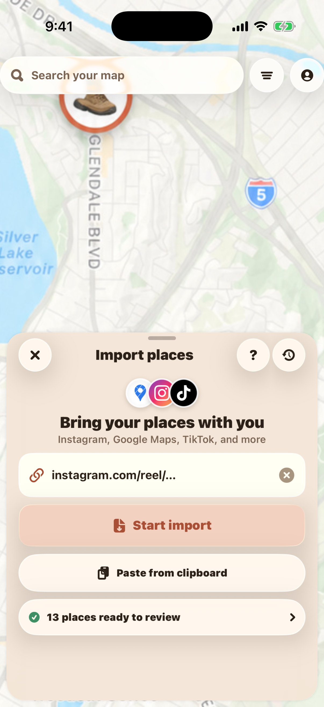
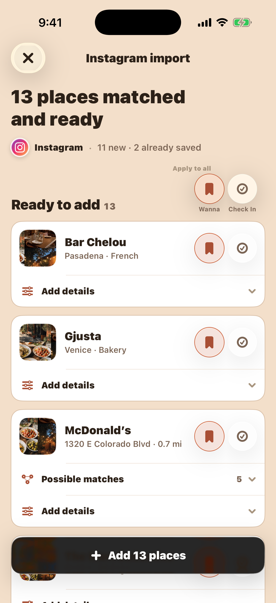
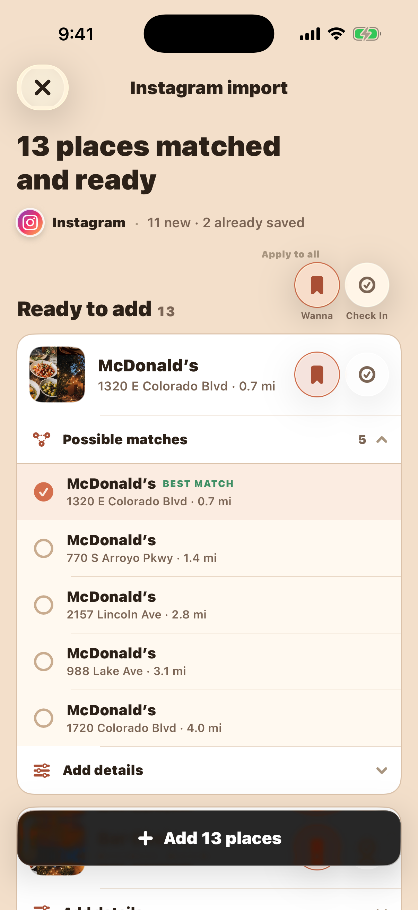
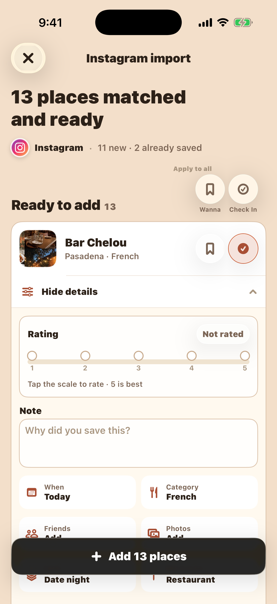
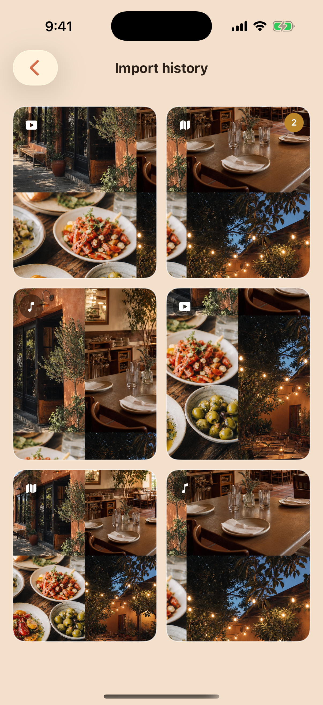
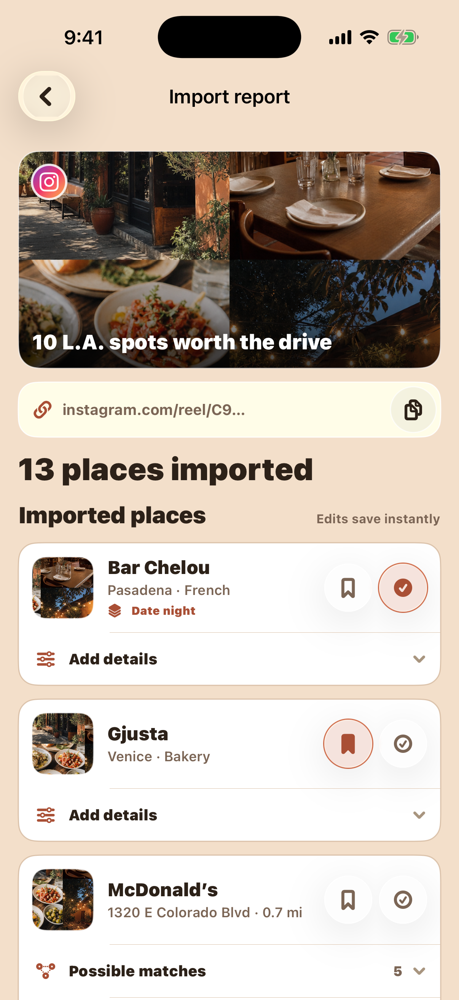
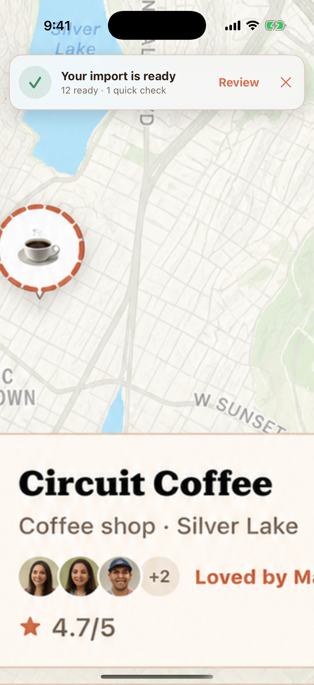
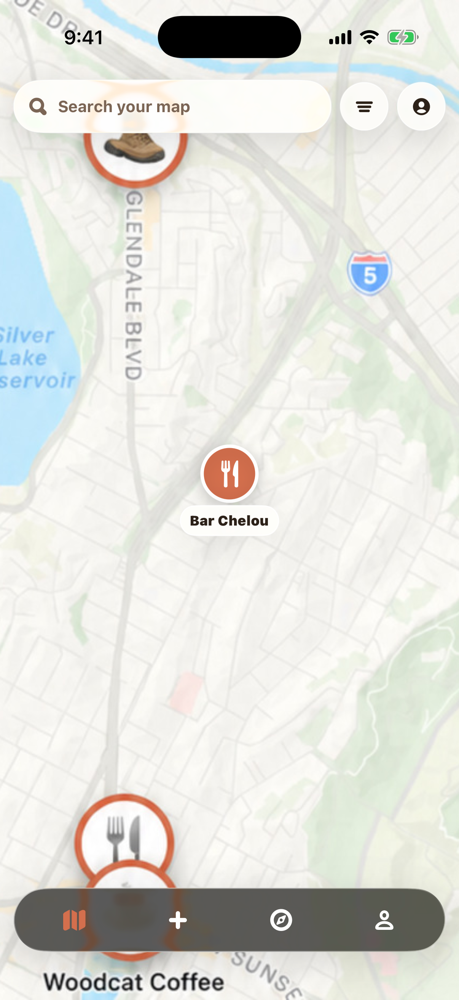
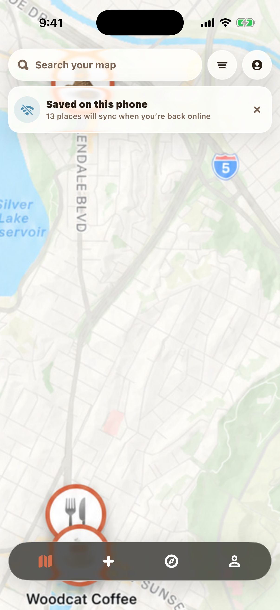
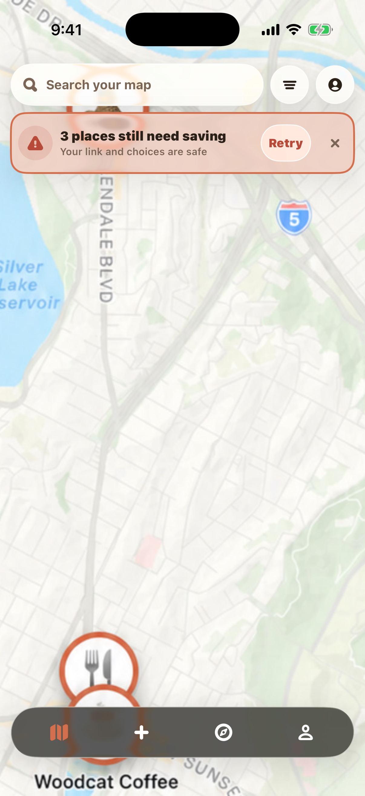

## Compact iPhone

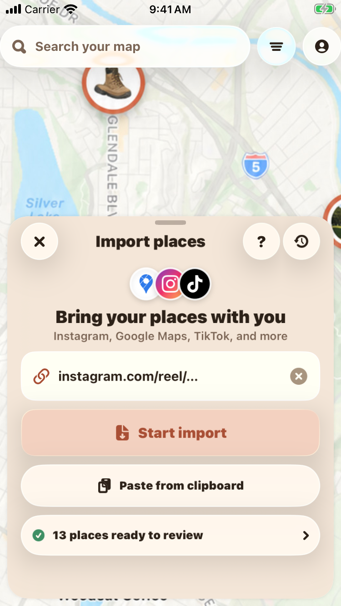
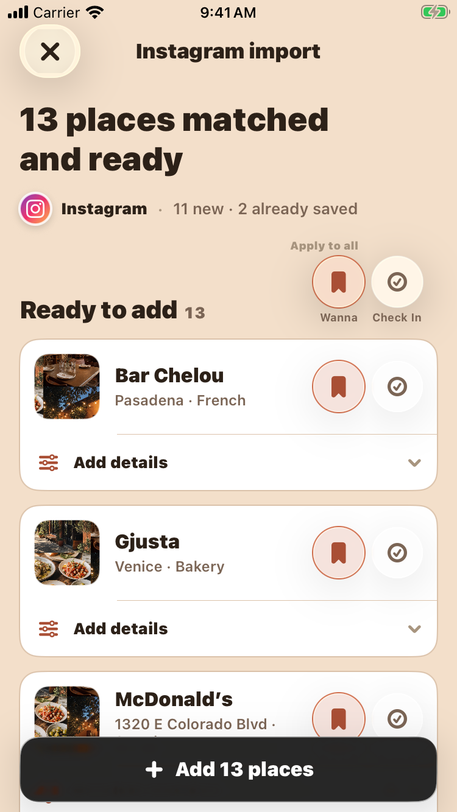
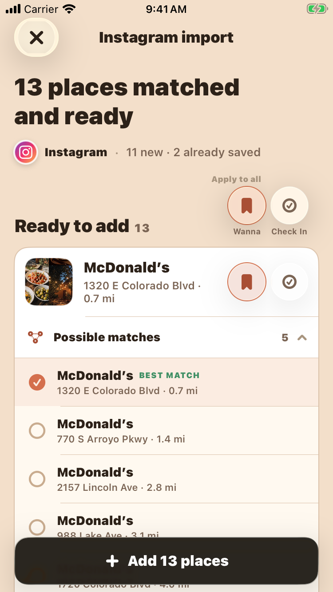
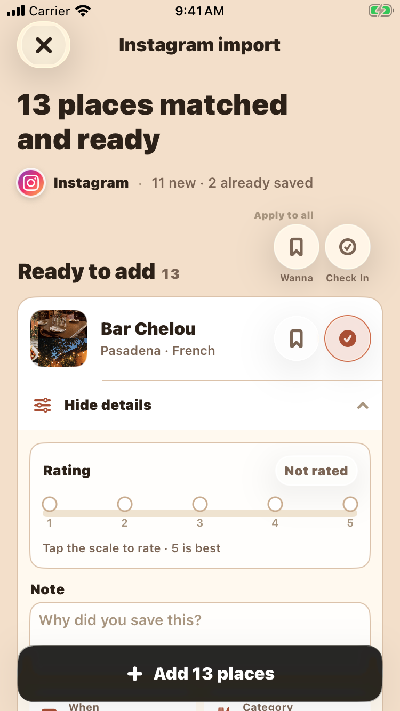
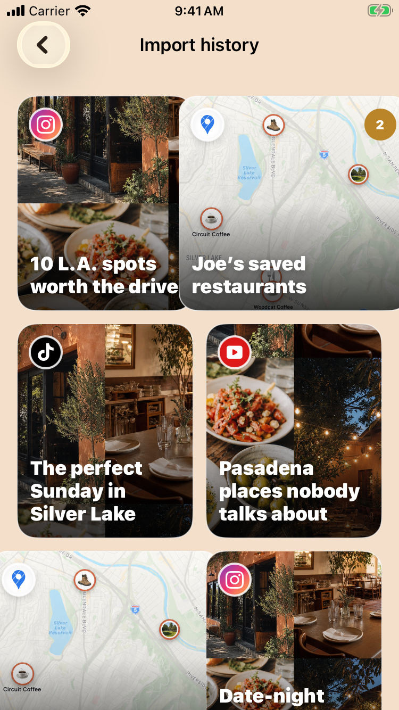
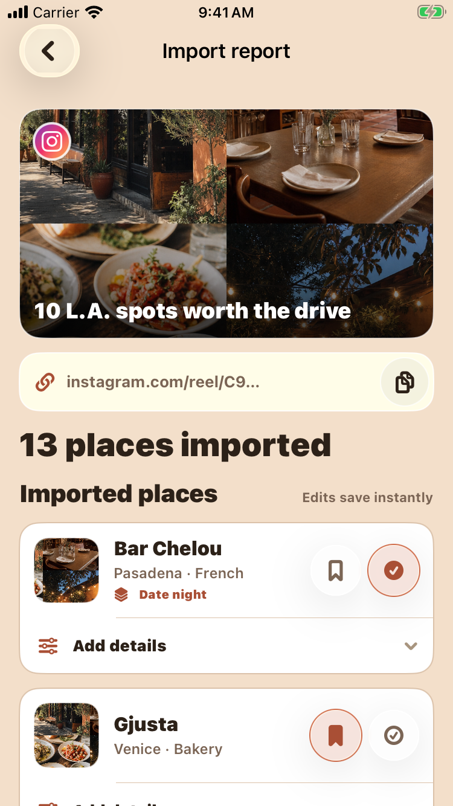

Status: DONE_WITH_CONCERNS. Visual and focused contract validation pass. The full XCTest target compiled, but Xcode's UI-test runner repeatedly failed to materialize with `no debugger version`; the run was interrupted after the infrastructure error repeated.
