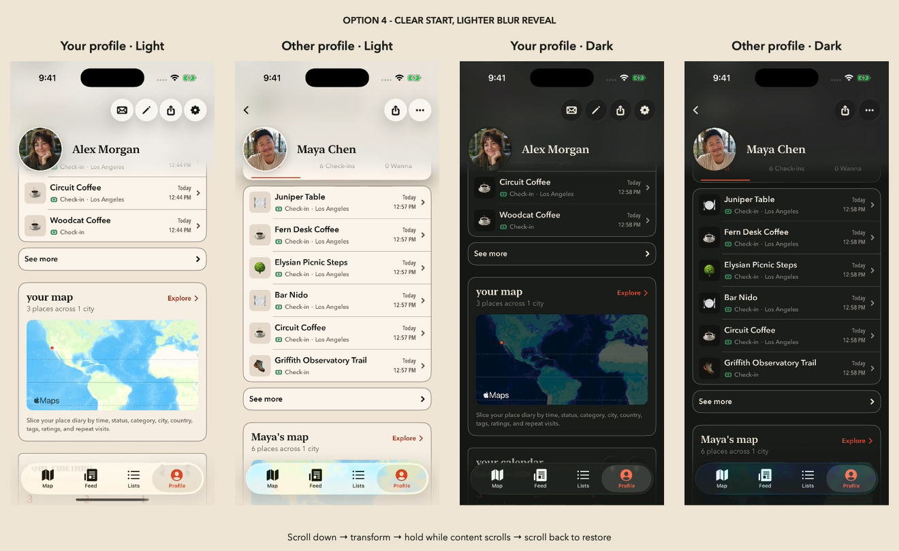
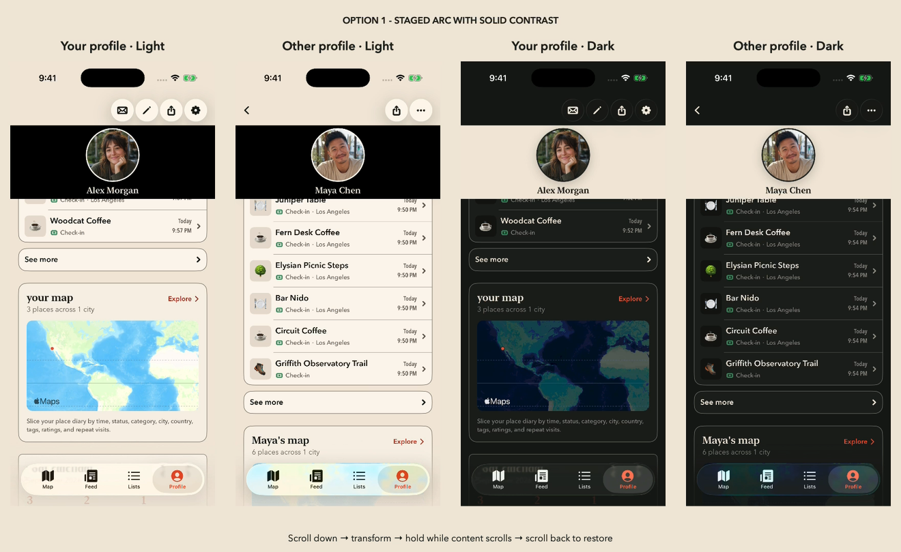
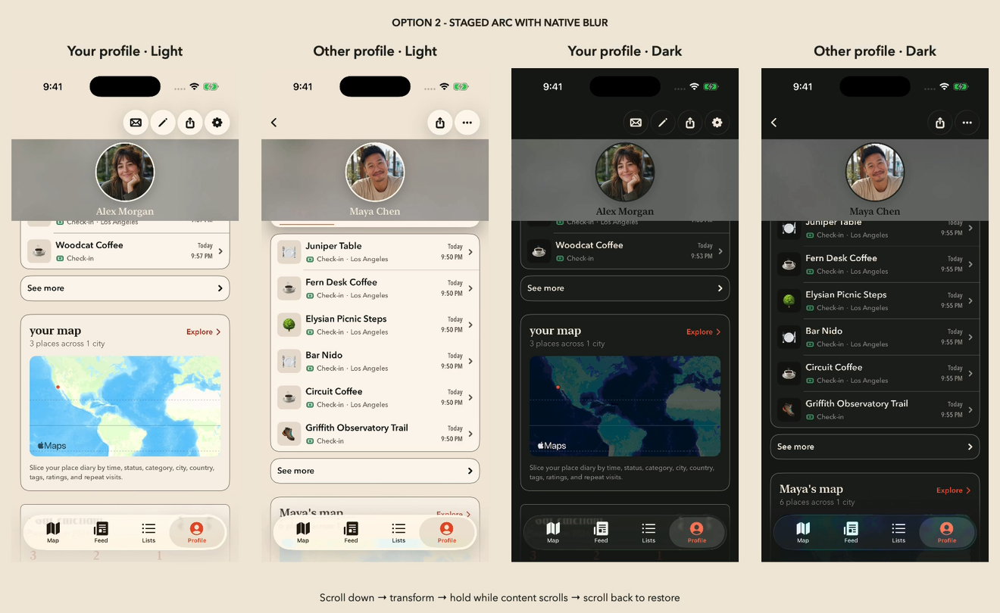
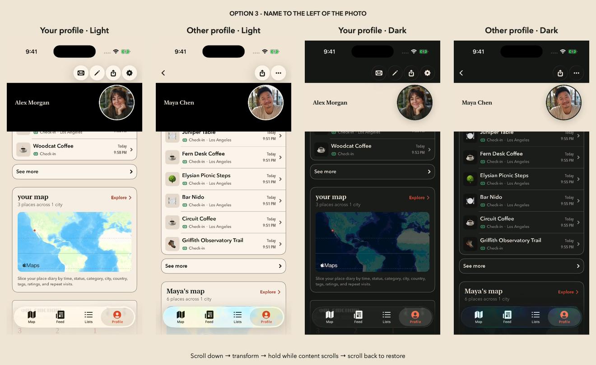
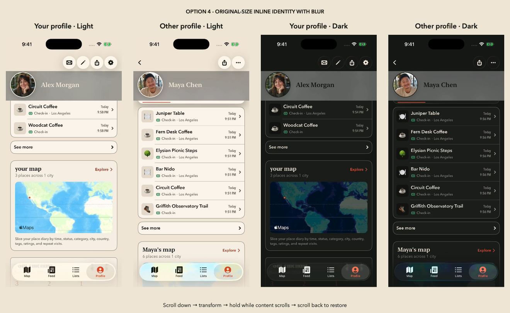

# Profile header motion exploration · REC-482

## Approved option 4: clear start and lighter blur reveal

[Play the updated MP4](option-4-reveal-blur.mp4)



The profile starts with no header blur. As the original name begins passing beneath the toolbar, a light native blur reveals downward from the top of the screen while the original-size name settles beside the photo. The lower edge is feathered, and the material retains softened backdrop shapes and colors instead of imposing a desaturated gray field. Its intensity is substantially lower than the previous review.

The photo remains 86pt and the name keeps the preceding iteration's size, destination, and timing. Scrolling back up to the bio's lower edge restores the original identity and retracts the entire blur, returning to a clear header. Reduce Transparency substitutes the app background during the same reveal. This is the default transition on normal owner and member profiles. Accessibility text sizes retain the original reading layout.

The updated video includes both profile roles in light and dark mode. Capture the `compact` variant with the commands below, then render the four files with the output prefix `option-4-reveal-blur`.

### Previous continuous-blur review

[Earlier option 4 MP4](option-4-continuous-blur.mp4) preserves the preceding always-blurred toolbar and stronger, desaturated material for comparison.

## Previous four-option comparison

The previous four native SwiftUI previews ran on the shared `ProfileOwnerHome` component. Each earlier MP4 compares your profile and another person's profile in both light and dark mode, using the same automated down/hold/up scroll sequence.

| Option | Expanded layout | Surface |
| --- | --- | --- |
| [1 · Staged arc](option-1.mp4) | Centered 103.2pt photo; name below at 55% of the previous render's size | Black in light mode; standard beige in dark mode |
| [2 · Blurred arc](option-2.mp4) | Same geometry and timing as option 1 | Contrasting native blur |
| [3 · Name beside photo](option-3.mp4) | Same sizes; name aligned left, to the left of the portrait | Same solid contrast as option 1 |
| [4 · Inline blur](option-4.mp4) | Original 86pt photo stays left; original-size name settles vertically alongside it | Contrasting native blur |

The username sits immediately above the city/state at the same font size in all four previews. Navigation buttons stay in their original top row. Options 1–3 occupy 208pt below the safe area, down from 294pt in the first exploration. Option 4 occupies 166pt.

## Pinned states






## Motion behavior

- Options 1–3 begin moving when the original photo midpoint crosses the bottom of the pinned navigation row. The current option 4 begins when the original name's top edge reaches that boundary.
- Options 1–3 follow the staged arc: the portrait leads over 0.8 seconds, followed by a fading name that rises into position after a 0.2-second delay. The portrait is 40% smaller than the previous 172pt render; the name is 55% of the previous 1.4× name, or 0.77× the original sheet-title size (about 17pt at default type size).
- The identity holds still while the activity, map, and calendar continue scrolling underneath. On upward scrolling, options 1–3 restore when the original photo's lower edge returns to the pinned toolbar boundary.
- Option 4 keeps the portrait at 86pt and shifts the original-size name down to its center line. Its latest clear-start blur reveal is shown in the current-review MP4 above; the older option-4.mp4 preserves the earlier appearance. It restores on upward scrolling when the bio's lower edge reaches the toolbar boundary. This preview interprets the bio boundary as the return-scroll threshold.
- The original layout reserves its space throughout, so changing motion state never changes scroll content height. A stationary scroll offset does not retrigger animation.
- Reduce Motion removes animation. Long names shrink to one line. Accessibility text sizes retain the original reading layout. The selected motion preserves live photo and navigation actions.

## Scope

Normal Debug and Release profiles use the selected inline transition through the shared ProfileOwnerHome component. Earlier alternatives and the automated capture route require an explicit DEBUG launch argument. The recordings use bundled demo portraits and an in-memory seeded store. The preview photo opens its native viewer; other preview actions remain inert. Production actions retain their normal behavior. No persistence, analytics, auth, follow, visibility, or backend contracts change.

## Run interactively

Build the `Wander` scheme for a Simulator, install the app, then launch:

```sh
xcrun simctl launch <simulator-id> com.grayline.wander \
  -WanderAuthenticatedUITest -ProfileHeaderMotion solid
```

Variants are `solid`, `blur`, `leading`, and `compact`. Add `-ProfileMotionMember` for the other-person profile. Add `-ProfileMotionAutoplay` for the 15-second automated scroll sequence. Set the Simulator's system appearance to compare light and dark modes.

## Reproduce recordings

Use a dedicated Simulator. Capture all options and roles once per appearance:

```sh
python3 preview/profile-header-motion/capture.py \
  <simulator-id> <built-Wander.app> <output-directory> --appearance light
python3 preview/profile-header-motion/capture.py \
  <simulator-id> <built-Wander.app> <output-directory> --appearance dark
```

Each capture also creates original/pinned/restored PNGs. Use `--variants solid compact`, `--roles owner`, or `--compact` to limit the run or label a smaller-phone capture. The recording waits for native layout readiness before starting the shared timeline.

Render a four-column MP4 and pinned-state PNG with Apple's native media frameworks:

```sh
swiftc -parse-as-library preview/profile-header-motion/render-comparison.swift \
  -o /tmp/profile-motion-render
/tmp/profile-motion-render <output-prefix> 'Option 1 · Staged arc' \
  <owner-solid-light.mp4> <member-solid-light.mp4> \
  <owner-solid-dark.mp4> <member-solid-dark.mp4>
```

Repeat with the other three variants. Add `--gif` only when a looping GIF is needed.

## Validation

`ProfileHeaderMotionStateTests` covers midpoint entry, continued-scroll hold, directional photo/bio boundary restoration, stationary offsets, and explicit preview argument parsing. The final PR records the native build, unit-test results, and large/compact phone visual checks. The repository's prescribed iPhone 16 Plus / iOS 18.6 destination is unavailable on this machine; installed iOS 26.5 Simulators are used instead.

The visual-selection run passed all 1,897 unit tests. Production integration additionally covers the default animation, accessibility fallback, normal owner/member navigation while pinned, photo-viewer return, tab return, and the existing profile-width regression. The PR records the final integrated unit/UI test counts, Release build, and native screenshots on iPhone 17 and iPhone 17e.
