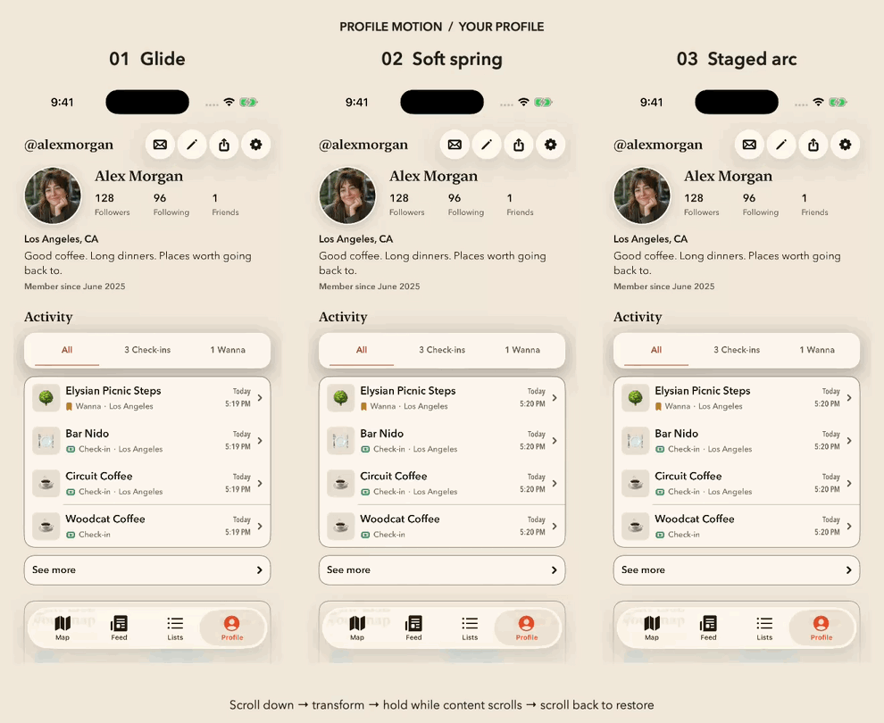
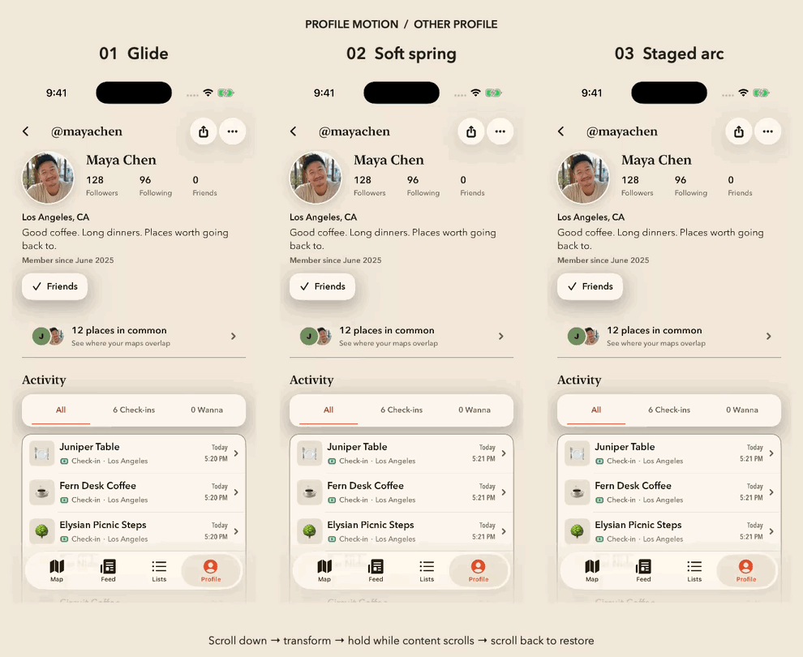

# Profile header motion exploration · REC-482

Three native SwiftUI motion options run on the current shared `ProfileOwnerHome` component. They use the same content, original identity geometry, 172pt final avatar, 1.4× display name, pinned navigation actions, and automated scroll path.

| Option | Motion |
| --- | --- |
| Glide | Photo and name move together with a 0.62-second ease in/out. |
| Soft spring | Photo and name move together with a 0.78-second spring and restrained overshoot. |
| Staged arc | Photo follows a shallow upward arc over 0.8 seconds; name rises and fades into place 0.2 seconds later. |

The regular app is unchanged unless the explicit DEBUG preview entry point is launched. Release builds compile the profile hooks to no-ops. This is a design exploration; select and review the production behavior before enabling it in normal profiles.

## Recordings

Your profile:



Other person's profile:



These are recordings of the native Simulator UI with demo data, including the return transition. Full-resolution individual MP4s can be regenerated with the capture script below.

## Review notes

- Reuses the existing avatar, profile typography, floating action controls, activity, map, calendar, and owner/member layouts.
- Scroll trigger: the original photo midpoint crosses the bottom of the pinned navigation row. On upward scrolling, restore when the original photo's lower edge returns to that same visible boundary. A stationary offset never retriggers the animation.
- The identity remains fixed while the content continues below it. The original layout continues to reserve its space, so changing animation state cannot change scroll content height.
- The glide and spring route the name around the portrait to avoid crossing it. The staged arc reveals the name underneath after the photo starts moving.
- The original photo is 86pt. A 172pt photo, the top action row, and an enlarged name require about 294pt below the safe area. This exceeds the approximate 20% target; the captures intentionally show the requested photo size so the tradeoff can be judged visually.
- Existing brand colors respond to system appearance. Reduce Motion removes animation. Long names retain one-line shrinking; larger accessibility sizes need a production layout decision because a fixed 294pt header cannot accommodate every text size.
- Bundled demo portraits and an in-memory seeded store provide repeatable content without account data. Profile actions in the demonstration are inert; production destinations remain on their existing paths.
- No persistence, analytics event, auth, follow, visibility, or backend contract changes.

## Run interactively

Build the `Wander` scheme for a Simulator, install the app, then launch it with:

```sh
xcrun simctl launch <simulator-id> com.grayline.wander \
  -WanderAuthenticatedUITest -ProfileHeaderMotion spring
```

Use `glide`, `spring`, or `arc`. Add `-ProfileMotionMember` for the other-person profile and `-ProfileMotionAutoplay` for the same 15-second scroll sequence used in recordings.

## Reproduce recordings

Use a dedicated Simulator to avoid interrupting another session. The capture command records each option for both profile roles, plus original/pinned/restored PNGs:

```sh
python3 preview/profile-header-motion/capture.py \
  <simulator-id> <built-Wander.app> <output-directory>
```

Add `--compact` to record the spring on a smaller Simulator. The rendering tool uses native macOS media frameworks to generate a three-column MP4, a looping GIF, and a pinned-state PNG:

```sh
swiftc -parse-as-library preview/profile-header-motion/render-comparison.swift \
  -o /tmp/profile-motion-render
/tmp/profile-motion-render <output-prefix> 'Your profile' \
  <owner-glide.mp4> <owner-spring.mp4> <owner-arc.mp4>
```

Repeat with member recordings and the title `Other profile`.

## Validation

`ProfileHeaderMotionStateTests` covers midpoint entry, continued-scroll hold, directional lower-edge restoration, stationary offsets, and explicit preview argument parsing. Native captures verify the shared view on large and compact iPhones. The final PR records build/test results and remaining gaps.

Validated on iPhone 17 and iPhone 17e Simulators running iOS 26.5. The final native build passed, and all 1,895 Wander unit tests passed (zero failures or skips). The prescribed iPhone 16 Plus / iOS 18.6 destination is not installed; that required command could not run. No UI automation suite was run.
