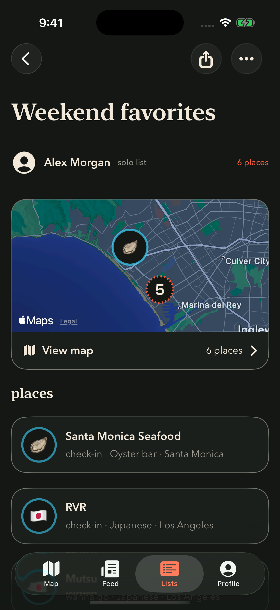
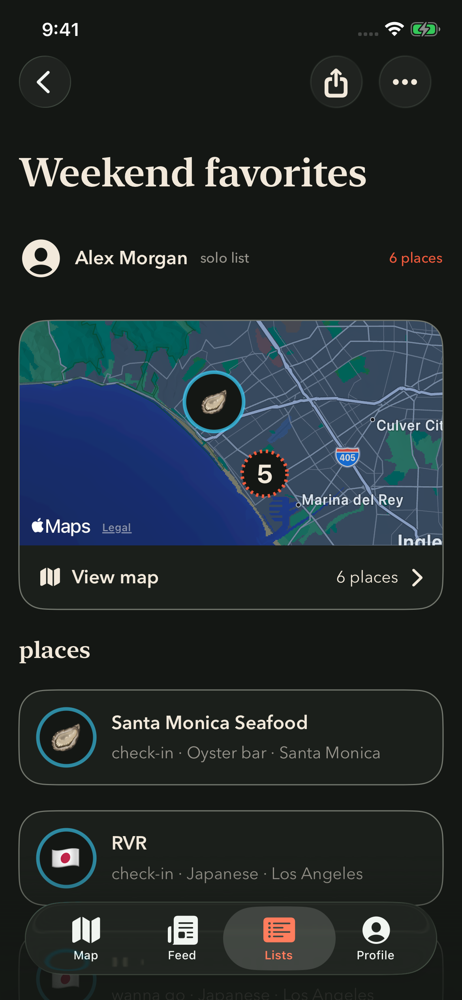
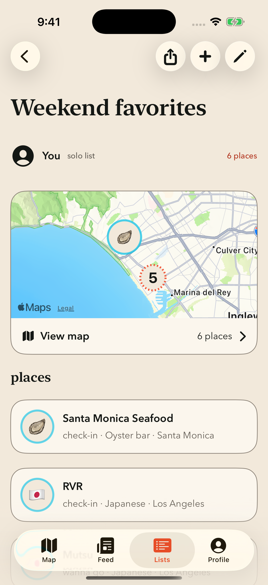
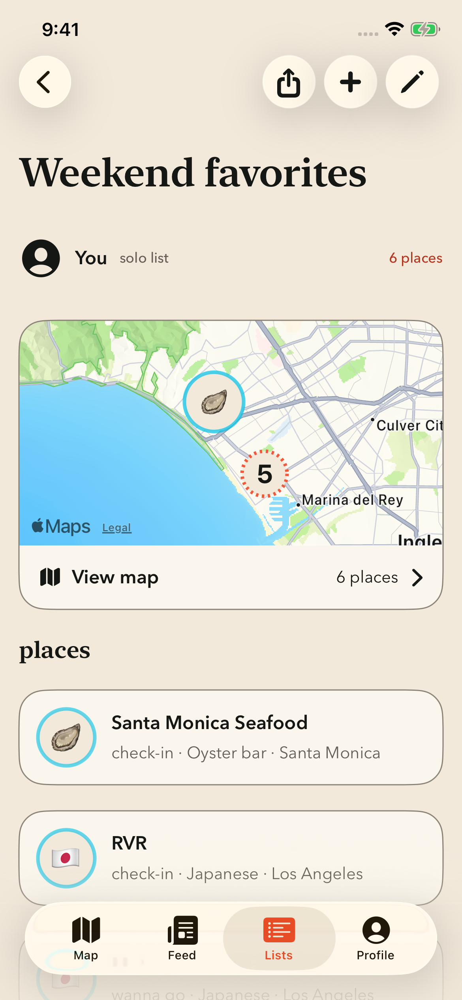

# List detail header — native SwiftUI approval mockups

The standalone preview compiles `ListDetailHeaderToolbar` and `ListDetailHeaderActionLabel` directly from production `ListsScreen.swift`, plus the production color, typography, and Liquid Glass definitions. The surrounding list content is illustrative. These are native simulator-rendered mockups, not full-app screenshots.

The toolbar uses independent 44pt circular controls with 8pt spacing and no shared enclosing background on iOS 26. Share, Add, Edit, and More use the same neutral glass treatment as the Profile header. The native back button and production action handlers are preserved. Earlier systems and Reduce Transparency use the existing design-system fallbacks.

Build from the repository root:

```sh
python3 preview/rec-454/render-build.py
```

Install `/private/tmp/rec454-native/ListHeaderPreview.app` on an arm64 iOS simulator. Launch `com.recme.preview.list-header` with no arguments for a viewer, `--owner` for an owned list, or `--collaborator` for a shared list. Add `--light` for light appearance. Sample buttons report local preview actions; they do not share data or change real lists.

Visual approval and the full iOS test gate are required before squash merge.

## Validation checkpoint

- Native preview app compiles against the iOS Simulator SDK using production header/glass definitions.
- `swiftc -frontend -parse` succeeds for the edited production source; XcodeGen regenerates with no project diff.
- The required full `xcodebuild test` command stops before running tests: iPhone 16 Plus / iOS 18.6 is not installed. The available runtime is iOS 26.5. This is a pending gate, not a test pass.

## Captures

| Appearance / role | iPhone 17 Pro | iPhone 17e |
| --- | --- | --- |
| Dark / viewer |  |  |
| Light / owner |  |  |

Screenshots use iOS 26.5. The large and compact native renders show standalone circular actions with no shared capsule, preserved back-button placement, and no header clipping. Full-app navigation/action QA and visual approval remain pending.
