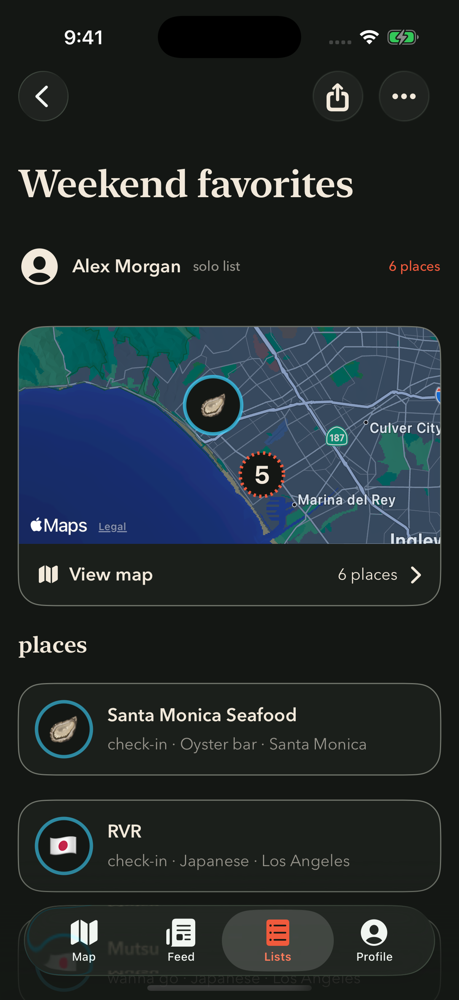
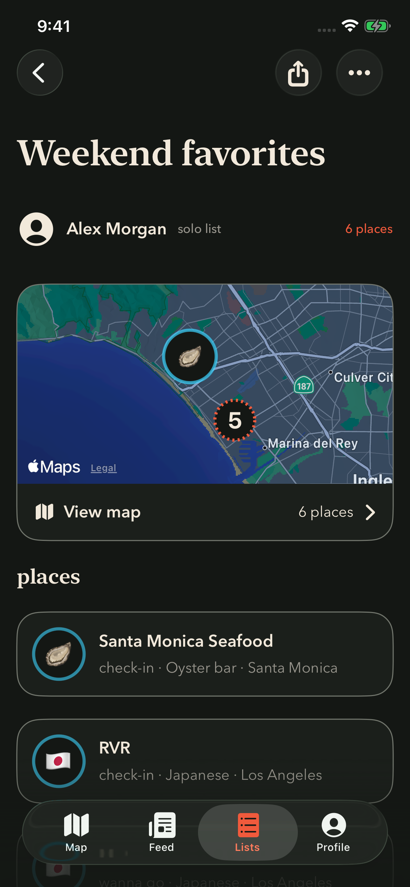
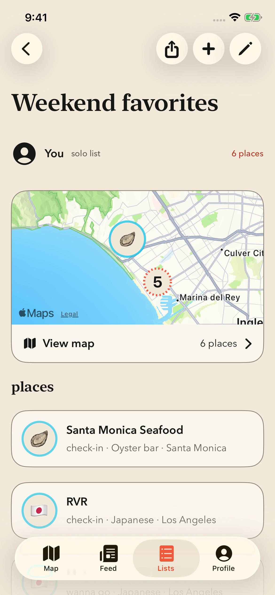

# List detail header and Lists tab — native SwiftUI mockups

The final design uses independent 44pt circular Liquid Glass header controls with 8pt spacing and no enclosing iOS 26 toolbar backdrop. Share, Add, Edit, and More match the Profile header. Native back navigation, action handlers, role eligibility, and accessibility labels remain intact. Earlier iOS versions and Reduce Transparency use the shared design-system fallbacks.

The filled Lists paper icon is 22×25pt. Its selected fill uses the exact Signal token (#F05A3C) in both appearances, with ink details in dark mode and warm-paper details in light mode. Unselected sheets are warm paper in dark mode and ink in light mode. Original-color cached images preserve the approved colors; the native tab bar still owns its selection pill, labels, tap handling, and accessibility.

The standalone SwiftUI preview compiles the production toolbar, icon renderer, typography, colors, and glass definitions. Surrounding list content is illustrative. These are simulator-rendered mockups, not full-app screenshots.

## Final 22×25pt renders

| Appearance / role | iPhone 17 Pro | iPhone 17e |
| --- | --- | --- |
| Dark / viewer |  |  |
| Light / owner |  |  |

## Reproduce

Run `python3 preview/rec-454/render-build.py` from the repository root. Install `/private/tmp/rec454-native/ListHeaderPreview.app` on an arm64 iOS simulator. Launch `com.recme.preview.list-header` with no arguments for a viewer, `--owner` for an owned list, or `--collaborator` for a shared list. Add `--light` for light appearance. Preview buttons report local mock actions; they do not share data or change real lists.

The earlier 20×28pt captures in this directory and 22×26pt captures in `22x26/` are superseded by the final 22×25pt production design. Validation results are recorded in PR #616 and REC-453 / REC-454.
